<picture>
  <source media="(prefers-color-scheme: dark)" srcset="https://capsule-render.vercel.app/api?type=waving&color=0:667eea,100:764ba2&height=200&section=header&text=AI%20Workflow&fontSize=80&fontColor=fff&animation=twinkling&fontAlignY=35&desc=Your%20AI-Powered%20Development%20Command%20Center&descSize=20&descAlignY=55">
  
</picture>

<div align="center">

[](https://modelcontextprotocol.io/)
[](https://www.python.org/)
[](https://cursor.sh/)
[](#-tool-modules)
[](LICENSE)

**Transform Claude into your personal DevOps engineer, developer assistant, and incident responder.**

[Getting Started](#-quick-start) •
[Features](#-features) •
[Architecture](#-architecture) •
[Agents](#-agents) •
[Skills](#-skills) •
[Examples](#-usage-scenarios)

</div>

---

## ✨ What is This?

AI Workflow is a **comprehensive MCP (Model Context Protocol) server** that gives Claude AI superpowers for software development. Instead of just answering questions, Claude can now:

```
┌─────────────────────────────────────────────────────────────────────┐
│  🔧 Execute Real Actions     Create branches, update Jira, deploy  │
│  🧠 Remember Context         Track your work across sessions       │
│  🎭 Adopt Personas           DevOps, Developer, Incident modes     │
│  📋 Run Workflows            Multi-step skills that chain tools    │
│  🔍 Debug Everything         See exactly what's happening          │
└─────────────────────────────────────────────────────────────────────┘
```

<details>
<summary><b>🎬 See it in action</b></summary>

```
You: Start working on AAP-12345 in the backend repo

Claude: 🚀 Executing Skill: start_work
        
        🔧 Step 1: get_issue ✅
           Issue: "Implement new REST API endpoint"
        
        🔧 Step 2: checkout_main ✅
           Switched to 'main'
        
        🔧 Step 3: pull_latest ✅
           Already up to date
        
        🔧 Step 4: create_branch ✅
           Created: aap-12345-implement-new-rest-api-endpoint
        
        🔧 Step 5: update_jira ✅
           Status → In Progress
        
        ─────────────────────────────────
        ⏱️ Completed in 2.3s | ✅ 5/5 steps
        
        Ready to code! Your branch is set up.
```

</details>

---

## 🏗️ Architecture


### The Four Pillars

```mermaid
graph LR
    subgraph PILLARS["<b>AI Workflow Architecture</b>"]
        direction TB
        
        subgraph P1["🔧 <b>TOOLS</b>"]
            T1[150+ MCP Tools]
            T2[13 Modules]
            T3[Dynamic Loading]
        end
        
        subgraph P2["🎭 <b>AGENTS</b>"]
            A1[Specialized Personas]
            A2[Focused Tool Sets]
            A3[Domain Expertise]
        end
        
        subgraph P3["⚡ <b>SKILLS</b>"]
            S1[Multi-Step Workflows]
            S2[Tool Chaining]
            S3[Conditional Logic]
        end
        
        subgraph P4["💾 <b>MEMORY</b>"]
            M1[Session Context]
            M2[Learned Patterns]
            M3[Work State]
        end
    end
    
    P1 --> P2
    P2 --> P3
    P3 --> P4
    
    style P1 fill:#3b82f6,stroke:#2563eb,color:#fff
    style P2 fill:#f59e0b,stroke:#d97706,color:#fff
    style P3 fill:#ec4899,stroke:#db2777,color:#fff
    style P4 fill:#8b5cf6,stroke:#7c3aed,color:#fff
```



---

## 🚀 Quick Start

### 1️⃣ Clone & Install

```bash
# Clone the repository
git clone https://github.com/yourusername/ai-workflow.git ~/src/ai-workflow
cd ~/src/ai-workflow

# Install dependencies
pip install fastmcp pyyaml httpx jinja2
```

### 2️⃣ Configure Your Project

Create `.cursor/mcp.json` in your project:

```json
{
  "mcpServers": {
    "ai-workflow": {
      "command": "python3",
      "args": [
        "/path/to/ai-workflow/mcp-servers/aa-common/src/server.py",
        "--agent", "developer"
      ]
    }
  }
}
```

<details>
<summary><b>📁 Example configurations for different roles</b></summary>

**Developer (Git, Jira, GitLab)**
```json
{
  "mcpServers": {
    "ai-workflow": {
      "command": "python3",
      "args": ["/path/to/ai-workflow/mcp-servers/aa-common/src/server.py", "--agent", "developer"]
    }
  }
}
```

**DevOps (Kubernetes, Prometheus, Alertmanager)**
```json
{
  "mcpServers": {
    "ai-workflow": {
      "command": "python3",
      "args": ["/path/to/ai-workflow/mcp-servers/aa-common/src/server.py", "--agent", "devops"]
    }
  }
}
```

**Incident Response (All monitoring tools)**
```json
{
  "mcpServers": {
    "ai-workflow": {
      "command": "python3",
      "args": ["/path/to/ai-workflow/mcp-servers/aa-common/src/server.py", "--agent", "incident"]
    }
  }
}
```

**Full Access (All 150+ tools)**
```json
{
  "mcpServers": {
    "ai-workflow": {
      "command": "python3",
      "args": ["/path/to/ai-workflow/mcp-servers/aa-common/src/server.py", "--tools", "all"]
    }
  }
}
```

</details>

### 3️⃣ Restart Cursor & Go!

```
You: Hello! What can you help me with?

Claude: 🚀 AI Workflow Active!
        
        I can help you with:
        • Git operations (branches, commits, merges)
        • Jira issue management
        • GitLab MRs and pipelines
        • Kubernetes cluster operations
        • And 150+ more tools...
        
        Try: "Start working on AAP-12345"
```

---

## 🎭 Agents

Agents are **specialized personas** that focus Claude on specific domains with curated tool sets.


### Agent Comparison

| Agent | Focus | Tools Loaded | Best For |
|-------|-------|--------------|----------|
| 👨‍💻 **developer** | Code & MRs | ~85 tools | Daily development work |
| 🔧 **devops** | Infrastructure | ~101 tools | Monitoring, deployments |
| 🚨 **incident** | Production issues | ~95 tools | Alert triage, debugging |
| 📦 **release** | Shipping | ~75 tools | Releases, promotions |

### Loading an Agent

```
You: Load the devops agent

Claude: ## 🔧 DevOps Agent Loaded
        
        I'm now focused on infrastructure and monitoring.
        
        **My capabilities:**
        • Kubernetes operations (pods, deployments, logs)
        • Prometheus metrics and alerts
        • Alertmanager silence management
        • Kibana log analysis
        • Bonfire ephemeral namespaces
        
        **Available skills:**
        • investigate_alert - Systematic alert triage
        • deploy_to_stage - Safe staging deployments
        
        What infrastructure task can I help with?
```

---

## ⚡ Skills

Skills are **reusable multi-step workflows** that chain tools together with logic, conditions, and templating.

```mermaid
flowchart LR
    subgraph SKILL["<b>⚡ Skill: start_work</b>"]
        direction LR
        S1[📋 Get Jira Issue] --> S2[🔀 Checkout main]
        S2 --> S3[⬇️ Pull latest]
        S3 --> S4[🌿 Create branch]
        S4 --> S5[📝 Update Jira]
    end
    
    INPUT[("issue_key: AAP-12345<br>repo: backend")] --> S1
    S5 --> OUTPUT[("✅ Branch ready<br>Jira: In Progress")]
    
    style INPUT fill:#6366f1,stroke:#4f46e5,color:#fff
    style OUTPUT fill:#10b981,stroke:#059669,color:#fff
    style S1 fill:#3b82f6,stroke:#2563eb,color:#fff
    style S2 fill:#3b82f6,stroke:#2563eb,color:#fff
    style S3 fill:#3b82f6,stroke:#2563eb,color:#fff
    style S4 fill:#3b82f6,stroke:#2563eb,color:#fff
    style S5 fill:#3b82f6,stroke:#2563eb,color:#fff
```



### Available Skills

| Skill | Description | Required Inputs |
|-------|-------------|-----------------|
| ⚡ **start_work** | Begin working on an issue | `issue_key`, `repo` |
| 🚀 **create_mr** | Create MR with Jira link | `issue_key`, `repo` |
| 🔍 **investigate_alert** | Systematic alert triage | `environment` |

### Skill Anatomy

```yaml
# skills/start_work.yaml
name: start_work
description: Begin working on a Jira issue

inputs:
  - name: issue_key
    required: true
  - name: repo
    required: true

steps:
  - name: get_issue
    tool: jira_view_issue
    args: {issue_key: "{{ inputs.issue_key }}"}
    output: issue

  - name: create_branch
    tool: git_branch_create
    args:
      repo: "{{ inputs.repo }}"
      branch_name: "{{ issue.key | lower }}-{{ issue.summary | slugify }}"

  - name: update_status
    tool: jira_set_status
    args: {issue_key: "{{ inputs.issue_key }}", status: "In Progress"}
    on_error: continue  # Don't fail if Jira update fails

outputs:
  - name: summary
    value: |
      ## ✅ Ready to Work
      **Issue:** {{ issue.summary }}
      **Branch:** `{{ branch_name }}`
```

### Running Skills

```
You: Run start_work for AAP-12345 in backend

Claude: ## ⚡ Executing: start_work
        
        ┌─────────────────────────────────────────────────────┐
        │ 🔧 get_issue                              ✅ 0.52s │
        │    Issue: "Implement new REST API endpoint"        │
        ├─────────────────────────────────────────────────────┤
        │ 🔧 checkout_main                          ✅ 0.08s │
        │    Switched to branch 'main'                       │
        ├─────────────────────────────────────────────────────┤
        │ 🔧 pull_latest                            ✅ 1.24s │
        │    Already up to date                              │
        ├─────────────────────────────────────────────────────┤
        │ 🔧 create_branch                          ✅ 0.11s │
        │    Created: aap-12345-implement-new-rest-api       │
        ├─────────────────────────────────────────────────────┤
        │ 🔧 update_status                          ✅ 0.31s │
        │    Status: In Progress                             │
        └─────────────────────────────────────────────────────┘
        
        ⏱️ Total: 2.26s | ✅ 5/5 succeeded
```

### Debug Mode

```
You: Run that with debug mode

Claude: ## 🔍 Debug: start_work
        
        ```
        [0.000s] 🚀 Starting skill: start_work
        [0.000s] 📥 Inputs: {"issue_key": "AAP-12345", "repo": "backend"}
        [0.001s] 📍 Step 1: get_issue
        [0.001s]    → Tool: jira_view_issue
        [0.001s]    → Args: {"issue_key": "AAP-12345"}
        [0.523s]    ✅ Completed (0.52s)
        [0.523s]    → Output: {"key": "AAP-12345", "summary": "Implement..."}
        [0.524s] 📍 Step 2: checkout_main
        ...
        ```
```

---

## 🔧 Tool Modules

The system provides **150+ tools** organized into 13 modules:

```mermaid
graph TB
    subgraph MODULES["<b>🔧 Tool Modules</b>"]
        direction TB
        
        subgraph DEV_TOOLS["<b>Development</b>"]
            GIT[📂 git<br/>19 tools]
            JIRA[📋 jira<br/>18 tools]
            GITLAB[🦊 gitlab<br/>26 tools]
        end
        
        subgraph K8S_TOOLS["<b>Infrastructure</b>"]
            K8S[☸️ k8s<br/>26 tools]
            BONFIRE[🔥 bonfire<br/>21 tools]
            KONFLUX[🔄 konflux<br/>18 tools]
        end
        
        subgraph MON_TOOLS["<b>Monitoring</b>"]
            PROM[📊 prometheus<br/>13 tools]
            ALERT[🚨 alertmanager<br/>6 tools]
            KIBANA[📜 kibana<br/>9 tools]
        end
        
        subgraph OTHER["<b>Other</b>"]
            QUAY[📦 quay<br/>8 tools]
            APPINT[🔗 appinterface<br/>6 tools]
            WORKFLOW[⚡ workflow<br/>28 tools]
        end
    end
    
    style GIT fill:#f97316,stroke:#ea580c,color:#fff
    style JIRA fill:#0052cc,stroke:#0747a6,color:#fff
    style GITLAB fill:#fc6d26,stroke:#e24329,color:#fff
    style K8S fill:#326ce5,stroke:#2563eb,color:#fff
    style PROM fill:#e6522c,stroke:#d14020,color:#fff
    style WORKFLOW fill:#10b981,stroke:#059669,color:#fff
```



### Tool Categories

<details>
<summary><b>📂 Git Tools (19)</b></summary>

| Tool | Description |
|------|-------------|
| `git_status` | Show working tree status |
| `git_branch` | List/create branches |
| `git_checkout` | Switch branches |
| `git_commit` | Commit changes |
| `git_push` | Push to remote |
| `git_pull` | Pull from remote |
| `git_log` | Show commit history |
| `git_diff` | Show changes |
| `git_stash` | Stash changes |
| `git_merge` | Merge branches |
| `git_rebase` | Rebase branch |
| `git_cherry_pick` | Cherry-pick commits |
| `git_reset` | Reset changes |
| `git_tag` | Manage tags |
| `git_remote` | Manage remotes |
| ... | and more |

</details>

<details>
<summary><b>📋 Jira Tools (18)</b></summary>

| Tool | Description |
|------|-------------|
| `jira_view_issue` | Get issue details |
| `jira_create_issue` | Create new issue |
| `jira_update_issue` | Update issue fields |
| `jira_set_status` | Transition status |
| `jira_add_comment` | Add comment |
| `jira_search` | Search issues (JQL) |
| `jira_assign` | Assign issue |
| `jira_link_issues` | Link issues |
| `jira_get_transitions` | List transitions |
| `jira_sprint_issues` | Sprint issues |
| ... | and more |

</details>

<details>
<summary><b>🦊 GitLab Tools (26)</b></summary>

| Tool | Description |
|------|-------------|
| `gitlab_mr_list` | List MRs |
| `gitlab_mr_create` | Create MR |
| `gitlab_mr_view` | View MR details |
| `gitlab_mr_approve` | Approve MR |
| `gitlab_mr_merge` | Merge MR |
| `gitlab_pipeline_list` | List pipelines |
| `gitlab_pipeline_view` | Pipeline details |
| `gitlab_pipeline_retry` | Retry pipeline |
| `gitlab_job_logs` | Job logs |
| `gitlab_project_info` | Project info |
| ... | and more |

</details>

<details>
<summary><b>☸️ Kubernetes Tools (26)</b></summary>

| Tool | Description |
|------|-------------|
| `kubectl_get_pods` | List pods |
| `kubectl_describe_pod` | Pod details |
| `kubectl_logs` | Pod logs |
| `kubectl_exec` | Execute command |
| `kubectl_get_deployments` | List deployments |
| `kubectl_rollout_restart` | Restart deployment |
| `kubectl_get_events` | Cluster events |
| `k8s_namespace_health` | Namespace overview |
| `k8s_pod_resources` | Resource usage |
| `kubectl_apply` | Apply manifest |
| ... | and more |

</details>

### Dynamic Tool Loading

To work around Cursor's 128-tool limit, we use **dynamic tool loading**:


```
You: I need to check something in Prometheus but I'm using the developer agent

Claude: No problem! I can use tool_exec to access Prometheus tools:
        
        [Calls tool_exec("prometheus_get_alerts", '{"environment": "stage"}')]
        
        Found 2 active alerts in stage:
        🟠 HighMemoryUsage - analytics-api at 85%
        🟢 SlowQueries - resolved 5m ago
```

---

## 💾 Memory System

Memory provides **persistent context** across Claude sessions.

```mermaid
graph TD
    subgraph MEMORY["<b>💾 Memory Structure</b>"]
        direction TB
        
        subgraph STATE["📊 state/"]
            CW[current_work.yaml<br/>Active issues, branches, MRs]
            ENV[environments.yaml<br/>Stage/prod health status]
        end
        
        subgraph LEARNED["🧠 learned/"]
            PAT[patterns.yaml<br/>Error patterns & solutions]
            RUN[runbooks.yaml<br/>Operational procedures]
        end
        
        subgraph SESSIONS["📅 sessions/"]
            TODAY[2024-12-22.yaml<br/>Today's action log]
            YESTERDAY[2024-12-21.yaml<br/>Yesterday's log]
        end
    end
    
    style STATE fill:#3b82f6,stroke:#2563eb,color:#fff
    style LEARNED fill:#10b981,stroke:#059669,color:#fff
    style SESSIONS fill:#f59e0b,stroke:#d97706,color:#fff
```



### Memory Operations

```
# Check what you were working on
You: What was I working on yesterday?

Claude: [Reads memory/sessions/2024-12-21.yaml]
        
        Yesterday you:
        • Started work on AAP-12345 (Implement API endpoint)
        • Created MR !456
        • Investigated a HighMemoryUsage alert in stage
        • Fixed by restarting analytics-api pod

# Save a learned pattern
You: Log that the ImagePullBackOff fix is to check Quay permissions

Claude: [Writes to memory/learned/patterns.yaml]
        
        ✅ Logged pattern:
        **Error:** ImagePullBackOff
        **Fix:** Check Quay image permissions and registry credentials
```

### Example: Current Work State

```yaml
# memory/state/current_work.yaml
last_updated: "2024-12-22T10:30:00Z"

active_issues:
  - key: AAP-12345
    summary: "Implement new REST API endpoint"
    status: "In Progress"
    branch: "aap-12345-implement-rest-api"
    repo: "backend"

open_mrs:
  - id: 456
    title: "AAP-12345 - feat(api): Implement new endpoint"
    url: "https://gitlab.example.com/mr/456"
    pipeline_status: "success"

current_branches:
  backend: "aap-12345-implement-rest-api"
  frontend: "main"
```

---

## 📋 Usage Scenarios

### 🔄 Daily Development Workflow

```mermaid
sequenceDiagram
    participant Dev as 👨‍💻 Developer
    participant AI as 🤖 Claude
    participant Tools as 🔧 Tools
    
    Dev->>AI: "Start session as developer"
    AI->>Tools: session_start(agent="developer")
    Tools-->>AI: Load context & tools
    AI-->>Dev: "Ready! No active issues."
    
    Dev->>AI: "Work on AAP-12345"
    AI->>Tools: skill_run("start_work", {...})
    Tools-->>AI: Branch created, Jira updated
    AI-->>Dev: "Ready to code!"
    
    Note over Dev: ...makes code changes...
    
    Dev->>AI: "Create merge request"
    AI->>Tools: skill_run("create_mr", {...})
    Tools-->>AI: MR created, Jira linked
    AI-->>Dev: "MR !456 created, pipeline running"
```



<details>
<summary><b>📝 Full conversation example</b></summary>

```
You: Start a developer session

Claude: 🚀 Developer Session Started
        
        **Current Context:**
        • No active issues
        • Branch: main
        
        **Available Skills:**
        • start_work - Begin working on an issue
        • create_mr - Create merge request
        
        What would you like to work on?

You: I need to work on AAP-12345

Claude: [Running skill: start_work]
        
        ✅ Step 1: Got issue details
           "Implement new REST API endpoint"
        
        ✅ Step 2: Switched to main
        ✅ Step 3: Pulled latest changes
        ✅ Step 4: Created branch
           aap-12345-implement-new-rest-api
        ✅ Step 5: Updated Jira status
           Status: In Progress
        
        Ready to code! Your workspace is set up.

[...you make code changes...]

You: I'm done, create the MR

Claude: [Running skill: create_mr]
        
        ✅ Step 1: Staged all changes
        ✅ Step 2: Created commit
           "AAP-12345 - feat(api): Implement new endpoint"
        ✅ Step 3: Pushed to origin
        ✅ Step 4: Created MR !456
        ✅ Step 5: Linked to Jira issue
        
        🚀 MR Created: !456
        Pipeline: Running ⏳
        
        I'll check the pipeline status in a moment...
```

</details>

### 🚨 Incident Response

```mermaid
flowchart TD
    ALERT[🚨 Alert Fired] --> LOAD[Load incident agent]
    LOAD --> INVESTIGATE[Run investigate_alert skill]
    INVESTIGATE --> CHECK{Issues found?}
    CHECK -->|Yes| DIAGNOSE[Diagnose with logs & metrics]
    CHECK -->|No| CLOSE[Close investigation]
    DIAGNOSE --> FIX{Can fix?}
    FIX -->|Yes| APPLY[Apply fix]
    FIX -->|No| ESCALATE[Escalate to team]
    APPLY --> VERIFY[Verify fix]
    VERIFY --> LOG[Log to memory]
    
    style ALERT fill:#ef4444,stroke:#dc2626,color:#fff
    style FIX fill:#f59e0b,stroke:#d97706,color:#fff
    style APPLY fill:#10b981,stroke:#059669,color:#fff
```



<details>
<summary><b>📝 Full conversation example</b></summary>

```
You: Load incident agent, we have alerts in prod

Claude: ## 🚨 Incident Agent Loaded
        
        Running immediate investigation...
        
        [Executing: investigate_alert for production]
        
        ## Investigation Report: production
        
        ### 🔴 Active Alerts (2)
        
        | Alert | Severity | Duration | Pod |
        |-------|----------|----------|-----|
        | HighMemoryUsage | critical | 15m | analytics-api-7d8f9 |
        | SlowResponseTime | warning | 8m | analytics-api-7d8f9 |
        
        ### 📊 Namespace Health
        
        • Pods: 4/5 running
        • 1 pod restarting (CrashLoopBackOff)
        • Recent deployments: None in 24h
        
        ### 🔍 Likely Cause
        
        analytics-api-7d8f9 is consuming 95% of its memory limit,
        causing slow responses and restarts.
        
        ### Recommended Actions
        1. Check pod logs for memory leaks
        2. Consider restarting the pod
        3. May need to increase memory limits

You: Check the logs for that pod

Claude: [Calls kubectl_logs with tail=100]
        
        ## Recent Logs: analytics-api-7d8f9
        
        ```
        2024-12-22 10:15:23 [ERROR] OutOfMemoryError in report generation
        2024-12-22 10:15:24 [WARN] Large result set: 1.2M rows
        2024-12-22 10:15:25 [ERROR] Query timeout, retrying...
        2024-12-22 10:15:26 [ERROR] OutOfMemoryError in report generation
        ```
        
        📋 **Analysis:**
        There's a runaway report query fetching 1.2M rows,
        causing OOM errors. This is likely a user-triggered
        report with too broad filters.
        
        **Options:**
        1. Restart pod (quick fix)
        2. Kill the specific process
        3. Investigate which report is causing this

You: Restart the pod

Claude: [Calls kubectl_delete_pod]
        
        ✅ Pod deleted: analytics-api-7d8f9
        
        [Calls kubectl_get_pods]
        
        New pod starting: analytics-api-8k2m1
        Status: Running (0/1 ready)
        
        [Waiting 30s...]
        
        ✅ New pod is healthy and ready!
        
        [Calls memory_session_log]
        Logged: Restarted analytics-api due to OOM from large report query
        
        Should I create a Jira issue to investigate the root cause?
```

</details>

### 🔍 Exploring & Learning

```
You: What Prometheus tools are available?

Claude: [Calls tool_list(module="prometheus")]
        
        ## 📊 Prometheus Module
        
        **13 tools available:**
        
        | Tool | Description |
        |------|-------------|
        | `prometheus_query` | Execute PromQL query |
        | `prometheus_query_range` | Time-range query |
        | `prometheus_get_alerts` | List firing alerts |
        | `prometheus_get_rules` | List alert rules |
        | `prometheus_check_health` | API health check |
        | ... | |
        
        Try: "Query CPU usage across all pods"

You: Query CPU usage for the last hour

Claude: [Calls prometheus_query_range]
        
        ## CPU Usage (Last Hour)
        
        | Pod | Avg | Max | Current |
        |-----|-----|-----|---------|
        | analytics-api | 45% | 72% | 48% |
        | analytics-worker | 68% | 89% | 71% |
        | analytics-scheduler | 12% | 25% | 15% |
        
        📈 Worker is running hot. Check if there's a backlog.
```

---

## ⚙️ Configuration

### Project Structure

```
ai-workflow/
├── 📁 agents/           # Agent personas and configs
│   ├── developer.yaml   # Developer agent config
│   ├── developer.md     # Developer persona
│   ├── devops.yaml
│   ├── incident.yaml
│   └── release.yaml
├── 📁 skills/           # Workflow definitions
│   ├── start_work.yaml
│   ├── create_mr.yaml
│   └── investigate_alert.yaml
├── 📁 memory/           # Persistent context
│   ├── state/          # Current work state
│   ├── learned/        # Patterns & runbooks
│   └── sessions/       # Daily logs
├── 📁 mcp-servers/      # MCP tool modules
│   ├── aa-git/
│   ├── aa-jira/
│   ├── aa-gitlab/
│   ├── aa-k8s/
│   └── ...
├── 📁 examples/         # Example configurations
│   ├── mcp-developer.json
│   ├── mcp-devops.json
│   └── mcp-full.json
├── 📄 config.json        # Repository configurations
└── 📄 .cursorrules      # Project rules for Claude
```

### Adding to Your Project

1. **Copy `.cursorrules`** to your project root:
   ```bash
   cp ~/src/ai-workflow/.cursorrules /path/to/your/project/
   ```

2. **Create `.cursor/mcp.json`**:
   ```json
   {
     "mcpServers": {
       "ai-workflow": {
         "command": "python3",
         "args": ["/path/to/ai-workflow/mcp-servers/aa-common/src/server.py"]
       }
     }
   }
   ```

3. **Customize `config.json`** with your repositories

4. **Restart Cursor**

---

## 🛠️ Extending

### Adding a New Tool

```python
# mcp-servers/aa-newtool/src/tools.py
from mcp.types import TextContent

def register_tools(server):
    @server.tool()
    async def newtool_action(param: str) -> list[TextContent]:
        """Description of what this tool does."""
        result = do_something(param)
        return [TextContent(type="text", text=f"Result: {result}")]
    
    return 1  # Return tool count
```

### Adding a New Skill

```yaml
# skills/my_skill.yaml
name: my_skill
description: What this skill does

inputs:
  - name: required_param
    required: true
  - name: optional_param
    default: "default_value"

steps:
  - name: step_one
    tool: some_tool
    args:
      param: "{{ inputs.required_param }}"
    output: step_result

  - name: conditional_step
    condition: "step_result.success"
    tool: another_tool
    args:
      data: "{{ step_result.data }}"

outputs:
  - name: summary
    value: "Completed: {{ step_result.message }}"
```

### Adding a New Agent

```yaml
# agents/myagent.yaml
name: myagent
description: What this agent specializes in
persona: agents/myagent.md

tools:
  - git
  - jira
  - workflow

skills:
  - start_work
  - my_custom_skill
```

```markdown
# agents/myagent.md
# My Agent

You are a specialized agent for [domain].

## Your Role
- Focus on [specific tasks]
- Use [specific tools]

## Guidelines
- Always [best practice]
- Never [anti-pattern]
```

---

## 🤝 Contributing

1. Fork the repository
2. Create a feature branch (`git checkout -b feature/amazing-tool`)
3. Add tests for new functionality
4. Submit a merge request

### Development Setup

```bash
# Clone your fork
git clone https://github.com/yourusername/ai-workflow.git
cd ai-workflow

# Install dev dependencies
pip install -e ".[dev]"

# Run tests
pytest tests/

# Test the server
python mcp-servers/aa-common/src/server.py --http --port 8080
# Visit http://localhost:8080
```

---

## 📄 License

MIT License - See [LICENSE](LICENSE) for details.

---

<picture>
  <source media="(prefers-color-scheme: dark)" srcset="https://capsule-render.vercel.app/api?type=waving&color=0:667eea,100:764ba2&height=100&section=footer">
  
</picture>

<div align="center">
  <sub>Built with ❤️ for developers who want AI that actually does things</sub>
</div>
