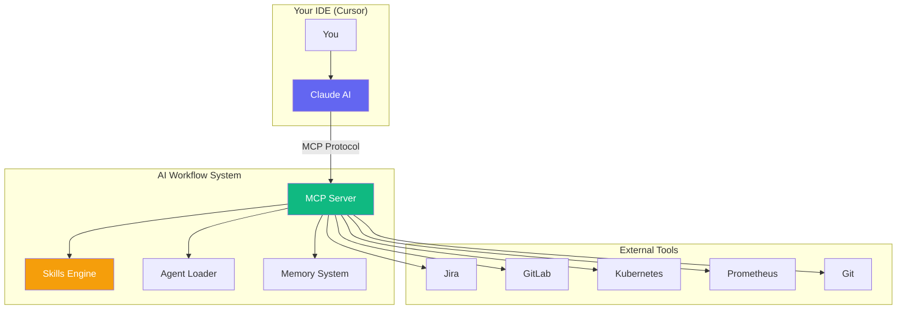
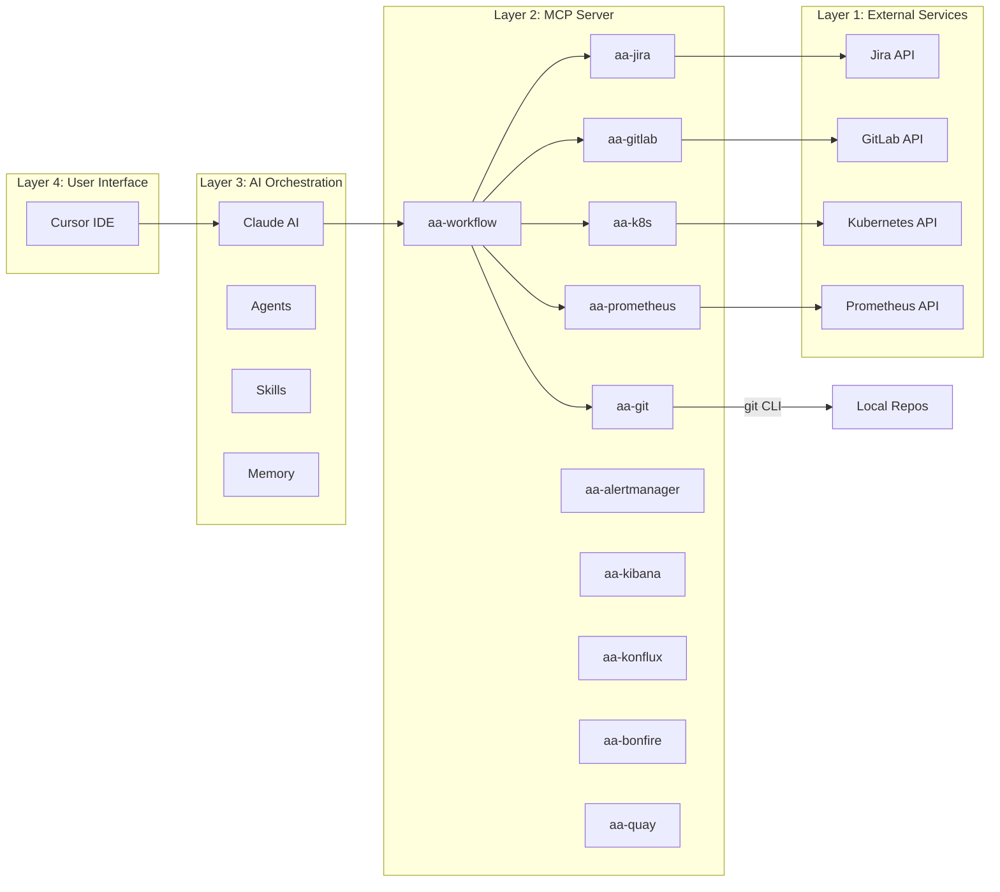
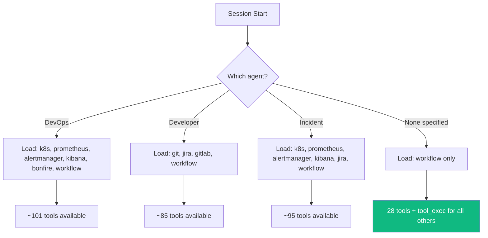
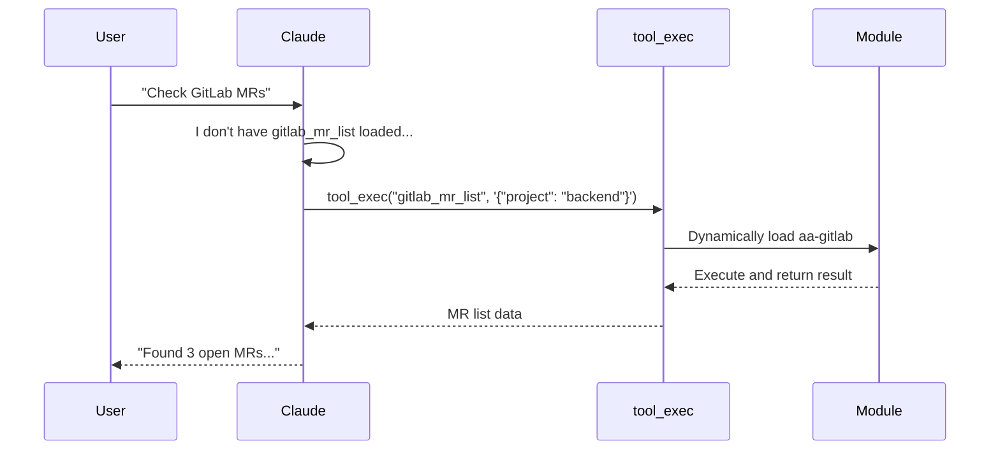
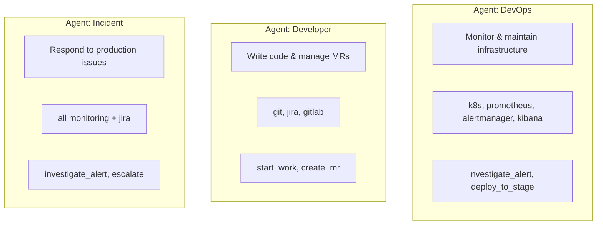
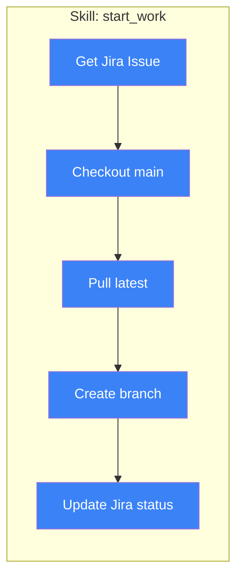
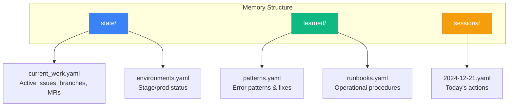

# AI Workflow Assistant

A comprehensive AI-powered development workflow system that integrates with your existing tools (Jira, GitLab, Kubernetes, Prometheus, etc.) through the Model Context Protocol (MCP).

## Table of Contents

- [Overview](#overview)
- [Architecture](#architecture)
- [Quick Start](#quick-start)
- [Components](#components)
  - [MCP Tools](#mcp-tools)
  - [Agents](#agents)
  - [Skills](#skills)
  - [Memory](#memory)
- [Setup Guide](#setup-guide)
- [Usage Examples](#usage-examples)
- [Configuration](#configuration)
- [Extending the System](#extending-the-system)

---

## Overview

This system provides an AI assistant that can:

- 🔧 **Execute real actions** - Create branches, update Jira, deploy to clusters
- 🧠 **Remember context** - Track your work across sessions
- 🎭 **Adopt personas** - DevOps, Developer, Incident Response modes
- 📋 **Run workflows** - Multi-step skills that chain tools together
- 🔍 **Debug mode** - See exactly what's happening step-by-step



---

## Architecture

### High-Level Architecture



### Tool Loading Strategy



### The Meta-Tool Pattern

To work around tool limits, we use a **meta-tool** pattern:



---

## Quick Start

### 1. Add to Your Repository

Create `.cursor/mcp.json` in your project:

```json
{
  "mcpServers": {
    "aa-workflow": {
      "command": "python3",
      "args": [
        "/path/to/ai-workflow/mcp-servers/aa-common/src/server.py",
        "--agent", "developer"
      ]
    }
  }
}
```

### 2. Add Project Rules (Optional)

Copy `.cursorrules` to your project root for automatic session behavior.

### 3. Start Working

Open Cursor and start chatting:

```
You: Start a session

Claude: 🚀 Session Started
        Loading Developer persona...
        Available skills: start_work, create_mr
        
        What would you like to work on?
```

---

## Components

### MCP Tools

The system provides **150+ tools** organized into modules:

| Module | Tools | Purpose |
|--------|-------|---------|
| `git` | 19 | Local git operations (status, commit, branch, etc.) |
| `jira` | 18 | Jira issue management |
| `gitlab` | 26 | GitLab MRs, pipelines, reviews |
| `k8s` | 26 | Kubernetes operations |
| `prometheus` | 13 | Metrics and alerting |
| `alertmanager` | 6 | Alert silencing and management |
| `kibana` | 9 | Log searching and analysis |
| `konflux` | 18 | CI/CD pipeline management |
| `bonfire` | 21 | Ephemeral namespace management |
| `quay` | 8 | Container image registry |
| `workflow` | 28 | Skills, agents, memory, orchestration |

#### Tool Discovery

```
You: What tools are available?

Claude: ## Available Tool Modules

- **git**: 19 tools
- **jira**: 18 tools
- **gitlab**: 26 tools
- **k8s**: 26 tools
...

Use `tool_list(module='git')` to see tools in a module
```

#### Direct Tool Execution

```
You: Execute gitlab_mr_list for the backend project

Claude: [Calls tool_exec("gitlab_mr_list", '{"project": "backend"}')]
        
        Found 3 open MRs:
        - !456 - AAP-12345 - Add new API endpoint (Draft)
        - !457 - AAP-12346 - Fix timeout issue (Ready)
        - !458 - AAP-12347 - Update dependencies (WIP)
```

---

### Agents

Agents are **specialized personas** that focus Claude on specific tasks.



#### Available Agents

| Agent | Focus | Key Tools |
|-------|-------|-----------|
| `developer` | Coding, MRs, Jira | git, jira, gitlab |
| `devops` | Infrastructure, monitoring | k8s, prometheus, alertmanager |
| `incident` | Production issues | All monitoring + jira |
| `release` | Shipping software | gitlab, konflux, quay |

#### Loading an Agent

```
You: Load the devops agent

Claude: ## Loading Agent: devops

        # DevOps Agent
        
        You are a DevOps engineer specializing in Kubernetes, 
        monitoring, and incident response for the Automation 
        Analytics platform.
        
        ## Your Role
        - Monitor application health across stage and production
        - Respond to alerts and investigate issues
        - Manage deployments and rollbacks
        ...
```

---

### Skills

Skills are **reusable multi-step workflows** that chain tools together.



#### Available Skills

| Skill | Purpose | Inputs |
|-------|---------|--------|
| `start_work` | Begin working on a Jira issue | `issue_key`, `repo` |
| `create_mr` | Create merge request with Jira link | `issue_key`, `repo` |
| `investigate_alert` | Systematic alert investigation | `environment` |

#### Running a Skill

```
You: Run the start_work skill for AAP-12345 in the backend repo

Claude: ## 🚀 Executing Skill: start_work

        ### 📝 Execution Log
        
        🔧 **Step 1: get_issue**
           ✅ Success (0.5s)
           Issue: "Implement new API endpoint"
        
        🔧 **Step 2: switch_to_main**
           ✅ Success (0.1s)
        
        🔧 **Step 3: pull_latest**
           ✅ Success (1.2s)
        
        🔧 **Step 4: create_branch**
           ✅ Success (0.1s)
           Branch: aap-12345-implement-new-api-endpoint
        
        🔧 **Step 5: update_status**
           ✅ Success (0.3s)
           Status: In Progress
        
        ---
        ⏱️ Completed in 2.2s | ✅ 5 succeeded
```

#### Debug Mode

```
You: Run that again with debug mode

Claude: [Shows detailed trace with timing for each operation]

        ### 🔍 Debug Log
        ```
        🔍 [0.00s] Starting skill: start_work
        🔍 [0.00s] Inputs: {"issue_key": "AAP-12345", "repo": "backend"}
        🔍 [0.00s] Calling tool: jira_view_issue
        🔍 [0.00s]   → Args: {"issue_key": "AAP-12345"}
        🔍 [0.52s]   → Completed in 0.52s
        🔍 [0.52s] Calling tool: git_checkout
        ...
        ```
```

#### Plan Mode (Preview Without Executing)

```
You: Show me what start_work would do without running it

Claude: ## 📋 Skill Plan: start_work

        ### Steps to Execute
        
        1. **get_issue** → `jira_view_issue`
        2. **switch_to_main** → `git_checkout`
        3. **pull_latest** → `git_pull`
        4. **create_branch** → `git_branch_create`
        5. **update_status** → `jira_set_status`
        
        *Run with `execute=True` to execute this plan*
```

---

### Memory

Memory provides **persistent context** across Claude sessions.



#### Memory Operations

```
# Read current work state
You: What was I working on?
Claude: [Calls memory_read("state/current_work")]

# Log an action
You: Log that I fixed the timeout issue
Claude: [Calls memory_session_log("fix", "Resolved API timeout issue")]

# Update state
You: Add AAP-12345 to my active issues
Claude: [Calls memory_append("state/current_work", "active_issues", {...})]
```

#### Example: Current Work State

```yaml
# memory/state/current_work.yaml
last_updated: "2024-12-21T15:30:00Z"

active_issues:
  - key: AAP-12345
    summary: "Implement new API endpoint"
    status: "In Progress"
    branch: "aap-12345-implement-api"
    repo: "my-backend"

open_mrs:
  - id: 456
    title: "AAP-12345 - Implement new API endpoint"
    url: "https://gitlab.../merge_requests/456"
    pipeline_status: "success"

current_branches:
  my-backend: "aap-12345-implement-api"
```

---

## Setup Guide

### Prerequisites

- Python 3.10+
- Cursor IDE
- Access to your tools (Jira, GitLab, Kubernetes clusters)

### Authentication Setup

The system uses your existing CLI authentication:

| Tool | Auth Source |
|------|-------------|
| Git | SSH keys / git credentials |
| Jira | `~/.jira-token` or `JIRA_TOKEN` env var |
| GitLab | `glab auth` CLI or `GITLAB_TOKEN` |
| Kubernetes | `~/.kube/config` or `KUBECONFIG` |
| Quay | `podman login` / `docker login` |

### Installation

1. **Clone the repository:**
   ```bash
   git clone <repo-url> ~/src/ai-workflow
   cd ~/src/ai-workflow
   ```

2. **Install dependencies:**
   ```bash
   pip install fastmcp pyyaml httpx
   ```

3. **Configure repositories** (edit `config.json`):
   ```json
   {
     "repositories": {
       "backend": {
         "path": "/path/to/my-backend",
         "gitlab_project": "insights-platform/my-app/my-backend"
       }
     }
   }
   ```

4. **Add to your project:**
   ```bash
   mkdir -p /path/to/your/project/.cursor
   cat > /path/to/your/project/.cursor/mcp.json << 'EOF'
   {
     "mcpServers": {
       "aa-workflow": {
         "command": "python3",
         "args": [
           "/path/to/ai-workflow/mcp-servers/aa-common/src/server.py",
           "--agent", "developer"
         ]
       }
     }
   }
   EOF
   ```

5. **Restart Cursor**

---

## Usage Examples

### Daily Development Workflow

```
You: Start a session as a developer

Claude: 🚀 Session Started
        Loading Developer persona...
        
        Current work: No active issues
        Available skills: start_work, create_mr

You: I need to work on AAP-12345

Claude: [Runs start_work skill]
        ✅ Branch created: aap-12345-...
        ✅ Jira status: In Progress
        
        Ready to code! Make your changes, then say 
        "create MR" when ready.

[... you make code changes ...]

You: Create a merge request

Claude: [Runs create_mr skill]
        ✅ Pushed to origin
        ✅ MR created: !456
        ✅ Jira updated with MR link
```

### Incident Response

```
You: Load the incident agent, we have alerts firing in prod

Claude: [Loads incident persona]
        Running investigate_alert for production...
        
        ## 🔍 Investigation Report: production
        
        ### Alerts (2)
        🔴 **HighMemoryUsage** (critical)
           analytics-api pod at 95% memory
        🟠 **SlowResponseTime** (warning)
           P95 latency > 2s
        
        ### Namespace Health
        ⚠️ Issues Detected
        - Pods: 4/5 running (1 restarting)
        
        ### Recommended Actions
        1. Check failing pod: analytics-api-7d8f9...
        2. Consider restart or memory limit increase

You: Restart that pod

Claude: [Calls kubectl_delete_pod]
        ✅ Pod deleted, new pod starting...
        
        [Calls kubectl_get_pods]
        ✅ New pod is Running (0/1 ready, starting up)
        
        Monitoring... should be ready in ~30s.
```

### Exploring Unfamiliar Tools

```
You: What Prometheus tools are available?

Claude: [Calls tool_list(module="prometheus")]

        ## Module: prometheus
        
        **13 tools available:**
        - `prometheus_query`
        - `prometheus_query_range`
        - `prometheus_get_alerts`
        - `prometheus_get_rules`
        - `prometheus_get_targets`
        - `prometheus_check_health`
        ...

You: Query the current CPU usage

Claude: [Calls tool_exec("prometheus_query", '{"query": "..."}')]
        
        Current CPU usage across pods:
        - analytics-api: 45%
        - analytics-worker: 72%
        - analytics-scheduler: 12%
```

---

## Configuration

### Agent Configuration (`agents/*.yaml`)

```yaml
# agents/developer.yaml
name: developer
description: Development workflow specialist
persona: agents/developer.md

tools:
  - git
  - jira
  - gitlab
  - workflow

skills:
  - start_work
  - create_mr
```

### Skill Definition (`skills/*.yaml`)

```yaml
# skills/start_work.yaml
name: start_work
description: Begin working on a Jira issue

inputs:
  - name: issue_key
    type: string
    required: true
  - name: repo
    type: string
    required: true

steps:
  - name: get_issue
    tool: jira_view_issue
    args:
      issue_key: "{{ inputs.issue_key }}"
    output: issue

  - name: create_branch
    tool: git_branch_create
    args:
      repo: "{{ inputs.repo }}"
      branch_name: "{{ issue.key }}-{{ issue.summary | slugify }}"

outputs:
  - name: summary
    value: |
      ✅ Ready to work on {{ inputs.issue_key }}
      Branch: {{ branch_name }}
```

---

## Extending the System

### Adding a New Tool Module

1. Create `mcp-servers/aa-newtool/src/tools.py`:
   ```python
   def register_tools(server):
       @server.tool()
       async def newtool_action(param: str):
           """Do something."""
           return [TextContent(type="text", text="Result")]
       
       return 1  # tool count
   ```

2. Add to prefix mappings in `aa-workflow/src/tools.py`

3. Add to agent configurations as needed

### Adding a New Skill

1. Create `skills/new_skill.yaml`:
   ```yaml
   name: new_skill
   description: What it does
   
   inputs:
     - name: required_input
       required: true
   
   steps:
     - name: step1
       tool: some_tool
       args:
         param: "{{ inputs.required_input }}"
   ```

2. That's it! It's automatically available via `skill_run("new_skill", '...')`

### Adding a New Agent

1. Create `agents/newagent.yaml`:
   ```yaml
   name: newagent
   description: What this agent does
   persona: agents/newagent.md
   
   tools:
     - relevant_module1
     - relevant_module2
     - workflow
   
   skills:
     - relevant_skill
   ```

2. Create `agents/newagent.md` with the persona description

---

## Troubleshooting

### MCP Server Not Loading

1. Check Cursor's MCP panel (bottom-left)
2. Verify the path in `.cursor/mcp.json` is correct
3. Try running the server manually:
   ```bash
   python3 /path/to/server.py --tools workflow --http --port 8080
   ```

### Tool Execution Failing

1. Use debug mode: `skill_run(..., debug=True)`
2. Check authentication for the specific service
3. Verify the tool exists: `tool_list(module="...")`

### Memory Not Persisting

1. Check file permissions in `memory/` directory
2. Verify the path resolution in tools.py

---

## Contributing

1. Fork the repository
2. Create a feature branch
3. Add tests for new functionality
4. Submit a merge request

---

## License

MIT License - See LICENSE file for details.


