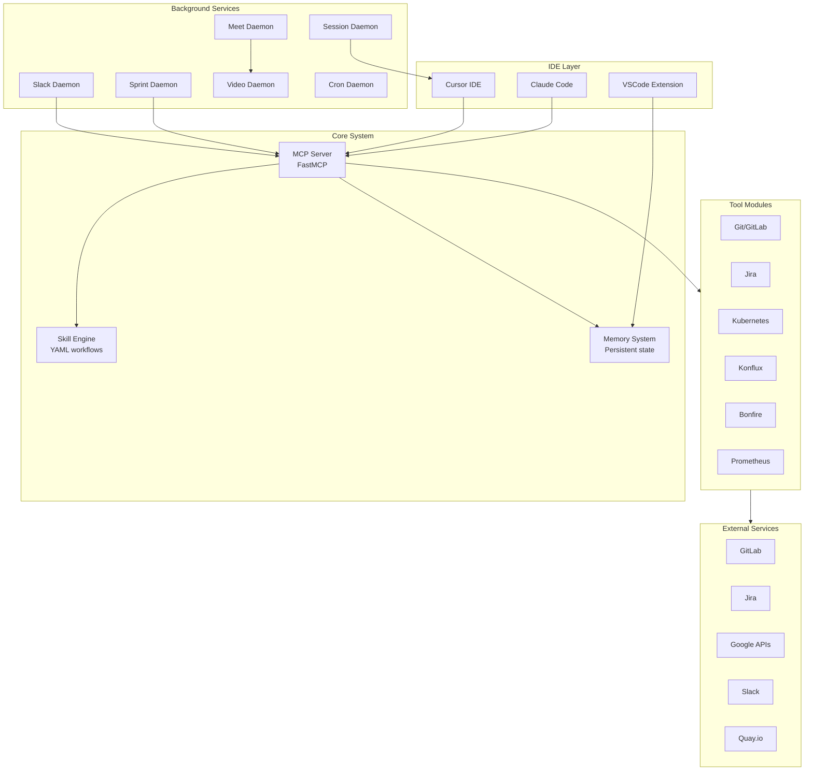
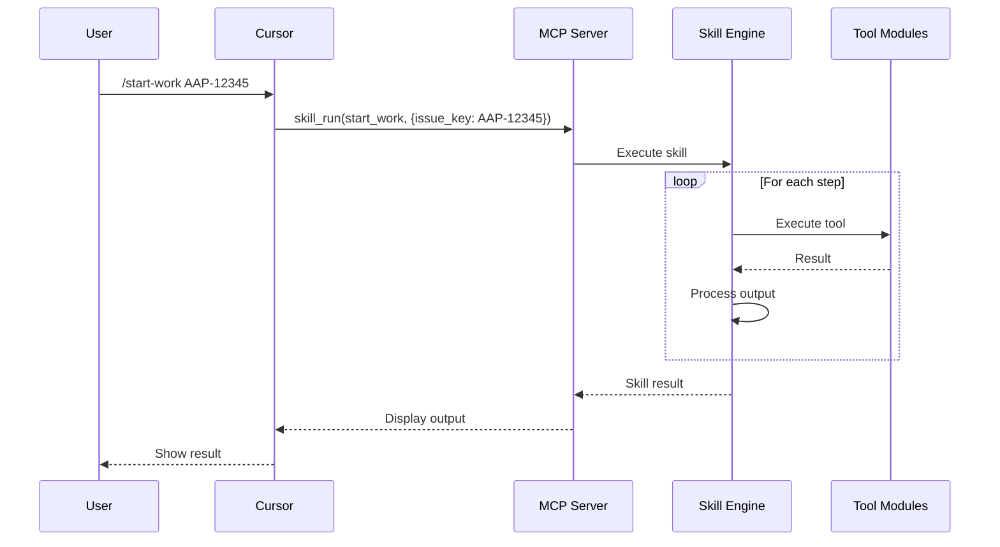
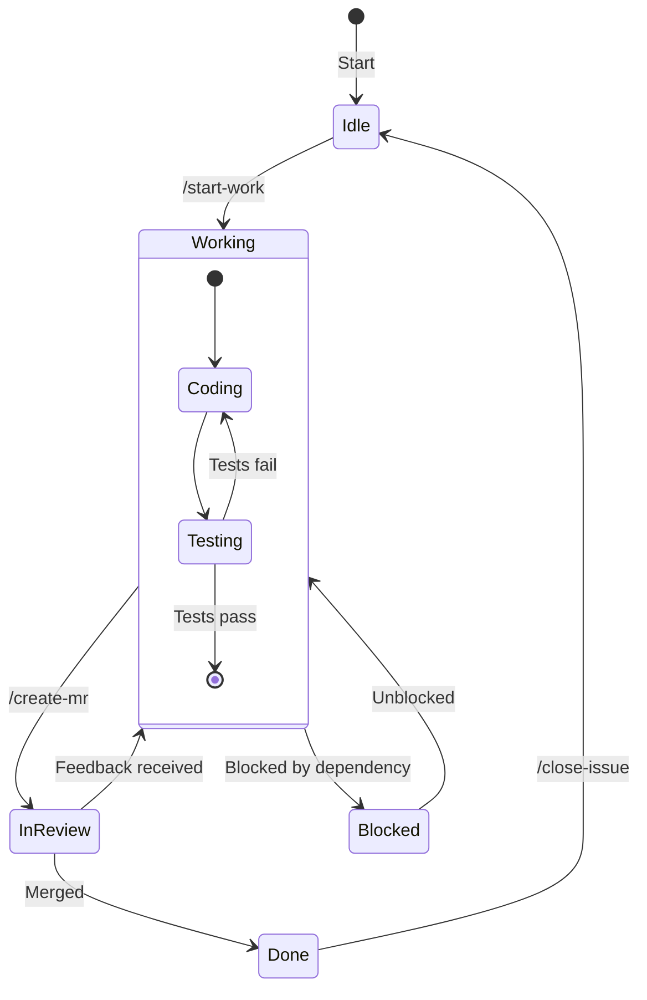
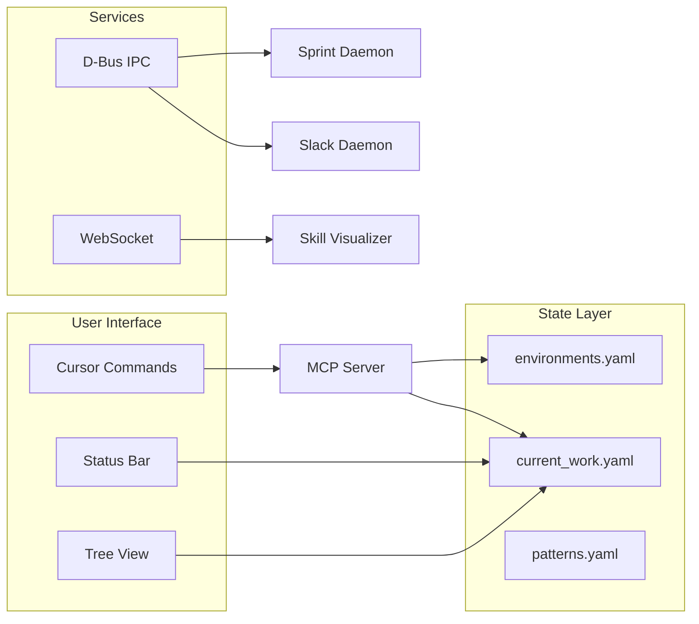

# AI Workflow Documentation

> Comprehensive documentation for the Red Hat AI Workflow system

## Overview

The AI Workflow system is an intelligent development assistant that integrates with Cursor IDE, Claude Code, and various DevOps tools to automate and enhance software development workflows.

### System Statistics

| Component | Count | Description |
|-----------|-------|-------------|
| **Tool Modules** | 27 | MCP tool plugins (aa_git, aa_jira, aa_k8s, etc.) |
| **Total Tools** | 435 | Individual MCP tool functions (294 basic + 90 extra + 51 workflow) |
| **Skills** | 82 | YAML-defined multi-step workflows (78 root + 4 performance) |
| **Personas** | 15 | Specialized AI configuration profiles |
| **Commands** | 130 | Cursor slash commands |
| **Daemons** | 7 | Background services (Slack, Sprint, Meet, Video, Session, Cron, Extension Watcher) |



## Documentation Structure

| Directory | Contents |
|-----------|----------|
| [architecture/](./architecture/) | System design, state management, MCP implementation |
| [daemons/](./daemons/) | Background service documentation |
| [skills/](./skills/) | Skill definitions and usage |
| [tool-modules/](./tool-modules/) | MCP tool module reference |
| [personas/](./personas/) | AI persona configurations |
| [commands/](./commands/) | Cursor slash command reference |
| [scripts/](./scripts/) | Utility and daemon script reference |
| [examples/](./examples/) | Practical examples and tutorials |
| [ai-rules/](./ai-rules/) | AI behavior configuration |
| [plans/](./plans/) | Implementation plans and designs |
| [slides/](./slides/) | Presentation materials |

## Quick Start

### For Users

1. **Start a session**: Use `session_start()` to initialize
2. **Load a persona**: `persona_load("developer")` for coding tasks
3. **Run skills**: `/start-work AAP-12345` to begin work on an issue
4. **Use commands**: Type `/` in Cursor to see available commands

### For Developers

1. Read [DEVELOPMENT.md](./DEVELOPMENT.md) for setup instructions
2. Review [architecture/README.md](./architecture/README.md) for system design
3. Check [tool-modules/README.md](./tool-modules/README.md) for adding tools
4. See [skills/README.md](./skills/README.md) for creating skills

## Core Concepts

### MCP Server

The Model Context Protocol (MCP) server provides tools to Claude/Cursor via a standardized protocol. See [architecture/mcp-implementation.md](./architecture/mcp-implementation.md).

### Skills

Skills are YAML-defined workflows that orchestrate multiple tool calls. See [skills/README.md](./skills/README.md).

```yaml
name: start_work
description: Begin work on a Jira issue
inputs:
  - name: issue_key
    required: true
steps:
  - name: get_issue
    tool: jira_view_issue
    args:
      issue_key: "{{ inputs.issue_key }}"
```

### Personas

Personas configure the AI with specific tools, focus areas, and behaviors. See [personas/README.md](./personas/README.md).

### Memory

The memory system provides persistent state across sessions. See [architecture/state-management.md](./architecture/state-management.md).

### Daemons

Background services that run independently and communicate via D-Bus. See [daemons/README.md](./daemons/README.md).

## Key Documentation

### Architecture

| Document | Description |
|----------|-------------|
| [Architecture Overview](./architecture/README.md) | High-level system design |
| [Architecture Diagrams](./architecture/diagrams.md) | Visual component and data flow diagrams |
| [Server Components](./architecture/server-components.md) | Server module internals |
| [MCP Implementation](./architecture/mcp-implementation.md) | Server and tool architecture |
| [Skill Engine](./architecture/skill-engine.md) | YAML workflow execution |
| [Session Management](./architecture/session-management.md) | Multi-workspace session tracking |
| [State Management](./architecture/state-management.md) | Memory and state files |
| [Memory System](./architecture/memory-system.md) | Persistent context storage |
| [Knowledge System](./architecture/knowledge-system.md) | Project knowledge and learning |
| [Vector Search](./architecture/vector-search.md) | Semantic code search |
| [Auto-Heal System](./architecture/auto-heal.md) | Error detection and recovery |
| [Usage Pattern Learning](./architecture/usage-pattern-learning.md) | Proactive error prevention |
| [Daemons Architecture](./architecture/daemons.md) | Background service design |
| [Cron Scheduler](./architecture/cron-scheduler.md) | Scheduled job execution |
| [VSCode Extension](./architecture/vscode-extension.md) | IDE integration architecture |
| [WebSocket Protocol](./architecture/websocket-protocol.md) | Real-time skill updates |
| [Claude Code Integration](./architecture/claude-code-integration.md) | Skill error recovery in Claude Code |

### Background Services

| Daemon | Description |
|--------|-------------|
| [Slack Daemon](./daemons/slack.md) | Slack message handling and AI responses |
| [Sprint Daemon](./daemons/sprint.md) | Automated Jira issue processing |
| [Meet Daemon](./daemons/meet.md) | Google Meet auto-join and notes |
| [Video Daemon](./daemons/video.md) | Virtual camera rendering |
| [Session Daemon](./daemons/session.md) | Cursor session synchronization |
| [Cron Daemon](./daemons/cron.md) | Scheduled job execution |

### Features

| Feature | Documentation |
|---------|---------------|
| Multi-Agent Code Review | [multi-agent-code-review.md](./multi-agent-code-review.md) |
| Multi-Agent Model Selection | [multiagent-model-selection.md](./multiagent-model-selection.md) |
| Learning Loop | [learning-loop.md](./learning-loop.md) |
| Claude Code Integration | [architecture/claude-code-integration.md](./architecture/claude-code-integration.md) |

### Reference

| Reference | Description |
|-----------|-------------|
| [Commands Reference](./commands/README.md) | 130 Cursor slash commands |
| [Skills Reference](./skills/README.md) | 82 automated workflows |
| [Tool Modules Reference](./tool-modules/README.md) | 435 MCP tools across 27 modules |
| [Personas Reference](./personas/README.md) | 15 AI personas |

## System Requirements

- **Python**: 3.11+
- **Node.js**: 18+ (for VSCode extension)
- **Cursor IDE**: Latest version
- **Claude Code**: Latest version (optional)

### External Services

- **GitLab**: For merge request management
- **Jira**: For issue tracking
- **Slack**: For team communication (optional)
- **Google Calendar**: For meeting management (optional)
- **Kubernetes**: For deployment management

## Configuration

Main configuration files:

| File | Purpose |
|------|---------|
| `config.json` | Project configuration, schedules, services |
| `personas/*.yaml` | Persona definitions |
| `skills/*.yaml` | Skill definitions |
| `.cursorrules` | Cursor IDE AI rules |
| `CLAUDE.md` | Claude Code AI rules |

## Diagrams

### Skill Execution Flow



### State Flow



### Component Interactions



## Contributing

1. Read [DEVELOPMENT.md](./DEVELOPMENT.md) for development setup
2. Follow the code style guidelines
3. Add tests for new features
4. Update documentation for changes
5. Create focused merge requests

## See Also

- [Project README](../README.md) - Main project documentation
- [AGENTS.md](../AGENTS.md) - Cross-tool AI rules
- [Makefile](../Makefile) - Build and development commands
