# 🎭 Agents Reference

Agents are **specialized personas** with curated tool sets. Switch agents to get different capabilities.

## Quick Reference

| Agent | Command | Tools | Focus |
|-------|---------|-------|-------|
| [👨‍💻 developer](./developer.md) | `Load developer agent` | ~80 | Daily coding, PRs |
| [🔧 devops](./devops.md) | `Load devops agent` | ~90 | Deployments, K8s |
| [🚨 incident](./incident.md) | `Load incident agent` | ~78 | Production debugging |
| [📦 release](./release.md) | `Load release agent` | ~69 | Shipping releases |
| [💬 slack](./slack.md) | `Load slack agent` | ~74 | Slack automation |

## How Agents Work

```mermaid
sequenceDiagram
    participant User
    participant Claude
    participant MCP as MCP Server
    participant Cursor
    
    User->>Claude: "Load devops agent"
    Claude->>MCP: agent_load("devops")
    MCP->>MCP: Unload current tools
    MCP->>MCP: Load k8s, bonfire, quay, gitlab
    MCP->>Cursor: tools/list_changed notification
    Cursor->>Cursor: Refresh tool list
    MCP-->>Claude: Agent persona + tool count
    Claude-->>User: "🔧 DevOps agent loaded with 90 tools"
```



## Switching Agents

You can switch agents at any time:

```
You: Load the developer agent
Claude: 👨‍💻 Developer agent loaded (~80 tools)

You: Actually I need to deploy, load devops
Claude: 🔧 DevOps agent loaded (~90 tools)
        [Tools automatically switch!]
```

## Tool Limit

Each agent is designed to stay under Cursor's 128 tool limit:

| Agent | Tool Count | Headroom |
|-------|------------|----------|
| developer | ~80 | 48 |
| devops | ~90 | 38 |
| incident | ~78 | 50 |
| release | ~69 | 59 |
| slack | ~74 | 54 |

## Agent Tool Modules

```mermaid
graph TD
    subgraph Developer["👨‍💻 Developer"]
        D_GIT[git]
        D_GITLAB[gitlab]
        D_JIRA[jira]
        D_CAL[google-calendar]
    end
    
    subgraph DevOps["🔧 DevOps"]
        O_K8S[k8s]
        O_BON[bonfire]
        O_QUAY[quay]
        O_GITLAB[gitlab]
    end
    
    subgraph Incident["🚨 Incident"]
        I_K8S[k8s]
        I_PROM[prometheus]
        I_ALERT[alertmanager]
        I_KIB[kibana]
        I_JIRA[jira]
    end
    
    subgraph Release["📦 Release"]
        R_KON[konflux]
        R_QUAY[quay]
        R_APP[appinterface]
        R_GIT[git]
    end
    
    style Developer fill:#3b82f6,stroke:#2563eb,color:#fff
    style DevOps fill:#10b981,stroke:#059669,color:#fff
    style Incident fill:#ef4444,stroke:#dc2626,color:#fff
    style Release fill:#8b5cf6,stroke:#7c3aed,color:#fff
```



## Core Tools (Always Available)

These tools are available regardless of which agent is loaded:

| Tool | Purpose |
|------|---------|
| `agent_load` | Switch to a different agent |
| `agent_list` | List available agents |
| `session_start` | Initialize session with context |
| `debug_tool` | Self-healing tool debugger |
| `skill_run` | Execute a skill |
| `skill_list` | List available skills |

## Agent Variants

Several agents have "slim" variants with fewer tools for better performance:

| Variant | Base Agent | Description |
|---------|------------|-------------|
| `developer-slim` | developer | Core dev tools only |
| `devops-slim` | devops | Essential k8s/deploy tools |
| `incident-slim` | incident | Fast incident response |
| `release-slim` | release | Streamlined release flow |

**Special Agents:**

| Agent | Description |
|-------|-------------|
| `core` | Minimal set - just workflow tools |
| `combined` | All tools from multiple agents |
| `universal` | Kitchen sink - all available tools |

> ⚠️ `universal` may exceed Cursor's 128 tool limit

## Agent Configuration

Agents are defined in YAML files in the `agents/` directory:

```yaml
name: developer
description: Coding, PRs, and code review
persona: agents/developer.md

tools:
  - git             # 15 tools
  - gitlab          # 35 tools
  - jira            # 24 tools
  - google-calendar # 6 tools

skills:
  - coffee
  - start_work
  - create_mr
  # ...
```

## See Also

- [MCP Servers](../mcp-servers/README.md) - Tool modules
- [Skills](../skills/README.md) - Available workflows


