# 🏗️ Architecture Overview

This document describes the comprehensive architecture of the AI Workflow system - an MCP server with background daemons, IDE integration, and intelligent auto-healing.

## Terminology

| Term | Meaning in This Project |
|------|------------------------|
| **Agent / Persona** | A tool configuration profile that determines which MCP tools are loaded (e.g., developer, devops, incident). NOT a separate AI instance. |
| **Tool Module** | A plugin directory containing MCP tool implementations (e.g., `aa_git/`, `aa_jira/`). |
| **Skill** | A YAML-defined multi-step workflow that chains tools together. |
| **Memory** | Persistent YAML files that maintain context across Claude sessions. |
| **Auto-Heal** | Automatic detection and remediation of VPN/auth failures. |
| **Daemon** | Background service (Slack, Sprint, Meet, Video, Session, Cron) with D-Bus IPC. |
| **Session** | A unique chat context within a workspace (multiple chats per workspace). |

> **Important:** This is a **single-agent system** with dynamic tool loading. When you "load an agent," you're changing which tools Claude has access to, not spawning a separate AI. The term "agent" refers to adopting a persona/role.

## System Overview

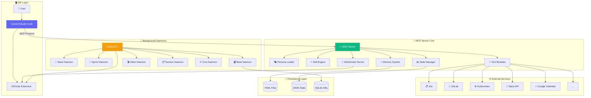

## The Seven Pillars

### Tools (435 across 27 modules)

Individual MCP tool functions that perform specific actions:

- **435 tools** split into **294 basic** (68%) and **90 extra** (21%) plus **51 workflow core** (11%)
- Basic tools loaded by default, reducing context window by 30%
- Each tool wrapped with `@auto_heal` decorators for self-healing
- Shared utilities in `server/utils.py`

### Personas (15 profiles)

Specialized tool configuration profiles:

| Persona | Focus | Tool Count | Key Modules |
|---------|-------|------------|-------------|
| developer | Coding, PRs | ~78 | git, gitlab, jira, workflow |
| devops | Deployments, K8s | ~74 | k8s, bonfire, quay, gitlab |
| incident | Production debugging | ~78 | prometheus, kibana, k8s, alertmanager |
| release | Shipping | ~91 | konflux, quay, appinterface, k8s |
| slack | Slack bot daemon | ~85 | slack, jira, gitlab, workflow |
| universal | All-in-one | ~100 | All primary tools combined |
| admin | Administrative | ~60 | concur, google_calendar, slack |
| code | Pure coding | ~50 | git, lint, code_search |
| meetings | Scheduling | ~45 | google_calendar, meet_bot |
| observability | Monitoring | ~35 | prometheus, kibana |
| performance | Quarterly reviews | ~55 | performance, jira |
| project | Knowledge | ~40 | knowledge, project, code_search |
| researcher | Research | ~50 | code_search, knowledge, ollama |
| core | Shared base | ~84 | workflow, git, jira |
| workspace | Sessions | ~45 | workflow, project |

### Skills (82 workflows)

Multi-step workflows that chain tools:

- YAML-defined with Jinja2 templating
- Conditional logic and branching
- Auto-heal patterns for VPN/auth issues
- **45+ shared parsers** in `scripts/common/parsers.py`
- **Config helpers** in `scripts/common/config_loader.py`

### 💾 Memory (Persistent Context)

Structured persistence across sessions:

```
memory/
├── state/                    # Active work tracking
│   ├── current_work.yaml     # Issues, branches, MRs
│   ├── environments.yaml     # Stage/prod health
│   └── shared_context.yaml   # Cross-session context
├── learned/                  # Machine learning
│   ├── patterns.yaml         # Error patterns
│   ├── tool_failures.yaml    # Auto-heal history
│   ├── tool_fixes.yaml       # Known fixes
│   └── usage_patterns.yaml   # Usage pattern learning
├── knowledge/                # Project expertise
│   └── personas/             # Per-persona knowledge
└── sessions/                 # Session logs
```

### 🔄 Auto-Heal (5-Layer System)

Sophisticated automatic remediation:

| Layer | Component | Function |
|-------|-----------|----------|
| 1 | Tool Decorators | VPN/auth detection and retry |
| 2 | Skill Patterns | YAML-based error handling |
| 3 | Auto-Debug | Source code analysis and fixes |
| 4 | Memory Learning | Store successful fixes |
| 5 | Usage Patterns | Prevent mistakes before they happen |

### 🤖 Daemons (6 services)

Background services with D-Bus IPC:

| Daemon | Service Name | Purpose |
|--------|--------------|---------|
| Slack | `com.aiworkflow.BotSlack` | Message monitoring & AI response |
| Sprint | `com.aiworkflow.BotSprint` | Automated issue processing |
| Meet | `com.aiworkflow.BotMeet` | Google Meet auto-join & notes |
| Video | `com.aiworkflow.BotVideo` | Virtual camera rendering |
| Session | `com.aiworkflow.BotSession` | Cursor chat synchronization |
| Cron | `com.aiworkflow.BotCron` | Scheduled job execution |

### 🖥️ IDE Integration

VSCode extension providing:

- Status bar with 7 indicators (VPN, Agent, Slack, Issue, Environment, MR, Namespace)
- Workflow Explorer sidebar
- Memory viewer
- Real-time skill execution visualization
- WebSocket connection for live updates

## Component Architecture

### MCP Server (`server/`)

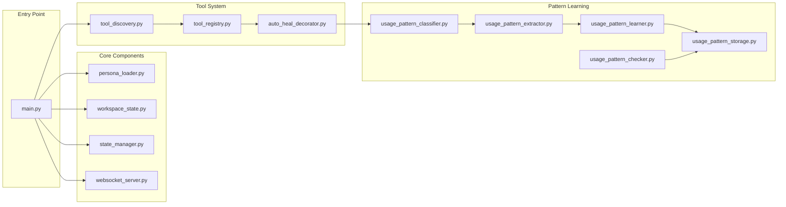

### Dynamic Persona Loading

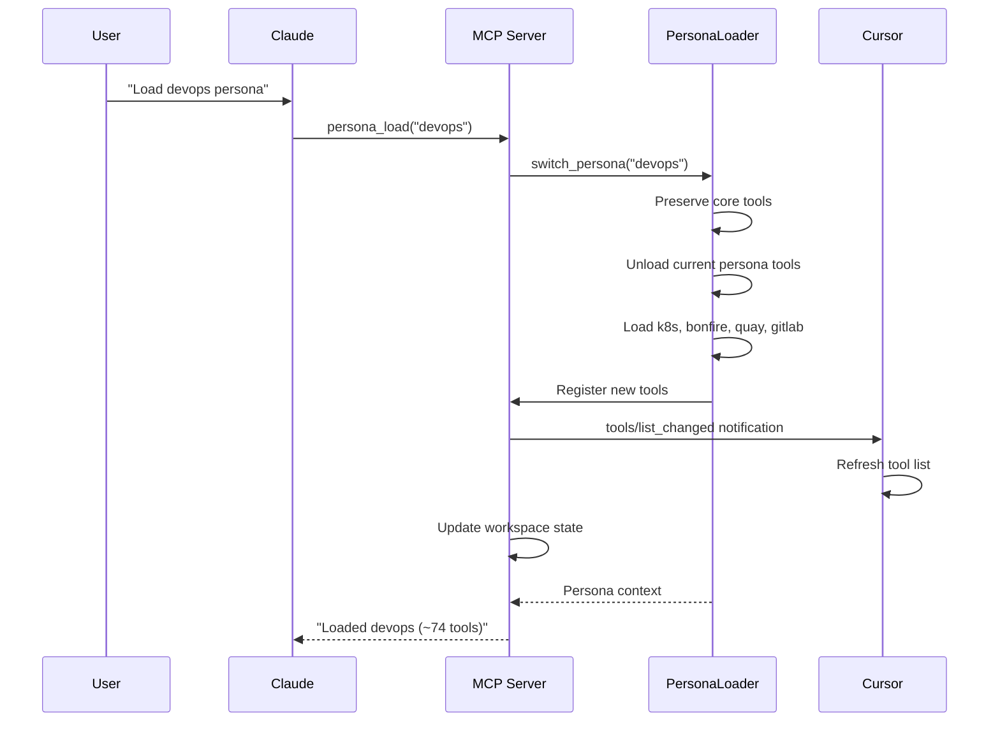

### Multi-Session Management

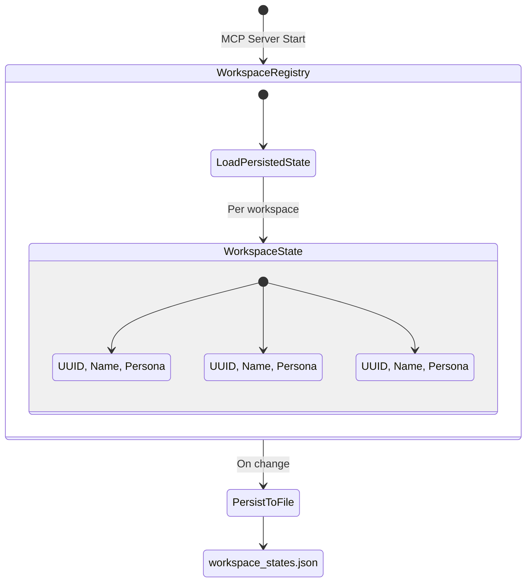

## Tool Modules

```text
tool_modules/
├── aa_workflow/        # Core: agents, skills, memory, vpn (18 tools)
├── aa_git/             # Git operations (30 tools)
├── aa_gitlab/          # GitLab MRs, pipelines (30 tools)
├── aa_jira/            # Jira issues, transitions (28 tools)
├── aa_k8s/             # Kubernetes operations (28 tools)
├── aa_bonfire/         # Ephemeral environments (20 tools)
├── aa_konflux/         # Tekton pipelines (35 tools)
├── aa_quay/            # Container registry (8 tools)
├── aa_prometheus/      # Metrics queries (13 tools)
├── aa_alertmanager/    # Alert management (7 tools)
├── aa_kibana/          # Log search (9 tools)
├── aa_google_calendar/ # Calendar & meetings (6 tools)
├── aa_gmail/           # Email processing (6 tools)
├── aa_slack/           # Slack integration (10 tools)
├── aa_appinterface/    # GitOps config (7 tools)
├── aa_lint/            # Linting tools (7 tools)
├── aa_dev_workflow/    # Dev helpers (9 tools)
├── aa_code_search/     # Semantic search (5 tools)
├── aa_performance/     # Performance tracking (4 tools)
├── aa_meet_bot/        # Meet bot control (6 tools)
└── aa_ollama/          # Local LLM inference (3 tools)
```

## Auto-Heal Architecture

### Layer 1-3: Tool-Level Healing

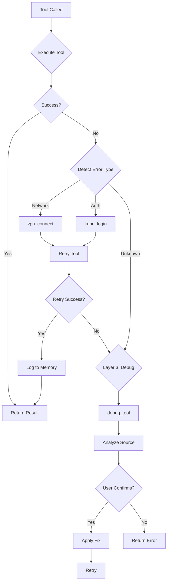

### Layer 4-5: Learning System

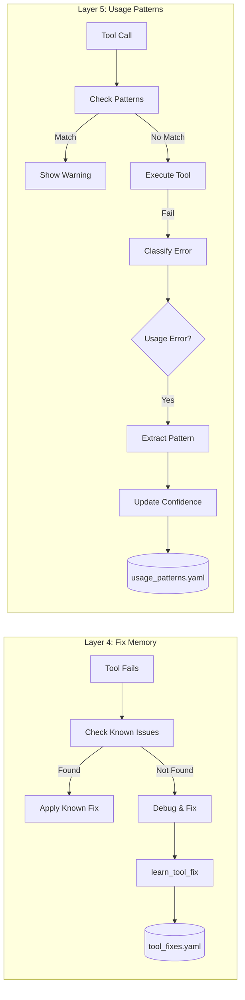

### Auto-Heal Decorators

| Decorator | Environment | Use Case |
|-----------|-------------|----------|
| `@auto_heal()` | Auto-detect | General tools |
| `@auto_heal_ephemeral()` | Ephemeral | Bonfire namespace tools |
| `@auto_heal_konflux()` | Konflux | Tekton pipeline tools |
| `@auto_heal_k8s()` | Stage/Prod | Kubectl tools |
| `@auto_heal_stage()` | Stage | Prometheus, Alertmanager |
| `@auto_heal_jira()` | - | Jira tools (auth only) |
| `@auto_heal_git()` | - | Git/GitLab tools (VPN only) |

## Daemon Architecture

### D-Bus Service Pattern

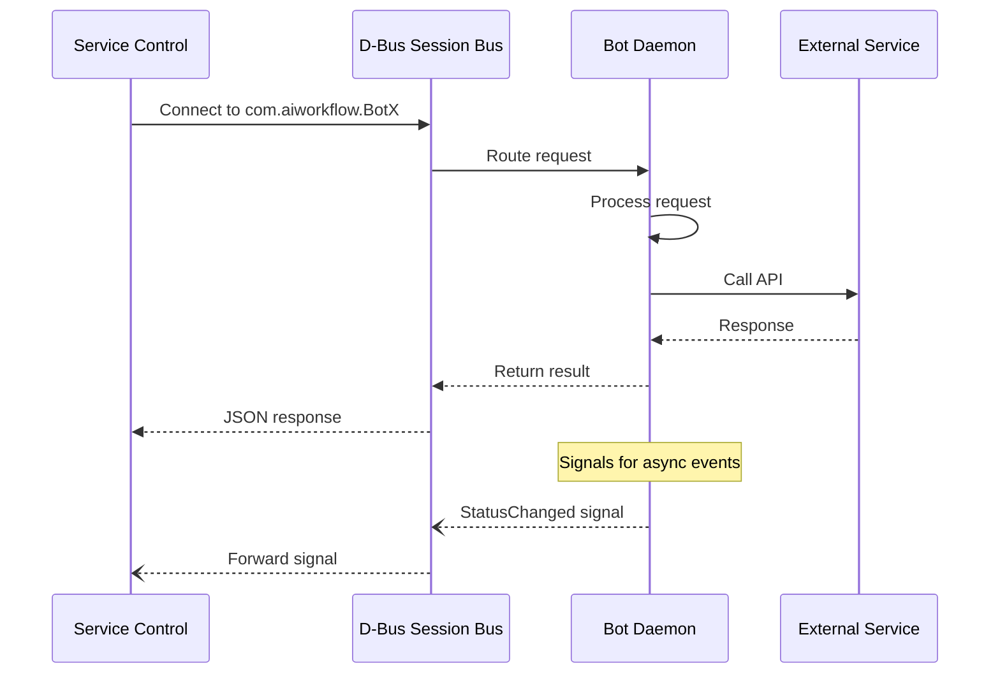

### Daemon State Flow

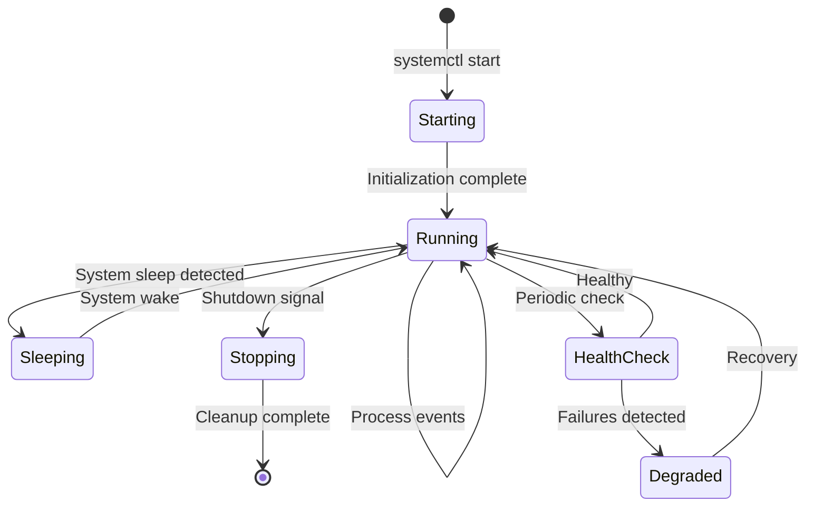

## State Management

### State Files Location

All state files stored in `~/.config/aa-workflow/`:

| File | Owner | Purpose |
|------|-------|---------|
| `state.json` | StateManager | Runtime toggles (services, jobs, meetings) |
| `workspace_states.json` | WorkspaceRegistry | Sessions and workspace context |
| `session_state.json` | Session Daemon | Cursor chat sync |
| `sprint_state_v2.json` | Sprint Daemon | Issue processing state |
| `meet_state.json` | Meet Daemon | Calendar and meeting state |
| `cron_state.json` | Cron Daemon | Job scheduling state |
| `slack_state.db` | Slack Daemon | Message history (SQLite) |
| `meetings.db` | Meet Daemon | Transcripts and notes (SQLite) |

### StateManager Pattern

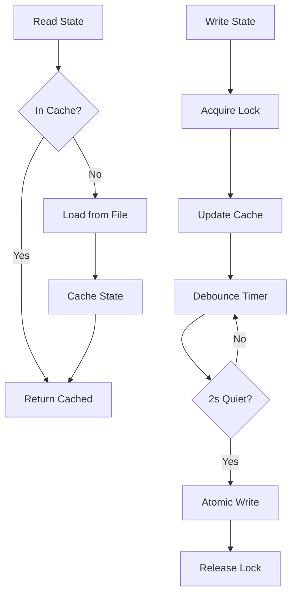

## VSCode Extension Architecture

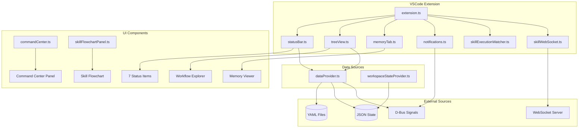

## Configuration

Central configuration via `config.json`:

| Section | Purpose |
|---------|---------|
| `repositories` | Local repo paths and GitLab projects |
| `jira` | Jira URL, project settings |
| `kubernetes.environments` | Kubeconfig paths per environment |
| `slack` | Tokens, channels, alert channels |
| `google` | Calendar API settings |
| `user` | Username, email, aliases |
| `commit` | Format pattern and valid types |
| `schedules` | Cron job definitions |
| `personas` | Tool module mappings |

## Data Flow: Complete Request

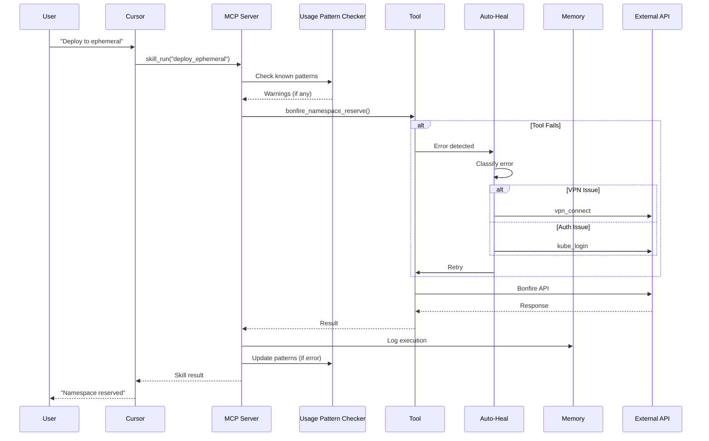

## See Also

- [Architecture Diagrams](./diagrams.md) - Visual diagrams of components and data flows
- [Server Components](./server-components.md) - Server internals
- [MCP Implementation](./mcp-implementation.md) - Server code details
- [Skill Engine](./skill-engine.md) - Skill execution
- [Memory System](./memory-system.md) - Persistent context storage
- [State Management](./state-management.md) - Runtime state persistence
- [Session Management](./session-management.md) - Multi-chat handling
- [Knowledge System](./knowledge-system.md) - Project knowledge
- [Vector Search](./vector-search.md) - Semantic code search
- [Auto-Heal System](./auto-heal.md) - Error recovery (Layers 1-4)
- [Usage Pattern Learning](./usage-pattern-learning.md) - Proactive prevention (Layer 5)
- [Daemon Architecture](./daemons.md) - Background services
- [Cron Scheduler](./cron-scheduler.md) - Scheduled jobs
- [VSCode Extension](./vscode-extension.md) - IDE integration
- [WebSocket Protocol](./websocket-protocol.md) - Real-time updates
- [Claude Code Integration](./claude-code-integration.md) - Skill error recovery
- [Skills Reference](../skills/README.md) - All available skills
- [Development Guide](../DEVELOPMENT.md) - Contributing guidelines
