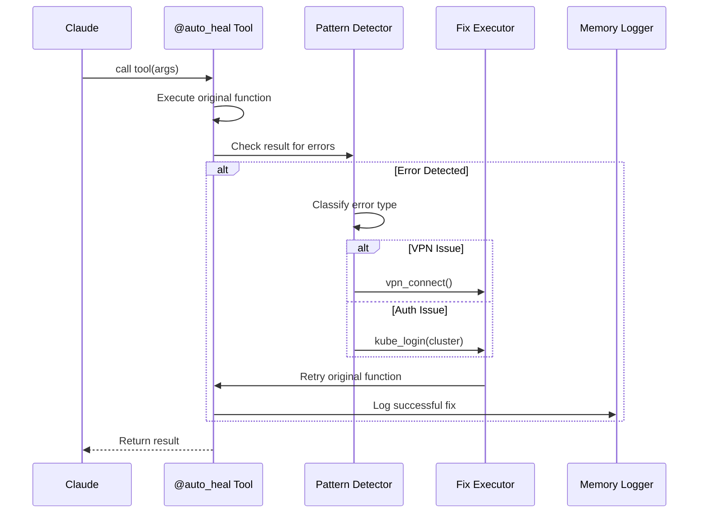
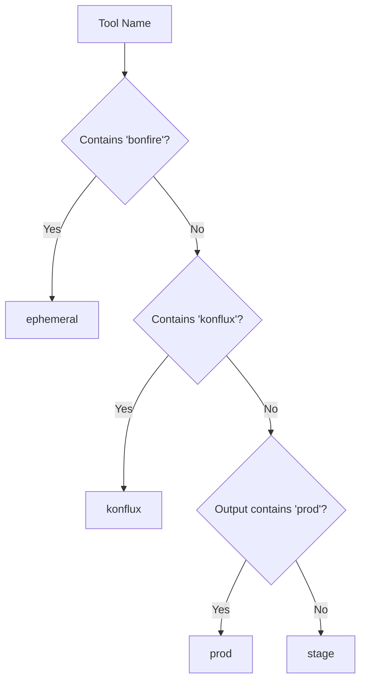
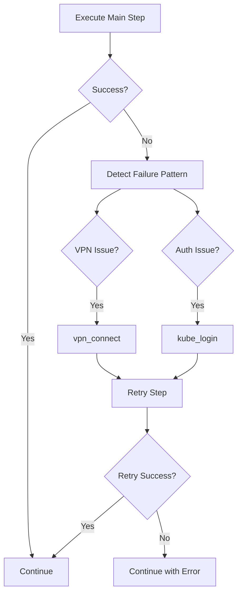
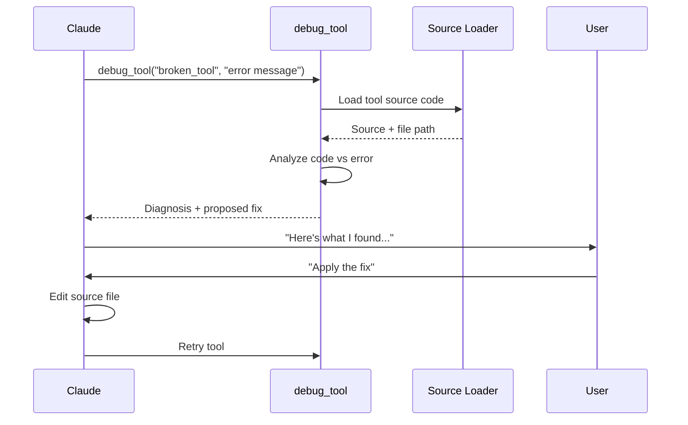
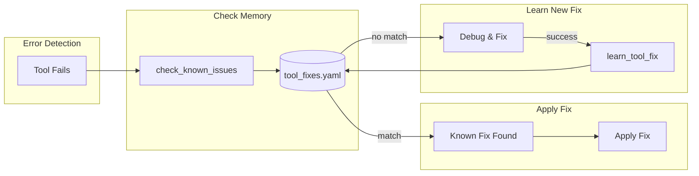
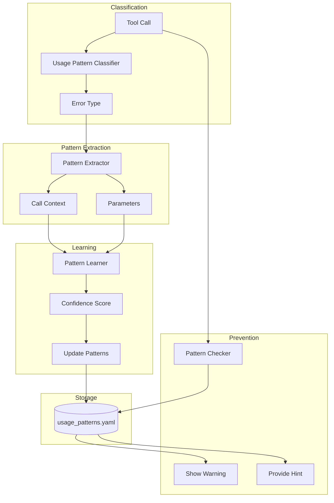
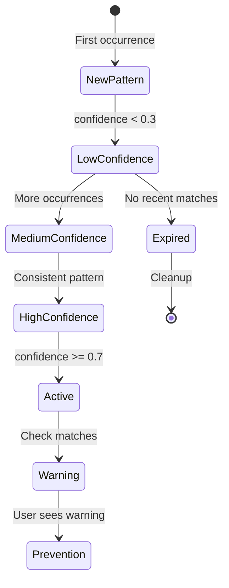
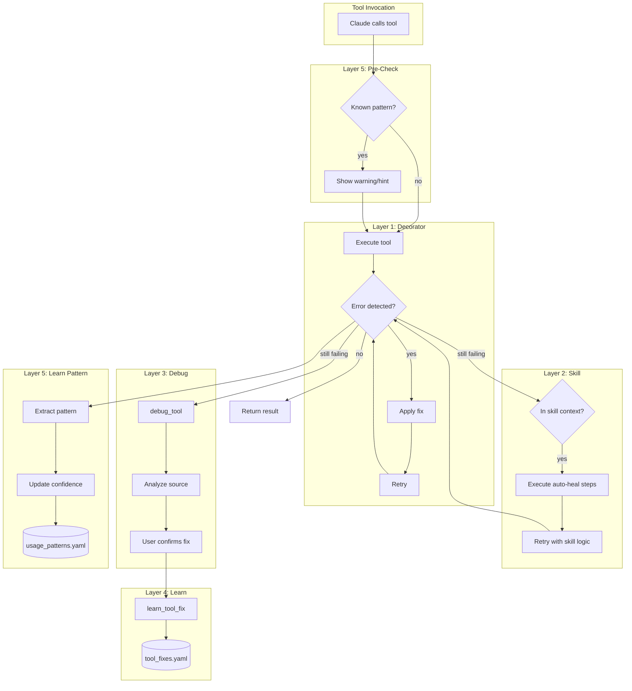

# Auto-Heal System Architecture

The Auto-Heal system provides automatic error detection, remediation, and learning for tool failures. It operates at multiple layers to ensure robust self-recovery.

## Overview

```mermaid
graph TB
    subgraph Layer1["Layer 1: Tool Decorators"]
        DEC[auto_heal Decorator]
        DETECT[Pattern Detection]
        FIX[Apply Fix]
        RETRY[Retry Tool]
    end

    subgraph Layer2["Layer 2: Skill Patterns"]
        SKILL[Skill YAML]
        COND[Conditional Steps]
        VPN[vpn_connect Step]
        AUTH[kube_login Step]
    end

    subgraph Layer3["Layer 3: Auto-Debug"]
        DEBUG[debug_tool]
        SOURCE[Source Analysis]
        PATCH[User-Confirmed Fix]
    end

    subgraph Layer4["Layer 4: Memory Learning"]
        CHECK[check_known_issues]
        LEARN[learn_tool_fix]
        FIXES[(tool_fixes.yaml)]
    end

    subgraph Layer5["Layer 5: Usage Patterns"]
        CLASSIFIER[Pattern Classifier]
        EXTRACTOR[Pattern Extractor]
        LEARNER[Pattern Learner]
        CHECKER[Pattern Checker]
        STORAGE[(usage_patterns.yaml)]
    end

    DEC --> DETECT
    DETECT --> FIX
    FIX --> RETRY

    SKILL --> COND
    COND --> VPN
    COND --> AUTH

    DEBUG --> SOURCE
    SOURCE --> PATCH

    CHECK --> FIXES
    LEARN --> FIXES

    CLASSIFIER --> EXTRACTOR
    EXTRACTOR --> LEARNER
    LEARNER --> STORAGE
    CHECKER --> STORAGE

    style DEC fill:#10b981,stroke:#059669,color:#fff
    style SKILL fill:#6366f1,stroke:#4f46e5,color:#fff
    style DEBUG fill:#f59e0b,stroke:#d97706,color:#fff
```



## The Five Layers

### Layer 1: Tool Decorators

**Location**: `server/auto_heal_decorator.py`

The `@auto_heal` decorator wraps MCP tool functions to automatically detect and fix common failures.



#### Error Patterns

| Category | Patterns | Fix |
|----------|----------|-----|
| **Network** | `no route to host`, `connection refused`, `timeout`, `dial tcp`, `network unreachable` | `vpn_connect()` |
| **Auth** | `unauthorized`, `401`, `403`, `forbidden`, `token expired`, `permission denied` | `kube_login(cluster)` |

#### Decorator Variants

```python
from server.auto_heal_decorator import (
    auto_heal,           # Generic, auto-detect cluster
    auto_heal_ephemeral, # Ephemeral cluster (Bonfire)
    auto_heal_stage,     # Stage cluster
    auto_heal_konflux,   # Konflux cluster
)

@auto_heal(cluster="auto", max_retries=1)
@registry.tool()
async def my_tool(param: str) -> str:
    """Tool with auto-healing enabled."""
    ...
```

#### Cluster Detection



### Layer 2: Skill Patterns

**Location**: Skill YAML files in `skills/`

Skills include explicit auto-heal blocks for step-level error recovery.

```yaml
# Example auto-heal pattern in skill YAML
steps:
  - id: main_operation
    tool: bonfire_deploy
    args:
      namespace: "{{ namespace }}"
    on_error: continue

  # ========== AUTO-HEAL PATTERN ==========
  - id: detect_failure
    condition: "main_operation and '❌' in str(main_operation)"
    compute: |
      error_text = str(main_operation)[:300].lower()
      result = {
        "needs_vpn": any(x in error_text for x in ['no route', 'timeout', 'network']),
        "needs_auth": any(x in error_text for x in ['unauthorized', '401', 'forbidden']),
      }
    output: failure_info

  - id: fix_vpn
    condition: "failure_info and failure_info.get('needs_vpn')"
    tool: vpn_connect
    on_error: continue

  - id: fix_auth
    condition: "failure_info and failure_info.get('needs_auth')"
    tool: kube_login
    args:
      cluster: ephemeral
    on_error: continue

  - id: retry_operation
    condition: "failure_info"
    tool: bonfire_deploy
    args:
      namespace: "{{ namespace }}"
    output: main_operation_retry
  # ========== END AUTO-HEAL ==========
```



### Layer 3: Auto-Debug

**Location**: `server/debuggable.py`

When layers 1-2 fail, the `debug_tool` analyzes the source code and proposes fixes.



#### Debug Tool Output

```python
debug_tool(
    tool_name="bonfire_namespace_reserve",
    error_message="manifest unknown: quay.io/org/app:abc123"
)

# Returns:
# {
#   "tool_name": "bonfire_namespace_reserve",
#   "source_file": "tool_modules/aa_bonfire/src/tools_basic.py",
#   "source_code": "...",
#   "error_message": "manifest unknown...",
#   "diagnosis": "Short SHA doesn't exist in Quay",
#   "proposed_fix": "Use full 40-char SHA"
# }
```

### Layer 4: Memory Learning

**Location**: `memory/learned/`

Stores successful fixes for future reference.



#### tool_fixes.yaml Structure

```yaml
tool_fixes:
  - tool_name: bonfire_deploy
    error_pattern: "manifest unknown"
    root_cause: "Short SHA doesn't exist in Quay"
    fix_description: "Use full 40-character SHA instead of short SHA"
    discovered_at: "2026-01-20T10:00:00Z"
    confidence: high

  - tool_name: k8s_get_pods
    error_pattern: "connection refused"
    root_cause: "Cluster API server unreachable"
    fix_description: "Check VPN connection and cluster health"
    discovered_at: "2026-01-22T14:00:00Z"
    confidence: high
```

#### tool_failures.yaml Structure

```yaml
failures:
  - timestamp: "2026-01-26T10:30:00Z"
    tool: bonfire_deploy
    error: "manifest unknown: quay.io/org/app:abc123"
    context:
      namespace: ephemeral-xyz
      mr_id: 1459
    resolution: "Used full SHA"
    auto_healed: false

stats:
  total_failures: 42
  auto_fixed: 35
  manual_required: 7
  daily:
    "2026-01-26":
      total: 5
      auto_fixed: 4
  weekly:
    "2026-W04":
      total: 15
      auto_fixed: 12
```

### Layer 5: Usage Pattern Learning

**Location**: `server/usage_pattern_*.py`

The most sophisticated layer - learns from usage patterns to prevent errors before they happen.



#### Components

| Component | File | Purpose |
|-----------|------|---------|
| Classifier | `usage_pattern_classifier.py` | Categorizes errors by type |
| Extractor | `usage_pattern_extractor.py` | Extracts patterns from failures |
| Learner | `usage_pattern_learner.py` | Updates pattern confidence |
| Checker | `usage_pattern_checker.py` | Checks before tool execution |
| Storage | `usage_pattern_storage.py` | Persists patterns to YAML |

#### Pattern Lifecycle



## Auto-Heal Flow

### Complete Flow Diagram



## Configuration

### Auto-Heal Settings

```json
{
  "auto_heal": {
    "enabled": true,
    "max_retries": 1,
    "vpn_script": "~/src/redhatter/src/redhatter_vpn/vpn-connect",
    "clusters": {
      "stage": "~/.kube/config.s",
      "prod": "~/.kube/config.p",
      "ephemeral": "~/.kube/config.e",
      "konflux": "~/.kube/config.k"
    }
  }
}
```

### Memory Files

| File | Purpose |
|------|---------|
| `memory/learned/tool_failures.yaml` | Failure history and stats |
| `memory/learned/tool_fixes.yaml` | Known fixes |
| `memory/learned/patterns.yaml` | Error patterns |
| `memory/learned/usage_patterns.yaml` | Layer 5 patterns |

## Statistics and Monitoring

### Failure Statistics

```yaml
# memory/learned/tool_failures.yaml
stats:
  total_failures: 150
  auto_fixed: 120
  manual_required: 30
  fix_rate: 0.80  # 80% auto-fixed

  by_type:
    network: 80
    auth: 55
    unknown: 15

  daily:
    "2026-01-26":
      total: 12
      auto_fixed: 10
    "2026-01-25":
      total: 15
      auto_fixed: 13

  weekly:
    "2026-W04":
      total: 45
      auto_fixed: 38
```

### Health Monitoring

```python
# Check auto-heal health
memory_stats()

# Returns:
# {
#   "auto_heal_rate": 0.80,
#   "patterns_active": 25,
#   "fixes_learned": 12,
#   "recent_failures": [...]
# }
```

## Best Practices

### 1. Always Use Decorators

```python
# Good: Tool has auto-heal
@auto_heal(cluster="ephemeral")
@registry.tool()
async def my_k8s_tool(...):
    ...

# Bad: No auto-heal
@registry.tool()
async def my_k8s_tool(...):
    ...
```

### 2. Include Skill Auto-Heal

Every skill accessing external services should include auto-heal blocks:

```yaml
# Required for production skills
steps:
  - id: main_step
    tool: external_tool
    on_error: continue  # Required!

  - id: detect_failure
    condition: "main_step and '❌' in str(main_step)"
    compute: |
      # Detect failure type
      ...

  - id: fix_and_retry
    condition: "failure_info"
    # Apply fix and retry
    ...
```

### 3. Learn from Fixes

After manually fixing an issue:

```python
learn_tool_fix(
    tool_name="problematic_tool",
    error_pattern="specific error text",
    root_cause="why it happened",
    fix_description="what fixed it"
)
```

### 4. Check Before Debugging

```python
# Always check memory first
check_known_issues(
    tool_name="failing_tool",
    error_text="the error message"
)
```

## See Also

- [Architecture Overview](./README.md) - System overview
- [MCP Implementation](./mcp-implementation.md) - Tool architecture
- [Skill Engine](./skill-engine.md) - Skill execution
- [Memory System](./memory-system.md) - Persistence
- [Usage Pattern Learning](./usage-pattern-learning.md) - Layer 5 details
