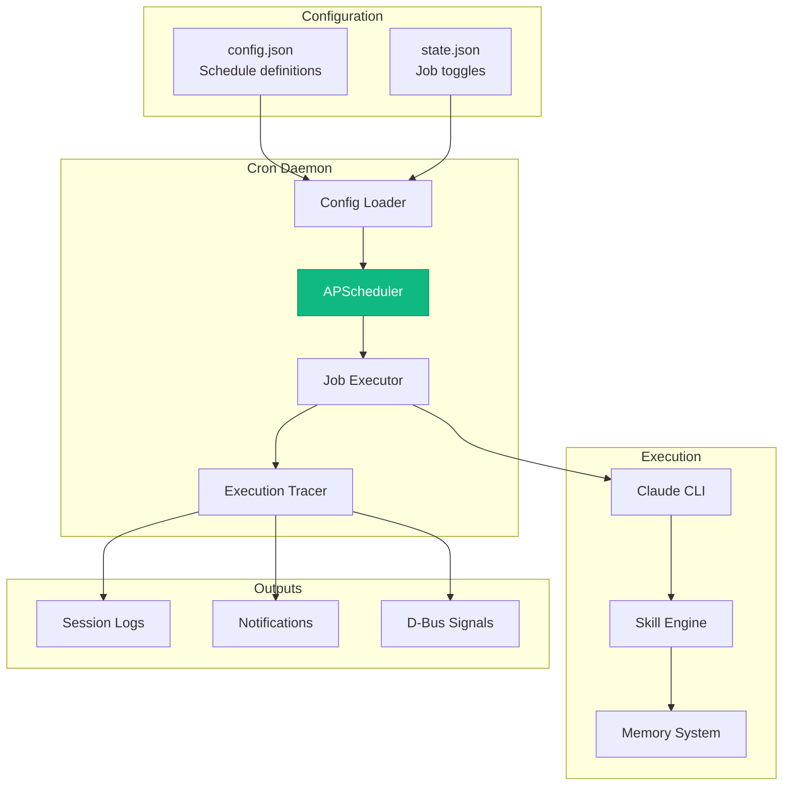
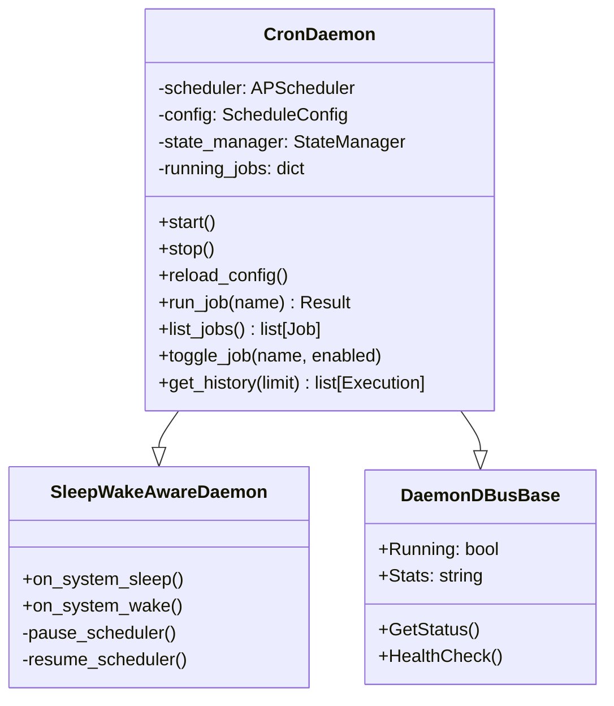
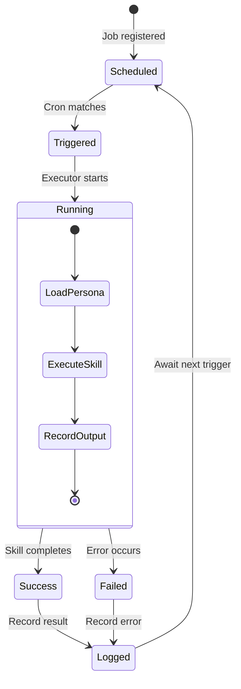
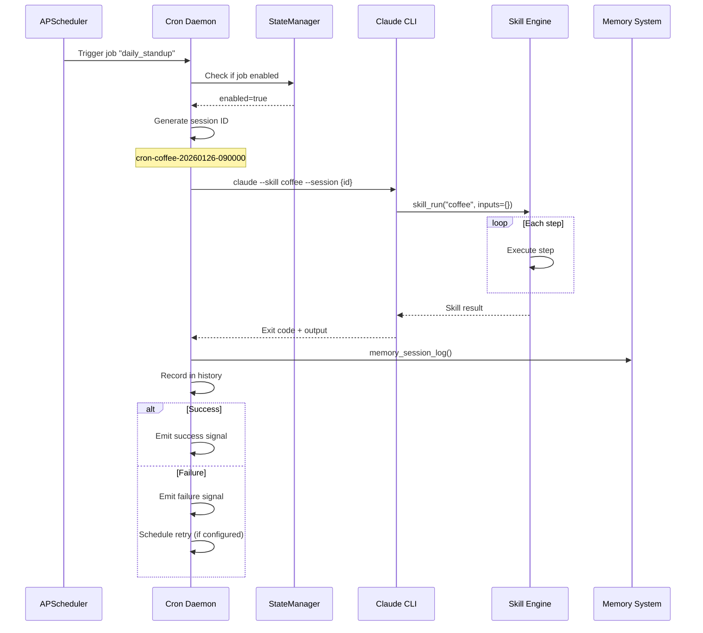
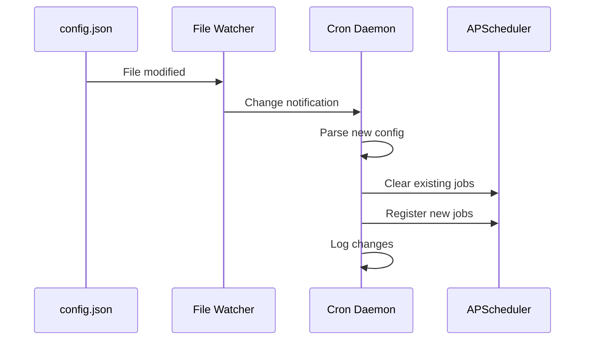
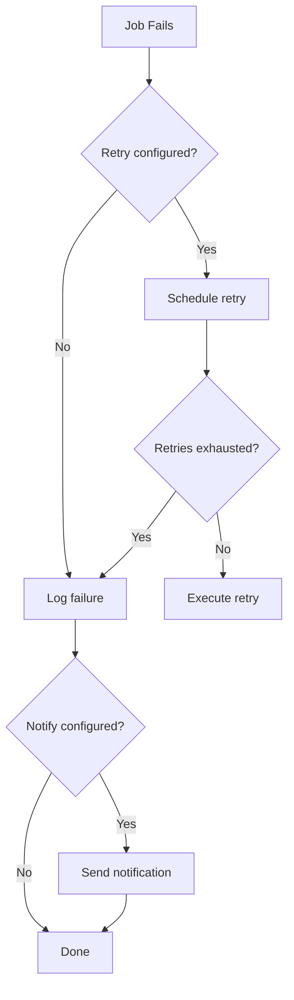

# Cron Scheduler Architecture

The Cron Scheduler provides automated job execution for the AI Workflow system using APScheduler. It enables scheduled skill execution, background tasks, and time-based automation.

## Overview



## Job Configuration

### config.json Structure

```json
{
  "schedules": {
    "enabled": true,
    "timezone": "America/New_York",
    "execution_mode": "claude_cli",
    "jobs": [
      {
        "name": "daily_standup",
        "cron": "0 9 * * MON-FRI",
        "skill": "coffee",
        "persona": "developer",
        "inputs": {},
        "notify": ["memory", "slack"],
        "enabled": true
      },
      {
        "name": "hello_world_test",
        "cron": "0 15 * * *",
        "skill": "hello_world",
        "persona": "workspace",
        "inputs": {},
        "enabled": true
      }
    ]
  }
}
```

### Job Properties

| Property | Type | Description |
|----------|------|-------------|
| `name` | string | Unique job identifier |
| `cron` | string | Cron expression (5-part or extended) |
| `skill` | string | Skill to execute |
| `persona` | string | Persona for context |
| `inputs` | object | Skill input parameters |
| `notify` | array | Notification targets |
| `enabled` | boolean | Job active status |

### Cron Expression Format

```
┌───────────── minute (0-59)
│ ┌───────────── hour (0-23)
│ │ ┌───────────── day of month (1-31)
│ │ │ ┌───────────── month (1-12 or JAN-DEC)
│ │ │ │ ┌───────────── day of week (0-6 or MON-SUN)
│ │ │ │ │
* * * * *
```

**Examples:**

| Expression | Description |
|------------|-------------|
| `0 9 * * MON-FRI` | 9 AM on weekdays |
| `30 8 * * *` | 8:30 AM daily |
| `0 */2 * * *` | Every 2 hours |
| `0 9,17 * * MON-FRI` | 9 AM and 5 PM on weekdays |

## Daemon Architecture

### CronDaemon Class



### Execution Modes

| Mode | Description | Use Case |
|------|-------------|----------|
| `claude_cli` | Execute via Claude Code CLI | Full AI workflow |
| `skill_direct` | Direct skill_run() call | Fast, no CLI overhead |
| `python_script` | Run Python scripts | Custom automation |

### Job Lifecycle



## Execution Flow

### Job Execution Sequence



### Claude CLI Invocation

```bash
# Generated command for job execution
claude --print --skill ${skill} \
  --session "cron-${skill}-$(date +%Y%m%d-%H%M%S)" \
  --persona ${persona} \
  --inputs '${inputs_json}'
```

## D-Bus Interface

### Service Details

| Property | Value |
|----------|-------|
| Service Name | `com.aiworkflow.BotCron` |
| Object Path | `/com/aiworkflow/BotCron` |
| Interface | `com.aiworkflow.BotCron` |

### Methods

| Method | Parameters | Returns | Description |
|--------|------------|---------|-------------|
| `run_job` | job_name | JSON result | Execute job immediately |
| `list_jobs` | - | JSON array | List all jobs |
| `get_history` | limit | JSON array | Execution history |
| `toggle_scheduler` | enabled | success | Enable/disable scheduler |
| `toggle_job` | job_name, enabled | success | Toggle specific job |
| `get_config` | section, key | value | Read config value |
| `update_config` | section, key, value | success | Update config value |

### Signals

| Signal | Parameters | Purpose |
|--------|------------|---------|
| `JobStarted` | job_name, execution_id | Job began |
| `JobCompleted` | job_name, execution_id, result | Job finished |
| `JobFailed` | job_name, execution_id, error | Job error |
| `SchedulerToggled` | enabled | Scheduler state changed |

### D-Bus Client Example

```python
from scripts.common.dbus_base import DaemonClient

async def run_job():
    client = DaemonClient(
        service_name="com.aiworkflow.BotCron",
        object_path="/com/aiworkflow/BotCron",
        interface_name="com.aiworkflow.BotCron"
    )

    if await client.connect():
        # Run a job immediately
        result = await client.call_method("run_job", ["daily_standup"])
        print(f"Result: {result}")

        # List all jobs
        jobs = await client.call_method("list_jobs", [])
        print(f"Jobs: {jobs}")
```

## State Management

### State File Structure

**Location:** `~/.config/aa-workflow/cron_state.json`

```json
{
  "enabled": true,
  "timezone": "America/New_York",
  "execution_mode": "claude_cli",
  "jobs": [
    {
      "name": "daily_standup",
      "skill": "coffee",
      "cron": "0 9 * * MON-FRI",
      "enabled": true,
      "next_run": "2026-01-27T09:00:00-05:00",
      "last_run": "2026-01-26T09:00:00-05:00",
      "last_status": "success",
      "run_count": 42,
      "failure_count": 2
    }
  ],
  "history": [
    {
      "job": "daily_standup",
      "execution_id": "cron-coffee-20260126-090000",
      "started_at": "2026-01-26T09:00:00-05:00",
      "completed_at": "2026-01-26T09:02:30-05:00",
      "status": "success",
      "duration_ms": 150000
    }
  ],
  "updated_at": "2026-01-26T09:02:30-05:00"
}
```

### Runtime Toggles

Jobs can be enabled/disabled at runtime via:

1. **D-Bus Method:**
   ```bash
   busctl --user call com.aiworkflow.BotCron \
     /com/aiworkflow/BotCron \
     com.aiworkflow.BotCron \
     toggle_job "ss" "daily_standup" "false"
   ```

2. **StateManager API:**
   ```python
   from server.state_manager import state
   state.set_job_enabled("daily_standup", False)
   ```

3. **VSCode Extension:**
   - Use the Command Center > Jobs tab
   - Toggle switches for each job

## Config File Watching

The daemon watches `config.json` for changes and automatically reloads:



## Integration with Skills

### Skill Session Context

When a cron job executes a skill, it provides session context:

```python
session_context = {
    "session_id": "cron-coffee-20260126-090000",
    "source": "cron",
    "job_name": "daily_standup",
    "persona": "developer",
    "scheduled_at": "2026-01-26T09:00:00-05:00"
}
```

### Skill YAML for Cron

Skills can detect they're running from cron:

```yaml
name: coffee
description: Morning standup assistant

steps:
  - id: check_source
    compute: |
      is_cron = "{{ session.source }}" == "cron"
      greeting = "Good morning!" if is_cron else "Hello!"

  - id: greet
    tool: slack_send_message
    condition: "{{ check_source.is_cron }}"
    args:
      channel: "#standup"
      text: "{{ check_source.greeting }}"
```

## Error Handling

### Retry Logic

```python
# Job configuration with retry
{
    "name": "important_job",
    "cron": "0 10 * * *",
    "skill": "critical_task",
    "retry": {
        "max_attempts": 3,
        "delay_seconds": 60,
        "backoff_multiplier": 2.0
    }
}
```

### Failure Notifications



### Notification Targets

| Target | Description |
|--------|-------------|
| `memory` | Log to session memory |
| `slack` | Post to Slack channel |
| `desktop` | Desktop notification |
| `email` | Send email (via Gmail tools) |

## Systemd Integration

### Service Unit

**Location:** `~/.config/systemd/user/bot-cron.service`

```ini
[Unit]
Description=AI Workflow Cron Daemon
After=network.target dbus.service

[Service]
Type=simple
WorkingDirectory=%h/src/redhat-ai-workflow
ExecStart=%h/src/redhat-ai-workflow/.venv/bin/python scripts/cron_daemon.py
Restart=on-failure
RestartSec=10
Environment=PYTHONPATH=%h/src/redhat-ai-workflow

[Install]
WantedBy=default.target
```

### Management Commands

```bash
# Start the daemon
systemctl --user start bot-cron

# Enable auto-start
systemctl --user enable bot-cron

# View logs
journalctl --user -u bot-cron -f

# Check status
systemctl --user status bot-cron
```

## Health Monitoring

### Health Check Response

```json
{
  "healthy": true,
  "scheduler_running": true,
  "job_count": 5,
  "next_job": {
    "name": "daily_standup",
    "scheduled": "2026-01-27T09:00:00-05:00",
    "in_seconds": 43200
  },
  "last_execution": {
    "job": "daily_standup",
    "status": "success",
    "completed_at": "2026-01-26T09:02:30-05:00"
  },
  "uptime_seconds": 86400,
  "stats": {
    "total_executions": 156,
    "successful": 150,
    "failed": 6,
    "success_rate": 0.961
  }
}
```

## Example Jobs

### Daily Standup

```json
{
  "name": "daily_standup",
  "cron": "0 9 * * MON-FRI",
  "skill": "coffee",
  "persona": "developer",
  "inputs": {},
  "notify": ["slack"],
  "enabled": true
}
```

### Weekly Summary

```json
{
  "name": "weekly_summary",
  "cron": "0 17 * * FRI",
  "skill": "weekly_summary",
  "persona": "developer",
  "inputs": {
    "days": 5
  },
  "notify": ["memory", "slack"],
  "enabled": true
}
```

### Environment Health Check

```json
{
  "name": "env_health",
  "cron": "0 */4 * * *",
  "skill": "environment_overview",
  "persona": "devops",
  "inputs": {},
  "enabled": true
}
```

### Integration Test Runner

```json
{
  "name": "nightly_tests",
  "cron": "0 2 * * *",
  "skill": "check_integration_tests",
  "persona": "developer",
  "inputs": {
    "project": "automation-analytics-backend"
  },
  "notify": ["slack"],
  "enabled": true
}
```

## Debugging

### Enable Debug Logging

```python
import logging
logging.getLogger("cron_daemon").setLevel(logging.DEBUG)
logging.getLogger("apscheduler").setLevel(logging.DEBUG)
```

### Manual Job Execution

```bash
# Via D-Bus
busctl --user call com.aiworkflow.BotCron \
  /com/aiworkflow/BotCron \
  com.aiworkflow.BotCron \
  run_job "s" "daily_standup"

# Via CLI
python scripts/cron_daemon.py --run-job daily_standup
```

### View Execution History

```bash
# Via D-Bus
busctl --user call com.aiworkflow.BotCron \
  /com/aiworkflow/BotCron \
  com.aiworkflow.BotCron \
  get_history "i" 10

# Or read state file directly
cat ~/.config/aa-workflow/cron_state.json | jq '.history[:5]'
```

## See Also

- [Daemon Architecture](./daemons.md) - Background service design
- [Skill Engine](./skill-engine.md) - Skill execution
- [State Management](./state-management.md) - Persistence patterns
- [Daemons: Cron](../daemons/cron.md) - Cron daemon specifics
