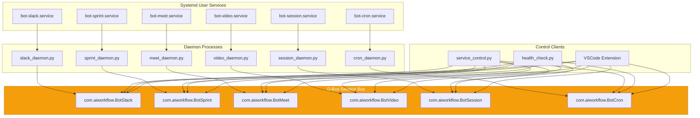
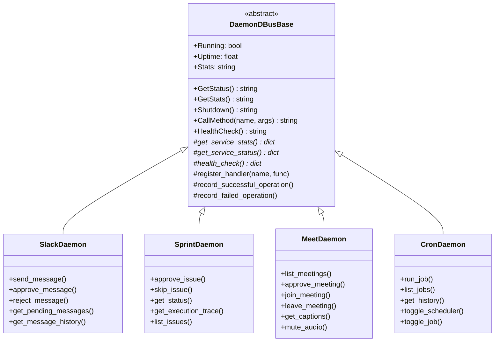
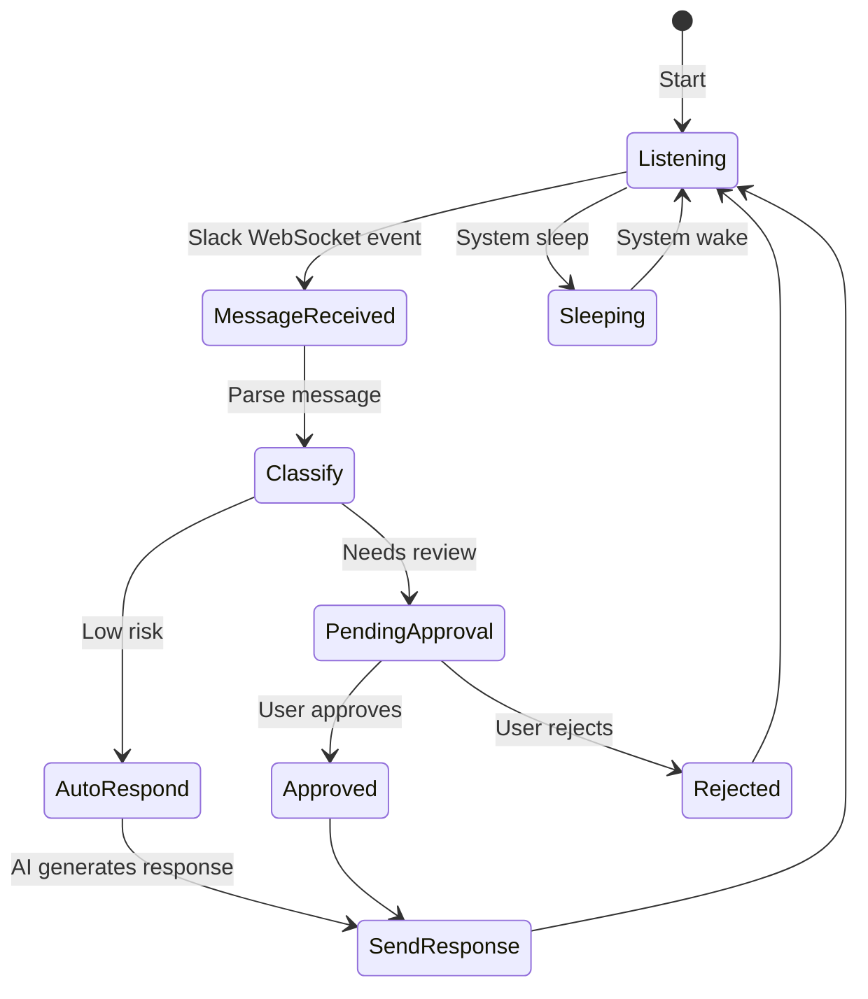
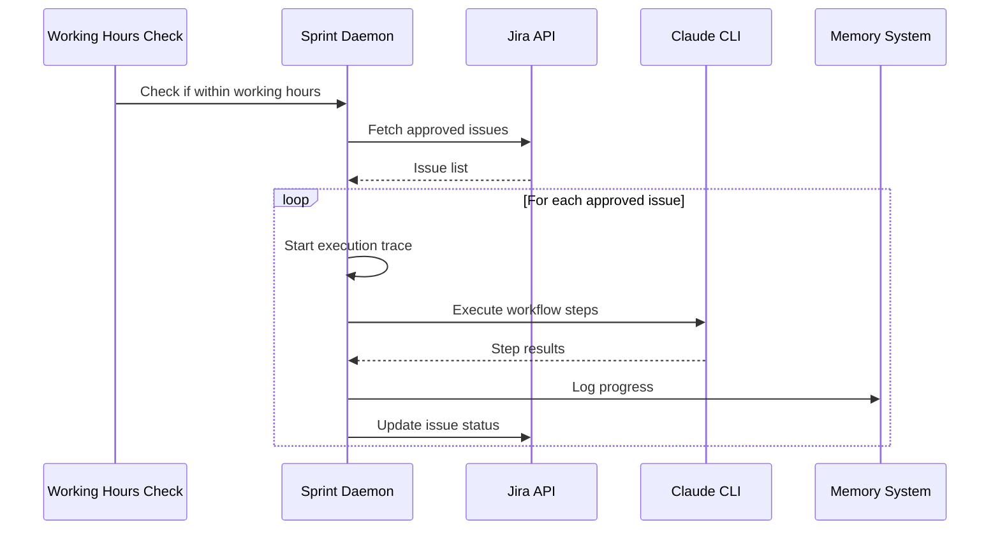
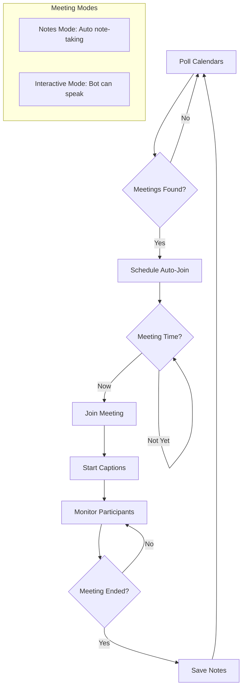
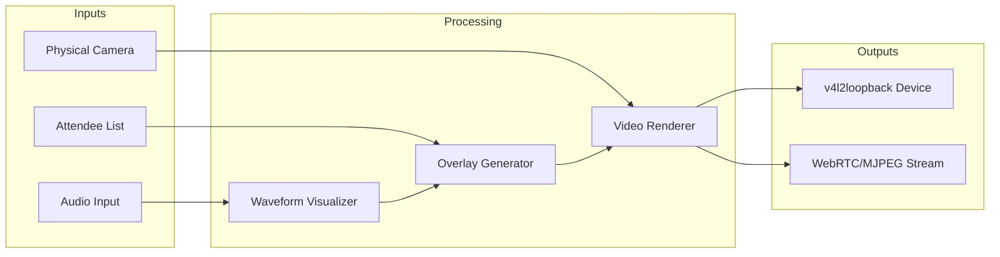
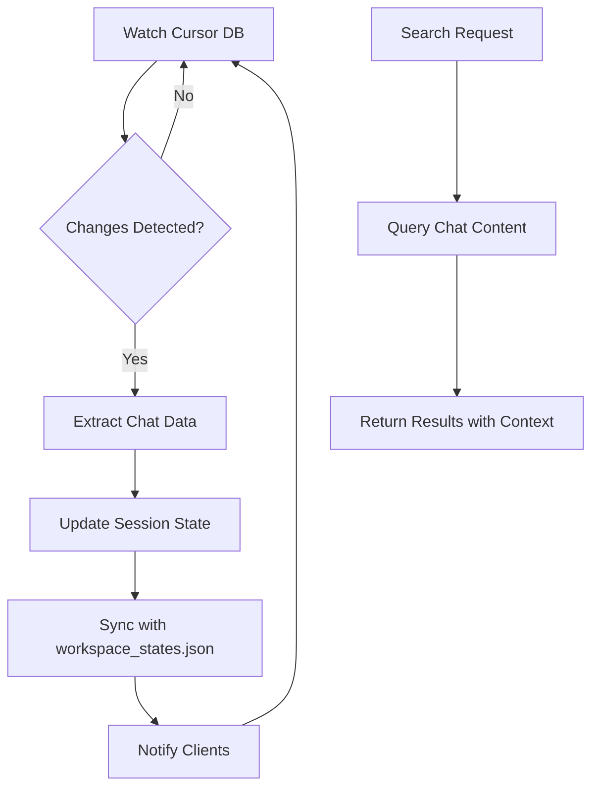
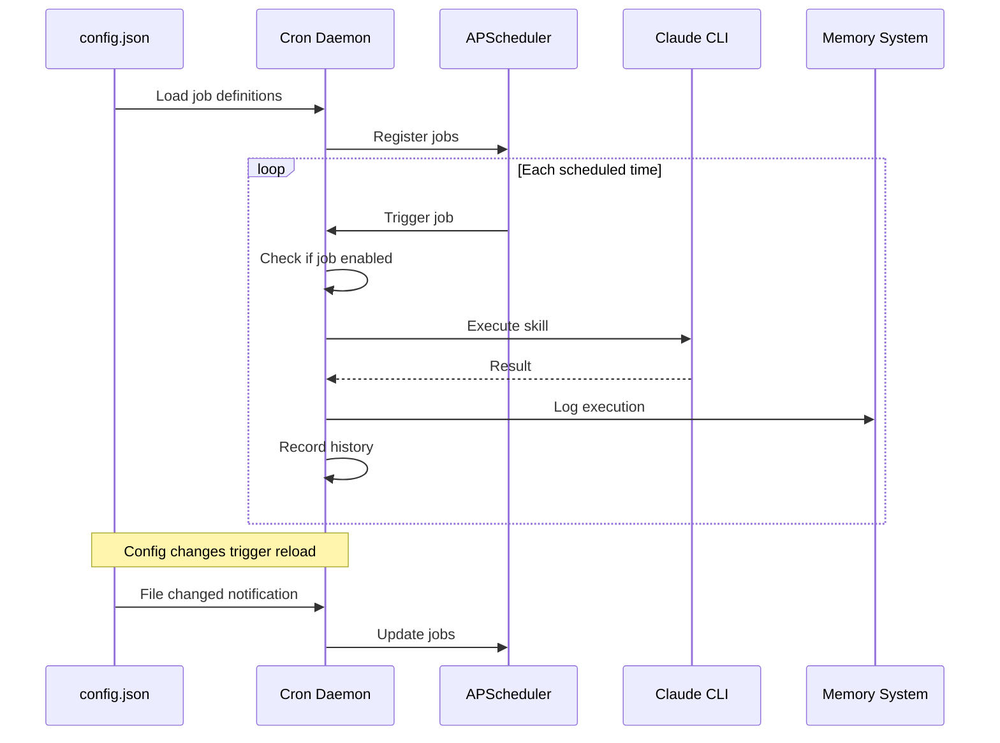
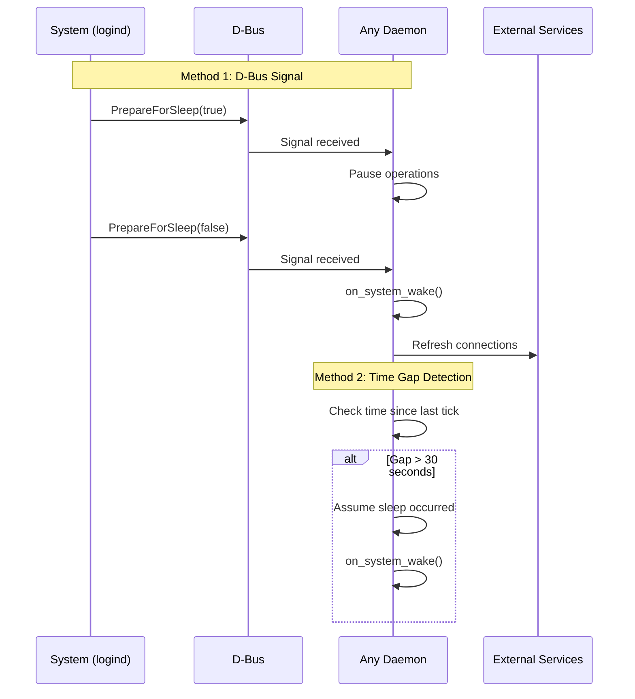
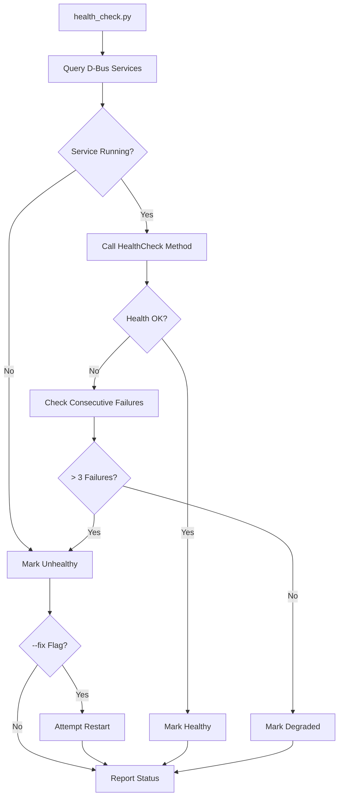

# 🤖 Daemon Architecture

This document describes the background daemon services that provide autonomous functionality for the AI Workflow system.

## Overview

The AI Workflow system includes 6 background daemons that run independently of the MCP server, providing:

- **Slack monitoring** - Real-time message listening and AI response
- **Sprint automation** - Automated Jira issue processing
- **Meeting management** - Google Meet auto-join and note-taking
- **Video rendering** - Virtual camera for meeting overlays
- **Session synchronization** - Cursor chat state tracking
- **Job scheduling** - Cron-based task execution

All daemons use a common D-Bus IPC architecture for control and monitoring.

## Architecture Diagram



## D-Bus Base Architecture

All daemons inherit from `DaemonDBusBase` in `scripts/common/dbus_base.py`, providing:

### Standard D-Bus Interface



### D-Bus Signals

All daemons emit standard signals:

| Signal | Parameters | Purpose |
|--------|------------|---------|
| `StatusChanged` | status (string) | Daemon state changes |
| `Event` | event_type, data | Generic event notification |

## Daemon Details

### 1. Slack Daemon (`slack_daemon.py`)

**Purpose**: Monitors Slack messages and routes them through AI workflow

**Service Name**: `com.aiworkflow.BotSlack`

**Features**:
- Real-time Slack message listening via WebSocket
- Message classification and intent detection
- Approval workflow for messages requiring human review
- Thread support for message replies
- Desktop notifications (via `gi.repository.Notify`)
- Sleep/wake awareness (pauses during system sleep)



**Custom D-Bus Methods**:

| Method | Parameters | Returns |
|--------|------------|---------|
| `send_message` | channel_id, text | message_id |
| `approve_message` | message_id | success |
| `reject_message` | message_id | success |
| `get_pending_messages` | - | JSON array |
| `get_message_history` | limit | JSON array |

**State File**: `~/.config/aa-workflow/slack_state.db` (SQLite)

---

### 2. Sprint Daemon (`sprint_daemon.py`)

**Purpose**: Autonomous issue processing during working hours

**Service Name**: `com.aiworkflow.BotSprint`

**Features**:
- Workflow execution for Jira issues
- Execution tracing with step-by-step logging
- Time-aware (respects Mon-Fri 9am-5pm)
- Issue prioritization
- Progress tracking



**Custom D-Bus Methods**:

| Method | Parameters | Returns |
|--------|------------|---------|
| `approve_issue` | issue_key | success |
| `skip_issue` | issue_key, reason | success |
| `get_status` | - | JSON status |
| `get_execution_trace` | issue_key | JSON trace |
| `list_issues` | - | JSON array |

**State File**: `~/.config/aa-workflow/sprint_state_v2.json`

---

### 3. Meet Daemon (`meet_daemon.py`)

**Purpose**: Google Meet bot for auto-join and note-taking

**Service Name**: `com.aiworkflow.BotMeet`

**Features**:
- Calendar polling for upcoming meetings
- Auto-join with configurable modes
- Live caption extraction
- Participant tracking
- Audio control (mute/unmute)
- Browser automation



**Custom D-Bus Methods**:

| Method | Parameters | Returns |
|--------|------------|---------|
| `list_meetings` | - | JSON array |
| `approve_meeting` | event_id, mode | success |
| `join_meeting` | url, title, mode | success |
| `leave_meeting` | - | success |
| `get_captions` | limit | JSON array |
| `get_participants` | - | JSON array |
| `mute_audio` | - | success |
| `unmute_audio` | - | success |

**State File**: `~/.config/aa-workflow/meet_state.json`
**Database**: `~/.config/aa-workflow/meetings.db` (SQLite)

---

### 4. Video Daemon (`video_daemon.py`)

**Purpose**: Real-time video rendering to virtual camera

**Service Name**: `com.aiworkflow.BotVideo`

**Features**:
- v4l2loopback virtual camera output
- Real-time video rendering with overlays
- Audio waveform visualization
- Attendee display
- WebRTC/MJPEG streaming support
- Horizontal flip toggle



**Custom D-Bus Methods**:

| Method | Parameters | Returns |
|--------|------------|---------|
| `start_video` | device, audio_in, audio_out, width, height, flip | success |
| `stop_video` | - | success |
| `update_attendees` | JSON | success |
| `set_flip` | bool | success |
| `get_render_stats` | - | JSON stats |
| `start_streaming` | device, mode, port | success |
| `stop_streaming` | - | success |

**D-Bus Signals**:

| Signal | Parameters | Purpose |
|--------|------------|---------|
| `RenderingStarted` | device | Video started |
| `RenderingStopped` | - | Video stopped |
| `StreamingStarted` | mode, port | Stream started |
| `StreamingStopped` | - | Stream stopped |
| `Error` | message | Error occurred |

---

### 5. Session Daemon (`session_daemon.py`)

**Purpose**: Cursor IDE session state management

**Service Name**: `com.aiworkflow.BotSession`

**Features**:
- Cursor database watching
- Session synchronization
- Full-text chat search
- Workspace state tracking



**Custom D-Bus Methods**:

| Method | Parameters | Returns |
|--------|------------|---------|
| `search_chats` | query, limit | JSON results |
| `get_sessions` | - | JSON array |
| `refresh_now` | - | success |
| `get_state` | - | JSON state |
| `write_state` | - | success |

**State File**: `~/.config/aa-workflow/session_state.json`

---

### 6. Cron Daemon (`cron_daemon.py`)

**Purpose**: Scheduled job execution via APScheduler

**Service Name**: `com.aiworkflow.BotCron`

**Features**:
- APScheduler integration
- Dynamic config reloading
- Execution history tracking
- Job enable/disable at runtime
- Claude CLI job execution



**Job Definition Format** (in `config.json`):

```yaml
schedules:
  enabled: true
  timezone: "America/New_York"
  execution_mode: "claude_cli"
  jobs:
    - name: "daily_standup"
      cron: "0 9 * * MON-FRI"
      skill: "coffee"
      persona: "developer"
      inputs: {}
      notify: ["memory", "slack"]
      enabled: true
```

**Custom D-Bus Methods**:

| Method | Parameters | Returns |
|--------|------------|---------|
| `run_job` | job_name | JSON result |
| `list_jobs` | - | JSON array |
| `get_history` | limit | JSON array |
| `toggle_scheduler` | enabled | success |
| `toggle_job` | job_name, enabled | success |
| `update_config` | section, key, value | success |
| `get_config` | section, key | value |

**State File**: `~/.config/aa-workflow/cron_state.json`

## Sleep/Wake Awareness

All daemons implement sleep/wake detection via the `SleepWakeAwareDaemon` mixin:



## State Management

### State File Locations

All daemon state files are stored in `~/.config/aa-workflow/`:

| Daemon | State File | Format |
|--------|------------|--------|
| Slack | `slack_state.db` | SQLite |
| Sprint | `sprint_state_v2.json` | JSON |
| Meet | `meet_state.json` | JSON |
| Meet | `meetings.db` | SQLite |
| Session | `session_state.json` | JSON |
| Cron | `cron_state.json` | JSON |

### Atomic Writes

All JSON state files use atomic writes:

```python
def atomic_write(path: Path, data: dict):
    temp = path.with_suffix('.tmp')
    temp.write_text(json.dumps(data, indent=2))
    temp.rename(path)  # Atomic on POSIX
```

## Systemd Integration

### Service Unit Template

```ini
[Unit]
Description=AI Workflow Bot - %s
After=network.target dbus.service

[Service]
Type=simple
WorkingDirectory=%h/src/redhat-ai-workflow
ExecStart=%h/src/redhat-ai-workflow/.venv/bin/python scripts/%s_daemon.py
Restart=on-failure
RestartSec=10

[Install]
WantedBy=default.target
```

### Service Management

```bash
# Start a daemon
systemctl --user start bot-slack

# Check status
systemctl --user status bot-slack

# View logs
journalctl --user -u bot-slack -f

# Enable auto-start on login
systemctl --user enable bot-slack

# Stop a daemon
systemctl --user stop bot-slack
```

### Installing Services

```bash
# Install all services
./scripts/install_services.sh

# Or manually
cp systemd/*.service ~/.config/systemd/user/
systemctl --user daemon-reload
```

## Health Monitoring

The `health_check.py` script provides unified health monitoring:

```bash
# Check all services
python scripts/health_check.py

# Check specific service
python scripts/health_check.py --service slack

# JSON output for scripting
python scripts/health_check.py --json

# Continuous monitoring
python scripts/health_check.py --watch

# Attempt auto-repair
python scripts/health_check.py --fix
```

### Health Check Flow



## Service Control CLI

The `service_control.py` script provides unified CLI control:

```bash
# Show all service status
python scripts/service_control.py status

# Show specific service
python scripts/service_control.py status slack

# Stop a service
python scripts/service_control.py stop slack

# Run a cron job
python scripts/service_control.py run-job daily_standup

# List scheduled jobs
python scripts/service_control.py list-jobs

# List upcoming meetings
python scripts/service_control.py list-meetings

# Search chat content
python scripts/service_control.py search-chats "deploy ephemeral"

# Approve sprint issue
python scripts/service_control.py approve-issue AAP-12345

# Skip sprint issue
python scripts/service_control.py skip-issue AAP-12345 "Blocked by dependency"
```

## D-Bus Client Usage

### Python Client Example

```python
from scripts.common.dbus_base import DaemonClient

async def example():
    client = DaemonClient(
        service_name="com.aiworkflow.BotCron",
        object_path="/com/aiworkflow/BotCron",
        interface_name="com.aiworkflow.BotCron"
    )

    if await client.connect():
        # Get status
        status = await client.get_status()
        print(f"Status: {status}")

        # Run a job
        result = await client.call_method("run_job", ["daily_standup"])
        print(f"Job result: {result}")

        # Health check
        health = await client.health_check()
        print(f"Health: {health}")

        await client.disconnect()
```

### Command Line D-Bus

```bash
# List available services
busctl --user list | grep aiworkflow

# Call a method
busctl --user call com.aiworkflow.BotCron \
    /com/aiworkflow/BotCron \
    com.aiworkflow.BotCron \
    GetStatus

# Monitor signals
dbus-monitor --session "interface='com.aiworkflow.BotSlack'"
```

## See Also

- [Architecture Overview](./README.md) - System overview
- [VSCode Extension](./vscode-extension.md) - IDE integration
- [State Management](./state-management.md) - Persistence patterns
- [Development Guide](../DEVELOPMENT.md) - Contributing guidelines
