# Architecture Diagrams

> Detailed visual diagrams of system components, data flows, and interactions

Comprehensive technical architecture of the AI Workflow system.

## High-Level Architecture

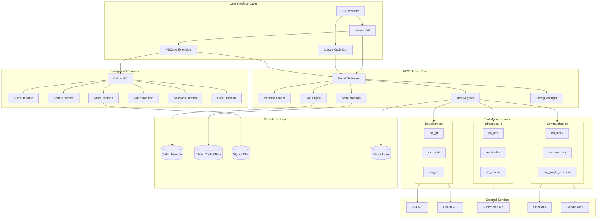

## Component Interactions

### Request Flow

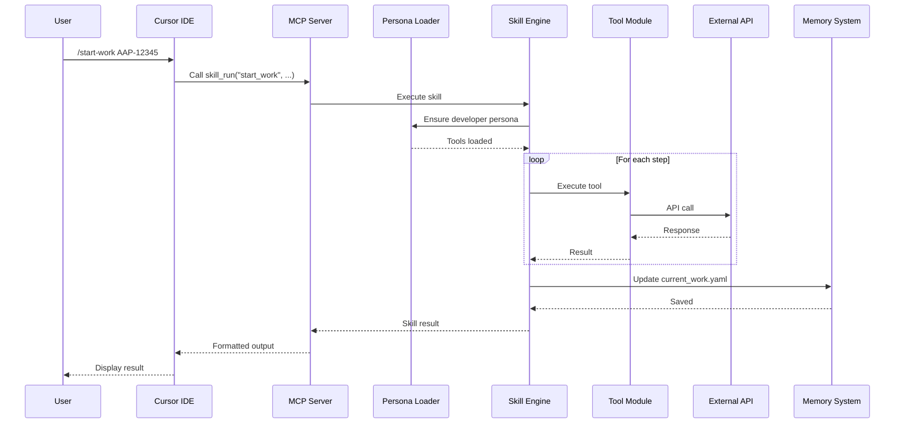

### Auto-Heal Flow

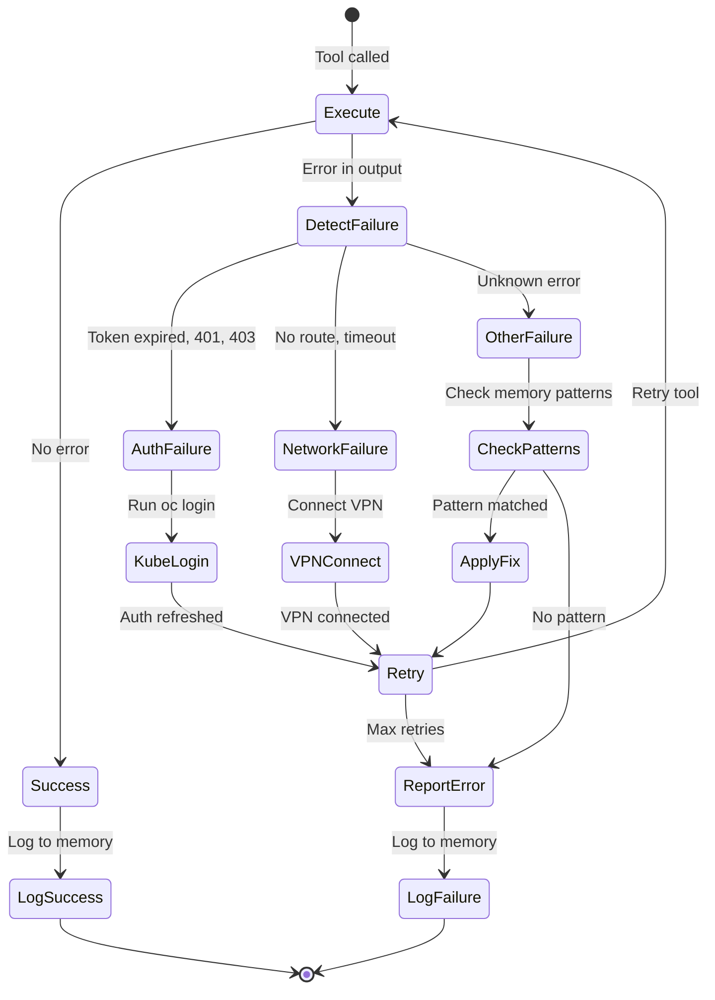

## Server Components

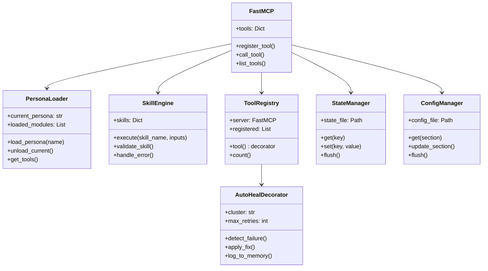

## Data Flow Architecture

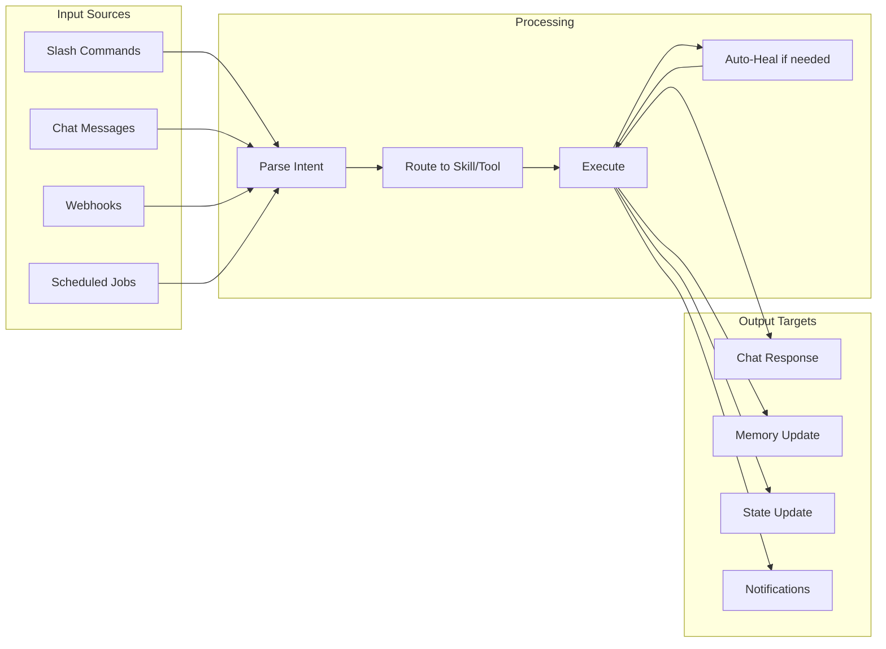

## Daemon Architecture

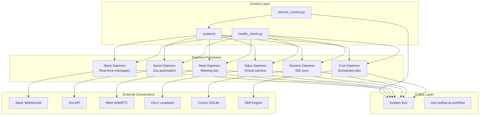

## Memory Architecture

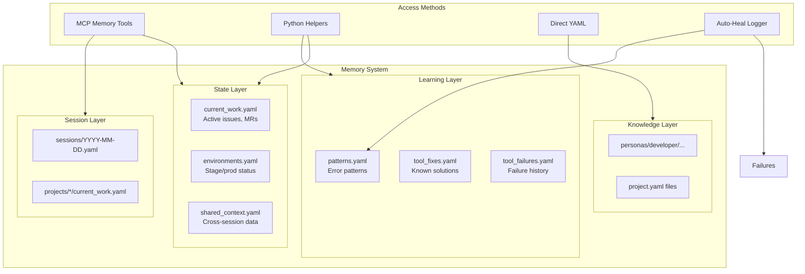

## Skill Execution State Machine

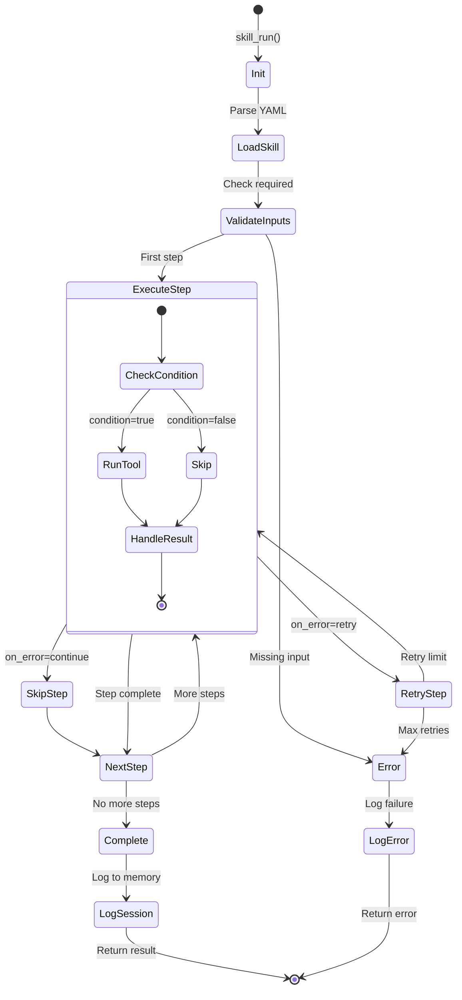

## WebSocket Protocol

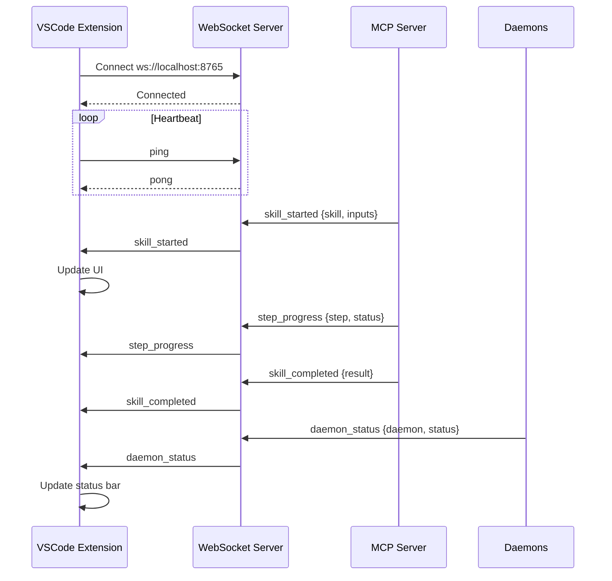

## Deployment Architecture

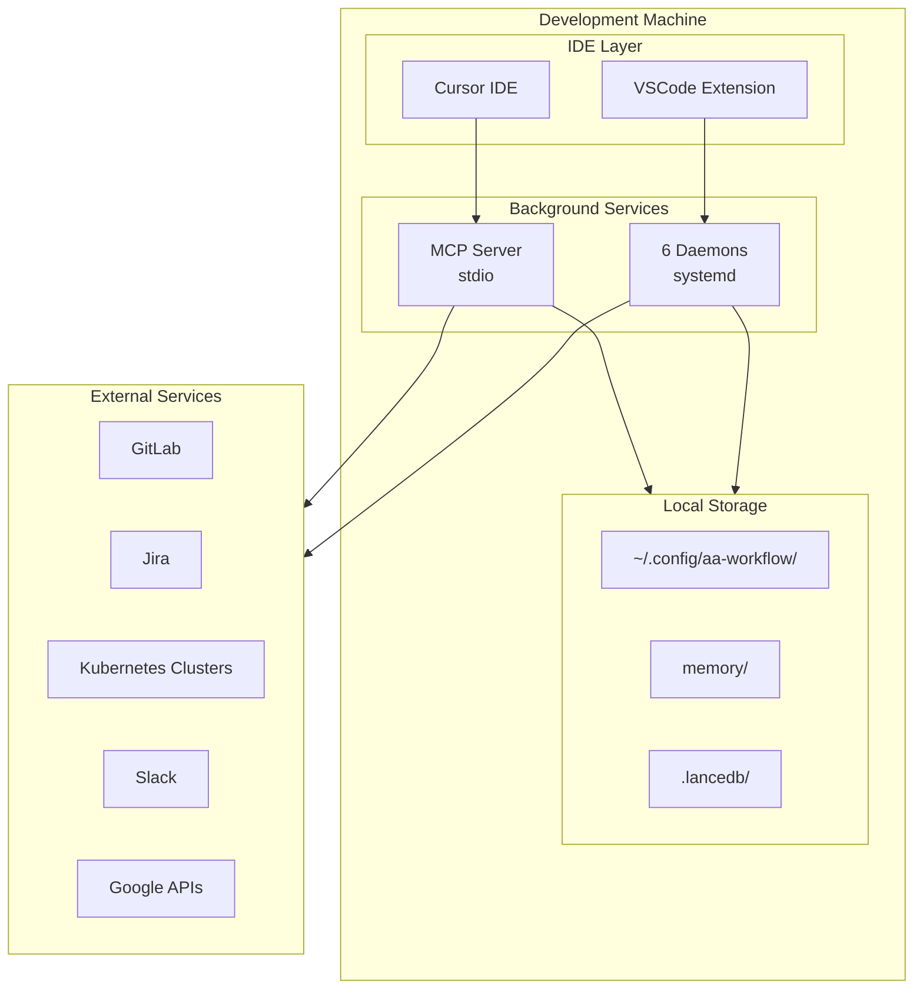

## Security Model

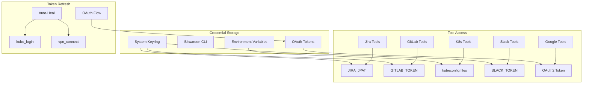

## See Also

- [Server Components](./server-components.md) - Detailed server architecture
- [Skill Engine](./skill-engine.md) - Skill execution details
- [Memory System](./memory-system.md) - Memory architecture
- [Daemons](./daemons.md) - Background services
- [Auto-Heal](./auto-heal.md) - Self-healing system
- [WebSocket Protocol](./websocket-protocol.md) - Real-time communication
