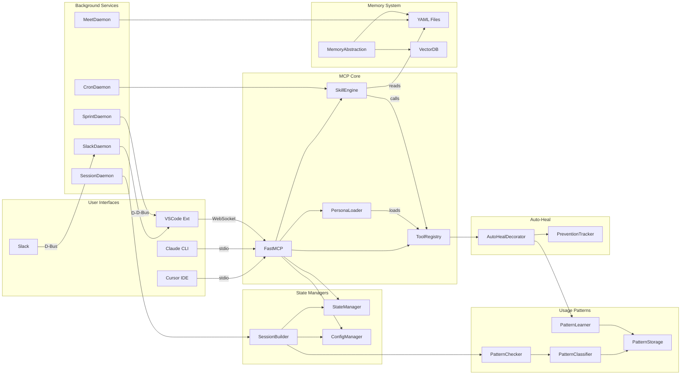

# Component Relationships

> How major system components connect and interact with each other

## Diagram

## Component Interactions

| Source | Target | Protocol | Purpose |
|--------|--------|----------|---------|
| Cursor/Claude | FastMCP | stdio/JSON-RPC | Tool invocation |
| VSCode Extension | FastMCP | WebSocket | Real-time updates |
| VSCode Extension | Daemons | D-Bus | Service control |
| FastMCP | PersonaLoader | Python | Tool loading |
| FastMCP | SkillEngine | Python | Workflow execution |
| SkillEngine | ToolRegistry | Python | Tool calls |
| ToolRegistry | AutoHealDecorator | Python | Error recovery |
| Daemons | Memory | File I/O | State persistence |
| MemoryAbstraction | Multiple Sources | Adapters | Unified queries |

## Key Relationships

### MCP Server Core
- **FastMCP** is the central hub receiving all requests
- **PersonaLoader** dynamically loads/unloads tool modules
- **SkillEngine** orchestrates multi-step workflows
- **ToolRegistry** manages tool registration and discovery

### State Management
- **StateManager** handles runtime state (JSON)
- **ConfigManager** manages configuration
- **SessionBuilder** bootstraps new sessions with context

### Usage Pattern System
- **PatternChecker** validates tool usage
- **PatternClassifier** categorizes patterns
- **PatternLearner** learns from successes/failures
- **PatternStorage** persists patterns to YAML

### Background Services
- All daemons communicate via **D-Bus**
- **CronDaemon** triggers scheduled skills
- **SessionDaemon** syncs IDE state
- **SlackDaemon** handles real-time messages

## Related Diagrams

- [System Architecture](./system-architecture.md)
- [Technology Stack](./technology-stack.md)
- [Data Flows](../08-data-flows/request-lifecycle.md)
