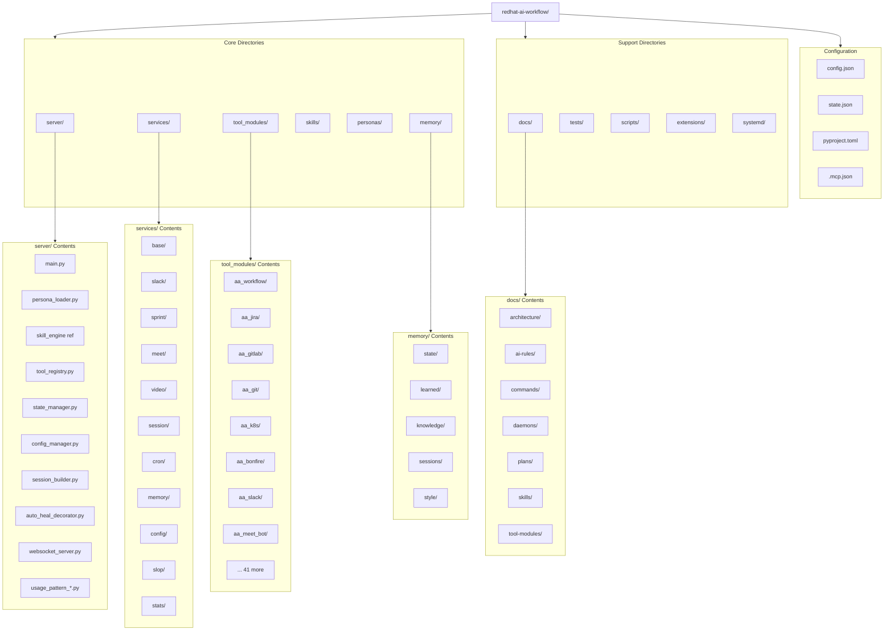

# Project Structure

> Directory layout and organization of the codebase

## Diagram



## Directory Details

### Core Directories

| Directory | Files | Purpose |
|-----------|-------|---------|
| `server/` | 29 | MCP server core components |
| `services/` | 61 | Background daemon services |
| `tool_modules/` | 302 | 49 tool module packages |
| `skills/` | 95 | YAML skill definitions |
| `personas/` | 36 | Persona YAML and docs |
| `memory/` | 127 | Persistent memory storage |

### Support Directories

| Directory | Files | Purpose |
|-----------|-------|---------|
| `docs/` | 400+ | Documentation |
| `tests/` | 33 | Test suite |
| `scripts/` | 15 | Utility scripts |
| `extensions/` | 2133 | VSCode extension |
| `systemd/` | 13 | Service definitions |

### Configuration Files

| File | Purpose |
|------|---------|
| `config.json` | Project configuration |
| `state.json` | Runtime state |
| `pyproject.toml` | Python project config |
| `.mcp.json` | MCP server config |
| `.cursorrules` | AI assistant rules |
| `CLAUDE.md` | Claude Code rules |
| `AGENTS.md` | Cross-tool AI rules |

### Tool Module Structure

Each tool module follows this pattern:
```
aa_<name>/
├── pyproject.toml      # Package config
├── src/
│   ├── __init__.py
│   ├── tools_basic.py  # Core tools
│   ├── tools_core.py   # Essential tools (optional)
│   ├── tools_extra.py  # Extended tools (optional)
│   └── adapter.py      # Memory adapter (optional)
```

### Memory Structure

```
memory/
├── state/              # Current runtime state
│   ├── current_work.yaml
│   ├── environments.yaml
│   └── projects/
├── learned/            # ML-derived patterns
│   ├── patterns.yaml
│   ├── tool_fixes.yaml
│   └── tool_failures.yaml
├── knowledge/          # Domain knowledge
│   └── personas/
├── sessions/           # Session logs
└── style/              # Style profiles
```

## Related Diagrams

- [System Architecture](./system-architecture.md)
- [Tool Module Structure](../03-tools/tool-module-structure.md)
- [Memory Architecture](../06-memory/memory-architecture.md)
