# System Architecture

> Complete high-level view of the AI Workflow system with all layers

## Diagram

```mermaid
graph TB
    subgraph UserLayer[User Interface Layer]
        USER[Developer]
        CURSOR[Cursor IDE]
        CLAUDE[Claude Code CLI]
        VSCODE[VSCode Extension]
        SLACK_UI[Slack Interface]
    end

    subgraph MCPLayer[MCP Server Core]
        MCP[FastMCP Server]
        PERSONA[Persona Loader]
        SKILL[Skill Engine]
        REGISTRY[Tool Registry]
        STATE[State Manager]
        CONFIG[Config Manager]
        SESSION[Session Builder]
        AUTOHEAL[Auto-Heal Decorator]
    end

    subgraph ToolLayer[Tool Modules Layer]
        subgraph DevTools[Development Tools]
            GIT[aa_git]
            GITLAB[aa_gitlab]
            JIRA[aa_jira]
            GITHUB[aa_github]
            LINT[aa_lint]
        end
        subgraph InfraTools[Infrastructure Tools]
            K8S[aa_k8s]
            BONFIRE[aa_bonfire]
            KONFLUX[aa_konflux]
            QUAY[aa_quay]
            DOCKER[aa_docker]
        end
        subgraph CommTools[Communication Tools]
            SLACK_T[aa_slack]
            MEET_T[aa_meet_bot]
            GCAL[aa_google_calendar]
            GMAIL[aa_gmail]
            GDRIVE[aa_gdrive]
        end
        subgraph ObsTools[Observability Tools]
            PROM[aa_prometheus]
            ALERT[aa_alertmanager]
            KIBANA[aa_kibana]
        end
        subgraph DataTools[Data Tools]
            SQLITE[aa_sqlite]
            POSTGRES[aa_postgres]
            MYSQL[aa_mysql]
        end
        subgraph AITools[AI Tools]
            OLLAMA[aa_ollama]
            INSCOPE[aa_inscope]
            CODESEARCH[aa_code_search]
        end
    end

    subgraph DaemonLayer[Background Services]
        DBUS[D-Bus IPC]
        SLACK_D[Slack Daemon]
        SPRINT_D[Sprint Daemon]
        MEET_D[Meet Daemon]
        VIDEO_D[Video Daemon]
        SESSION_D[Session Daemon]
        CRON_D[Cron Daemon]
        MEMORY_D[Memory Daemon]
        CONFIG_D[Config Daemon]
        SLOP_D[SLOP Daemon]
        STATS_D[Stats Daemon]
    end

    subgraph PersistLayer[Persistence Layer]
        YAML[(YAML Memory)]
        JSON[(JSON Config/State)]
        SQLITE_DB[(SQLite DBs)]
        VECTOR[(LanceDB Vector)]
        SESSIONS[(Session Logs)]
    end

    subgraph ExternalLayer[External Services]
        JIRA_API[Jira Cloud API]
        GITLAB_API[GitLab API]
        GITHUB_API[GitHub API]
        K8S_API[Kubernetes APIs]
        SLACK_API[Slack API]
        GOOGLE_API[Google APIs]
        QUAY_API[Quay.io API]
        KONFLUX_API[Konflux API]
    end

    USER --> CURSOR
    USER --> CLAUDE
    USER --> SLACK_UI
    CURSOR --> MCP
    CLAUDE --> MCP
    CURSOR --> VSCODE

    MCP --> PERSONA
    MCP --> SKILL
    MCP --> REGISTRY
    MCP --> STATE
    MCP --> CONFIG
    MCP --> SESSION
    MCP --> AUTOHEAL

    REGISTRY --> DevTools
    REGISTRY --> InfraTools
    REGISTRY --> CommTools
    REGISTRY --> ObsTools
    REGISTRY --> DataTools
    REGISTRY --> AITools

    DevTools --> JIRA_API
    DevTools --> GITLAB_API
    DevTools --> GITHUB_API
    InfraTools --> K8S_API
    InfraTools --> QUAY_API
    InfraTools --> KONFLUX_API
    CommTools --> SLACK_API
    CommTools --> GOOGLE_API

    DBUS --> SLACK_D
    DBUS --> SPRINT_D
    DBUS --> MEET_D
    DBUS --> VIDEO_D
    DBUS --> SESSION_D
    DBUS --> CRON_D
    DBUS --> MEMORY_D
    DBUS --> CONFIG_D
    DBUS --> SLOP_D
    DBUS --> STATS_D

    STATE --> JSON
    SKILL --> YAML
    MEET_D --> SQLITE_DB
    REGISTRY --> VECTOR
    SESSION --> SESSIONS

    VSCODE --> DBUS
    VSCODE --> MCP
    SLACK_UI --> SLACK_D
```

## Components

| Component | Location | Description |
|-----------|----------|-------------|
| FastMCP Server | `server/main.py` | Core MCP protocol server |
| Persona Loader | `server/persona_loader.py` | Dynamic tool loading |
| Skill Engine | `tool_modules/aa_workflow/src/skill_engine.py` | Workflow execution |
| Tool Registry | `server/tool_registry.py` | Tool registration and discovery |
| State Manager | `server/state_manager.py` | Runtime state persistence |
| Config Manager | `server/config_manager.py` | Configuration management |
| Session Builder | `server/session_builder.py` | Session bootstrap |
| Auto-Heal | `server/auto_heal_decorator.py` | Error recovery |
| Daemons | `services/*/daemon.py` | Background services |
| Tool Modules | `tool_modules/aa_*/` | 49 tool modules |

## Related Diagrams

- [Component Relationships](./component-relationships.md)
- [Technology Stack](./technology-stack.md)
- [Project Structure](./project-structure.md)
