# Technology Stack

> Languages, frameworks, protocols, and technologies used in the system

## Diagram

```mermaid
graph TB
    subgraph Languages[Programming Languages]
        PYTHON[Python 3.11+]
        TYPESCRIPT[TypeScript]
        YAML_LANG[YAML]
        JSON_LANG[JSON]
        BASH[Bash]
    end

    subgraph Frameworks[Frameworks and Libraries]
        subgraph PythonLibs[Python]
            FASTMCP[FastMCP]
            ASYNCIO[asyncio]
            AIOHTTP[aiohttp]
            PYDANTIC[Pydantic]
            RUAMEL[ruamel.yaml]
            LANCEDB[LanceDB]
            SENTENCE[sentence-transformers]
        end
        subgraph TSLibs[TypeScript]
            VSCODE_API[VSCode API]
            WEBVIEW[Webview API]
        end
    end

    subgraph Protocols[Communication Protocols]
        MCP_PROTO[MCP Protocol]
        JSONRPC[JSON-RPC 2.0]
        WEBSOCKET[WebSocket]
        DBUS_PROTO[D-Bus]
        REST[REST APIs]
        GRAPHQL[GraphQL]
    end

    subgraph Storage[Storage Technologies]
        YAML_FILES[YAML Files]
        JSON_FILES[JSON Files]
        SQLITE_DB[SQLite]
        LANCE_DB[LanceDB]
        JSONL[JSONL Logs]
    end

    subgraph Infrastructure[Infrastructure]
        SYSTEMD[systemd]
        DBUS_SYS[D-Bus System]
        V4L2[V4L2 Loopback]
        PULSEAUDIO[PulseAudio]
    end

    subgraph External[External Platforms]
        JIRA_CLOUD[Jira Cloud]
        GITLAB_SVC[GitLab]
        GITHUB_SVC[GitHub]
        SLACK_SVC[Slack]
        GOOGLE_SVC[Google Workspace]
        K8S_SVC[Kubernetes]
        QUAY_SVC[Quay.io]
        KONFLUX_SVC[Konflux]
    end

    subgraph AI[AI and ML]
        OLLAMA_SVC[Ollama]
        GEMINI[Google Gemini]
        CLAUDE_AI[Claude]
        EMBEDDINGS[Embeddings]
    end

    PYTHON --> FASTMCP
    PYTHON --> ASYNCIO
    PYTHON --> PYDANTIC
    TYPESCRIPT --> VSCODE_API

    FASTMCP --> MCP_PROTO
    MCP_PROTO --> JSONRPC
    VSCODE_API --> WEBSOCKET
    VSCODE_API --> DBUS_PROTO

    PYDANTIC --> YAML_FILES
    RUAMEL --> YAML_FILES
    LANCEDB --> LANCE_DB
    SENTENCE --> EMBEDDINGS

    SYSTEMD --> DBUS_SYS
    DBUS_SYS --> DBUS_PROTO

    REST --> JIRA_CLOUD
    REST --> GITLAB_SVC
    REST --> GITHUB_SVC
    REST --> SLACK_SVC
    REST --> GOOGLE_SVC
    REST --> K8S_SVC
    REST --> QUAY_SVC

    OLLAMA_SVC --> EMBEDDINGS
    GEMINI --> AI
    CLAUDE_AI --> AI
```

## Technology Details

### Core Languages

| Language | Version | Usage |
|----------|---------|-------|
| Python | 3.11+ | Server, tools, daemons |
| TypeScript | 5.x | VSCode extension |
| YAML | 1.2 | Skills, personas, memory |
| JSON | - | Config, state, MCP protocol |
| Bash | 5.x | Scripts, systemd |

### Python Dependencies

| Library | Purpose |
|---------|---------|
| FastMCP | MCP protocol server |
| asyncio | Async I/O |
| aiohttp | HTTP client |
| Pydantic | Data validation |
| ruamel.yaml | YAML parsing |
| LanceDB | Vector database |
| sentence-transformers | Embeddings |
| dbus-python | D-Bus integration |

### Communication Protocols

| Protocol | Usage |
|----------|-------|
| MCP | IDE to server communication |
| JSON-RPC 2.0 | MCP message format |
| WebSocket | Real-time updates |
| D-Bus | Inter-process communication |
| REST | External API calls |
| GraphQL | GitHub API |

### Storage

| Technology | Purpose |
|------------|---------|
| YAML files | Memory, skills, personas |
| JSON files | Config, state |
| SQLite | Meeting notes, caches |
| LanceDB | Vector embeddings |
| JSONL | Session logs, corpus |

### Infrastructure

| Component | Purpose |
|-----------|---------|
| systemd | Service management |
| D-Bus | IPC between daemons |
| V4L2 | Virtual camera |
| PulseAudio | Audio routing |

## Related Diagrams

- [System Architecture](./system-architecture.md)
- [Component Relationships](./component-relationships.md)
- [Deployment](../09-deployment/systemd-services.md)
