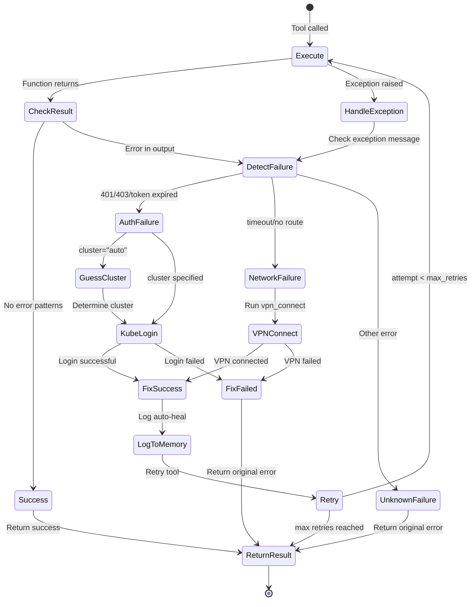
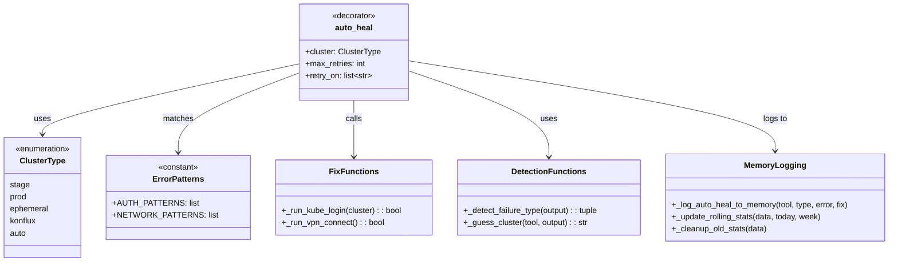
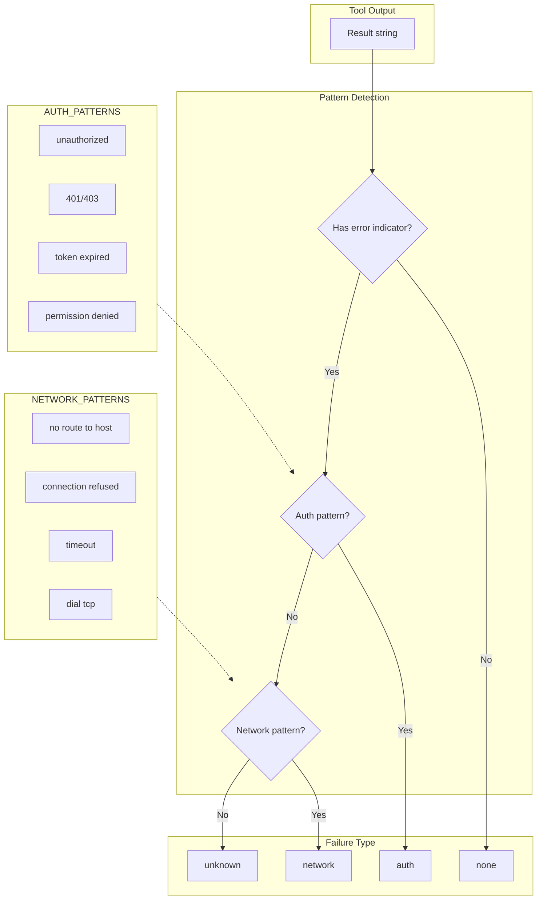

# Auto-Heal Decorator

> Automatic error detection and recovery for MCP tools

## Diagram



## Class Structure



## Error Detection Patterns



## Components

| Component | File | Description |
|-----------|------|-------------|
| auto_heal | `server/auto_heal_decorator.py` | Main decorator |
| auto_heal_ephemeral | `server/auto_heal_decorator.py` | Ephemeral preset |
| auto_heal_stage | `server/auto_heal_decorator.py` | Stage preset |
| auto_heal_konflux | `server/auto_heal_decorator.py` | Konflux preset |
| AUTH_PATTERNS | `server/auto_heal_decorator.py` | Auth error patterns |
| NETWORK_PATTERNS | `server/auto_heal_decorator.py` | Network error patterns |

## Fix Actions

| Failure Type | Fix Action | Description |
|--------------|------------|-------------|
| auth | kube_login | Run kube-clean + kube for SSO refresh |
| network | vpn_connect | Connect to Red Hat VPN |

## Memory Logging

Auto-heal events are logged to `memory/learned/tool_failures.yaml`:

```yaml
failures:
  - tool: bonfire_namespace_reserve
    error_type: auth
    error_snippet: "unauthorized..."
    fix_applied: kube_login
    success: true
    timestamp: "2024-01-15T10:30:00"

stats:
  total_failures: 42
  auto_fixed: 38
  daily:
    "2024-01-15": {total: 5, auto_fixed: 4}
  weekly:
    "2024-W03": {total: 12, auto_fixed: 10}
```

## Related Diagrams

- [Tool Registry](./tool-registry.md)
- [Memory Architecture](../06-memory/memory-architecture.md)
- [Auto-Heal Flow](../08-data-flows/incident-response.md)
