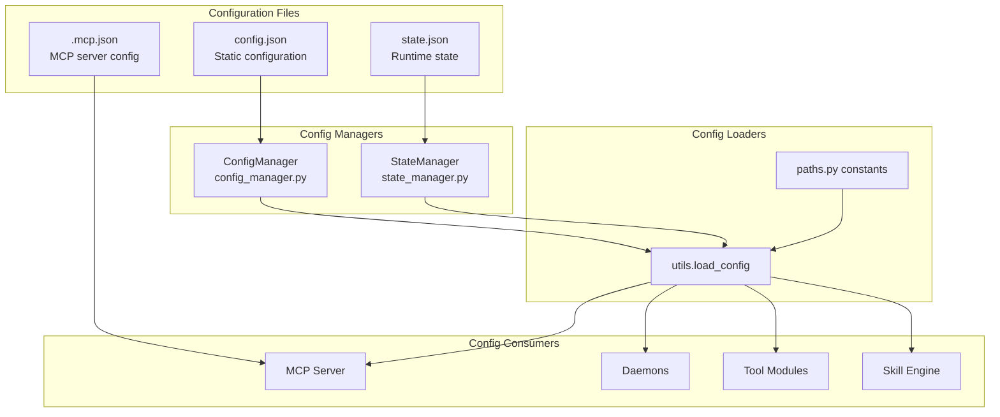
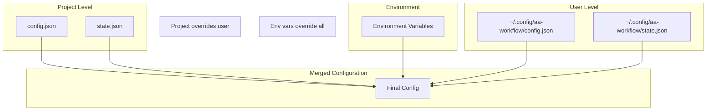
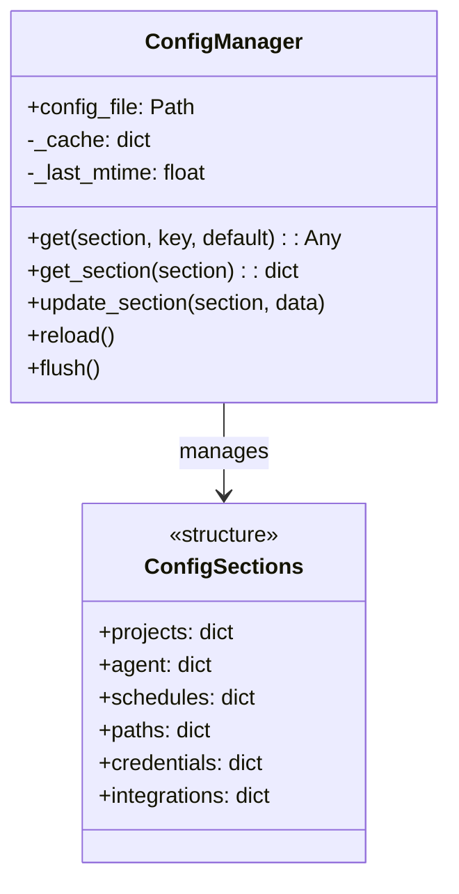

# Config System

> Configuration loading hierarchy and management

## Diagram

## Configuration Hierarchy

## Config Manager Class

## Components

| Component | File | Description |
|-----------|------|-------------|
| ConfigManager | `server/config_manager.py` | Config file manager |
| StateManager | `server/state_manager.py` | State file manager |
| load_config | `server/utils.py` | Config loading utility |
| paths | `server/paths.py` | Path constants |
| config.py | `server/config.py` | Config constants |

## Config Sections

| Section | Purpose | Example Keys |
|---------|---------|--------------|
| projects | Project definitions | gitlab_url, jira_project |
| agent | Agent settings | default_persona, tool_limit |
| schedules | Cron schedules | jobs, poll_sources |
| paths | File paths | vpn_script, kubeconfig |
| credentials | Auth config | jira_token_env, gitlab_token_env |
| integrations | External services | slack_workspace, google_project |

## State vs Config

| Aspect | config.json | state.json |
|--------|-------------|------------|
| Purpose | Static settings | Runtime state |
| Changes | Manual edits | Programmatic |
| Examples | URLs, paths | Enabled flags, toggles |
| Persistence | Git tracked | Local only |

## Environment Variables

| Variable | Purpose |
|----------|---------|
| AA_CONFIG_DIR | Config directory override |
| AA_PROJECT | Active project override |
| JIRA_JPAT | Jira API token |
| GITLAB_TOKEN | GitLab API token |
| SLACK_TOKEN | Slack API token |

## Related Diagrams

- [State Manager](./state-manager.md)
- [MCP Server Core](./mcp-server-core.md)
- [Project Structure](../00-overview/project-structure.md)
