# Debuggable Tool Infrastructure

> Auto-debug infrastructure for MCP tools with failure hints and self-healing

## Diagram

```mermaid
sequenceDiagram
    participant Claude as Claude/AI
    participant Tool as MCP Tool
    participant Wrapper as Debug Wrapper
    participant Registry as TOOL_REGISTRY
    participant Debug as debug_tool()

    Claude->>Tool: Call tool(args)
    Tool->>Wrapper: Execute wrapped function

    alt Tool succeeds
        Wrapper-->>Claude: Return result
    else Tool fails (❌ prefix)
        Wrapper->>Wrapper: Detect failure pattern
        Wrapper->>Wrapper: Add remediation hints
        Wrapper-->>Claude: Result + "💡 Auto-fix: debug_tool('name')"

        Claude->>Debug: debug_tool(tool_name)
        Debug->>Registry: get_tool_source(name)
        Registry-->>Debug: source_file, func_source, lines
        Debug-->>Claude: Source code + fix instructions
        Claude->>Claude: Analyze and propose fix
    end
```



## Class Structure


## Debug Flow

```mermaid
flowchart TB
    subgraph Registration[Tool Registration]
        DECORATOR[@debuggable decorator]
        WRAP_ALL[wrap_all_tools]
        WRAP_RUNTIME[wrap_server_tools_runtime]
    end

    subgraph Runtime[Runtime Wrapping]
        CALL[Tool called]
        EXECUTE[Execute original]
        CHECK{Result starts with ❌?}
        SUCCESS[Return result]
        HINTS[Add remediation hints]
        TRACK[Track in agent_stats]
    end

    subgraph Debug[Debug Tool]
        DEBUG_CALL[debug_tool called]
        SEARCH[Search TOOL_REGISTRY]
        FOUND{Found?}
        SEARCH_FILES[Search tool_modules/]
        EXTRACT[Extract function source]
        RETURN[Return source + instructions]
    end

    DECORATOR --> TOOL_REGISTRY
    WRAP_ALL --> TOOL_REGISTRY
    WRAP_RUNTIME --> TOOL_REGISTRY

    CALL --> EXECUTE
    EXECUTE --> CHECK
    CHECK -->|No| SUCCESS
    CHECK -->|Yes| HINTS
    HINTS --> TRACK
    TRACK --> SUCCESS

    DEBUG_CALL --> SEARCH
    SEARCH --> FOUND
    FOUND -->|Yes| EXTRACT
    FOUND -->|No| SEARCH_FILES
    SEARCH_FILES --> EXTRACT
    EXTRACT --> RETURN
```

## Components

| Component | File | Description |
|-----------|------|-------------|
| `TOOL_REGISTRY` | `server/debuggable.py` | Global dict mapping tool names to source info |
| `debuggable` | `server/debuggable.py` | Decorator that captures source info |
| `register_debug_tool` | `server/debuggable.py` | Registers `debug_tool` with MCP server |
| `wrap_all_tools` | `server/debuggable.py` | Register module tools in registry |
| `wrap_server_tools_runtime` | `server/debuggable.py` | Wrap all server tools with debug hints |
| `get_tool_source` | `server/debuggable.py` | Retrieve source code for a tool |
| `_get_remediation_hints` | `server/debuggable.py` | Detect common errors and suggest fixes |

## Remediation Patterns

The debug wrapper automatically detects common error patterns and suggests quick fixes:

| Error Pattern | Suggested Remediation |
|---------------|----------------------|
| "no route to host", "connection refused" | `vpn_connect()` |
| "unauthorized", "token expired" | `kube_login(cluster='...')` |
| "401 unauthorized" (GitLab) | Check `GITLAB_TOKEN` |
| "invalid_auth" (Slack) | Re-obtain XOXC token |

## Usage

```python
from server.debuggable import debuggable, register_debug_tool

# Option 1: Use decorator on individual tools
@server.tool()
@debuggable
async def my_tool(...):
    ...

# Option 2: Register debug_tool and wrap all existing tools
register_debug_tool(server)
wrap_server_tools_runtime(server)
```

## How It Works

1. **Registration**: Tools are registered in `TOOL_REGISTRY` with source file and line info
2. **Runtime Wrapping**: `wrap_server_tools_runtime()` patches all tool handlers
3. **Failure Detection**: Wrapped handlers check if result starts with ❌
4. **Hint Injection**: On failure, adds debug hint and remediation suggestions
5. **Stats Tracking**: Records tool calls in `agent_stats` for analytics
6. **Session Tracking**: Updates workspace session with tool activity

## Related Diagrams

- [MCP Server Core](./mcp-server-core.md)
- [Auto-Heal Decorator](./auto-heal-decorator.md)
- [Tool Registry](./tool-registry.md)
