# Error Handling

> Standardized error formatting and handling for MCP tools

## Diagram

```mermaid
graph TB
    subgraph Functions[Response Functions]
        ERROR[tool_error]
        SUCCESS[tool_success]
        WARNING[tool_warning]
        INFO[tool_info]
    end

    subgraph Prefixes[Output Prefixes]
        ERR_PREFIX["❌ Error"]
        OK_PREFIX["✅ Success"]
        WARN_PREFIX["⚠️ Warning"]
        INFO_PREFIX["ℹ️ Info"]
    end

    subgraph Codes[Error Codes]
        AUTH[AUTH_FAILED<br/>AUTH_EXPIRED<br/>PERMISSION_DENIED]
        RESOURCE[NOT_FOUND<br/>ALREADY_EXISTS<br/>CONFLICT]
        OPERATION[TIMEOUT<br/>RATE_LIMITED<br/>INVALID_INPUT]
        SYSTEM[INTERNAL_ERROR<br/>SERVICE_UNAVAILABLE]
    end

    ERROR --> ERR_PREFIX
    SUCCESS --> OK_PREFIX
    WARNING --> WARN_PREFIX
    INFO --> INFO_PREFIX

    ERROR --> Codes
```



## Components

| Component | File | Description |
|-----------|------|-------------|
| `ToolResult` | `server/errors.py` | Structured result dataclass |
| `tool_error` | `server/errors.py` | Create error response string |
| `tool_success` | `server/errors.py` | Create success response string |
| `tool_warning` | `server/errors.py` | Create warning response string |
| `tool_info` | `server/errors.py` | Create info response string |
| `ErrorCodes` | `server/errors.py` | Standard error code constants |

## ToolResult Dataclass

Structured result from a tool operation:

```python
@dataclass
class ToolResult:
    success: bool
    message: str
    error: str | None = None
    data: dict[str, Any] | None = None
    code: str | None = None
    context: dict[str, Any] = field(default_factory=dict)

    def to_string(self) -> str:
        """Convert to formatted string for MCP response."""
```

## Response Functions

### tool_error

Create a standardized error response string with ❌ prefix.

```python
from server.errors import tool_error

# Simple error
return tool_error("File not found", code="NOT_FOUND")

# Error with context
return tool_error(
    "Failed to deploy",
    error="Timeout waiting for pods",
    context={"namespace": "ns-123"},
    hint="Try increasing timeout"
)
```

**Parameters:**
- `message`: Main error message (shown prominently)
- `error`: Detailed error text (e.g., exception message)
- `code`: Error code for programmatic handling
- `context`: Additional context dict
- `hint`: Helpful hint for resolving the error

### tool_success

Create a standardized success response string with ✅ prefix.

```python
from server.errors import tool_success

return tool_success("Deployment complete", data={"pod_count": 3})
```

### tool_warning

Create a standardized warning response string with ⚠️ prefix.

```python
from server.errors import tool_warning

return tool_warning("Namespace expiring soon", details="2 hours remaining")
```

### tool_info

Create a standardized info response string with ℹ️ prefix.

```python
from server.errors import tool_info

return tool_info("Current status", data={"pods": 3, "ready": 2})
```

## Error Codes

Standard error codes for consistency across tools:

| Category | Codes |
|----------|-------|
| **Authentication** | `AUTH_FAILED`, `AUTH_EXPIRED`, `PERMISSION_DENIED` |
| **Resource** | `NOT_FOUND`, `ALREADY_EXISTS`, `CONFLICT` |
| **Operation** | `TIMEOUT`, `RATE_LIMITED`, `INVALID_INPUT`, `INVALID_STATE` |
| **System** | `INTERNAL_ERROR`, `SERVICE_UNAVAILABLE`, `DEPENDENCY_FAILED` |
| **Network** | `CONNECTION_FAILED`, `DNS_FAILED` |

## Usage Examples

```python
from server.errors import tool_error, tool_success, ErrorCodes

# Authentication error
if not authenticated:
    return tool_error(
        "Authentication failed",
        error="Token expired",
        code=ErrorCodes.AUTH_EXPIRED,
        hint="Run kube_login() to refresh credentials"
    )

# Resource not found
if not resource:
    return tool_error(
        f"Pod {name} not found",
        code=ErrorCodes.NOT_FOUND,
        context={"namespace": namespace}
    )

# Success with data
return tool_success(
    "Namespace created",
    data={"name": "ns-abc123", "ttl": "4h", "reserved_by": "user"}
)
```

## Output Format

Error responses follow a consistent format:

```
❌ Main error message [ERROR_CODE]
**Error:** Detailed error text
**Context:** key1=value1, key2=value2
💡 **Hint:** Helpful suggestion
```

Success responses:

```
✅ Main success message
**Context:** key1=value1
**key:** value
**list:**
```json
["item1", "item2"]
```
```

## Related Diagrams

- [Debuggable Tool Infrastructure](./debuggable.md)
- [Auto-Heal Decorator](./auto-heal-decorator.md)
