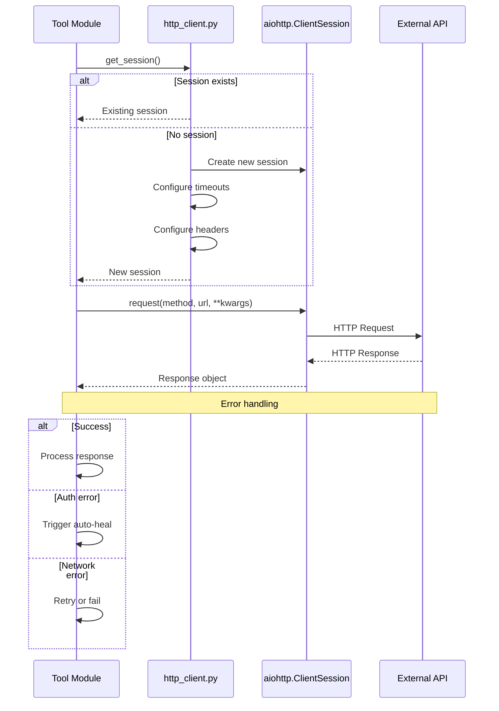
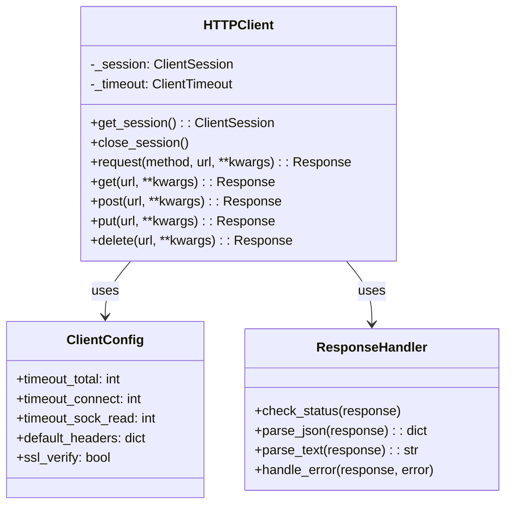
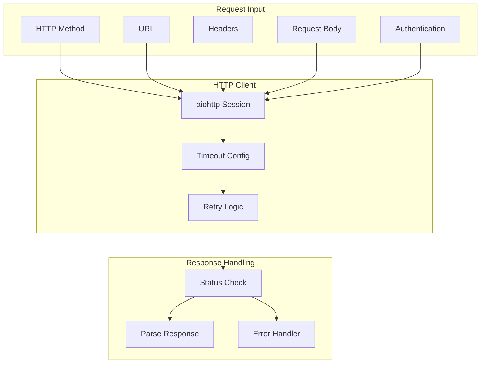

# HTTP Client

> Shared HTTP client utilities for external API calls

## Diagram



## Class Structure



## Request Flow



## Components

| Component | File | Description |
|-----------|------|-------------|
| HTTPClient | `server/http_client.py` | Main client class |
| get_session | `server/http_client.py` | Get/create session |
| close_session | `server/http_client.py` | Cleanup session |
| Timeouts | `server/timeouts.py` | Timeout constants |

## Timeout Configuration

| Timeout | Default | Description |
|---------|---------|-------------|
| total | 30s | Total request timeout |
| connect | 10s | Connection timeout |
| sock_read | 20s | Socket read timeout |

## Common Headers

```python
DEFAULT_HEADERS = {
    "User-Agent": "aa-workflow/1.0",
    "Accept": "application/json",
    "Content-Type": "application/json",
}
```

## Error Handling

| Error Type | Action |
|------------|--------|
| 401/403 | Trigger auto-heal (kube_login) |
| 429 | Retry with backoff |
| 5xx | Retry up to max_retries |
| Timeout | Retry or fail |
| Connection | Check VPN, retry |

## Related Diagrams

- [Auto-Heal Decorator](./auto-heal-decorator.md)
- [External Integrations](../07-integrations/auth-flows.md)
- [Tool Registry](./tool-registry.md)
