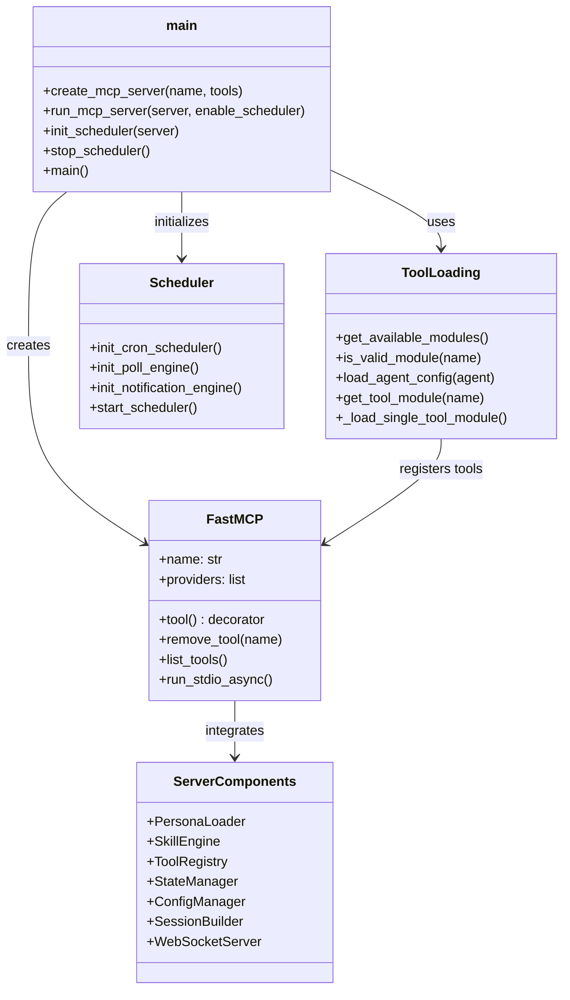
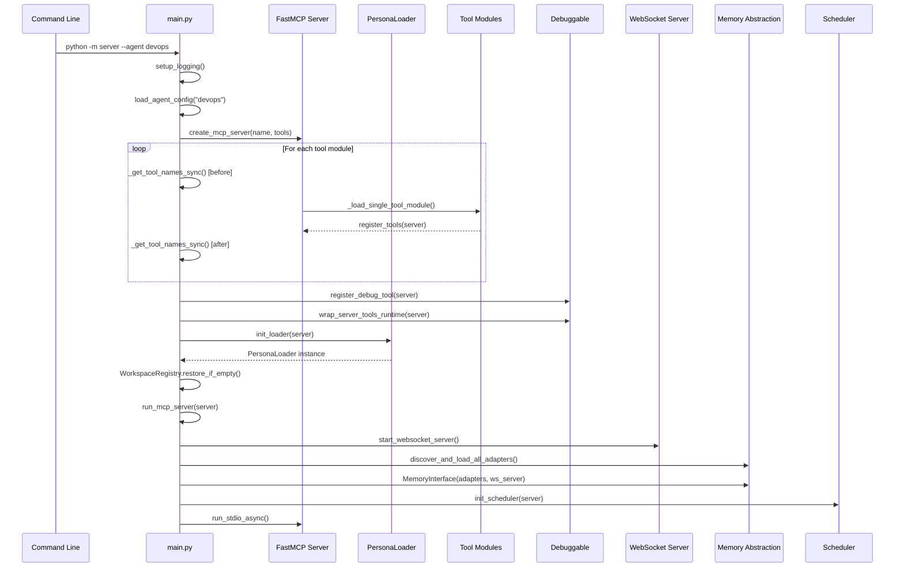

# MCP Server Core

> FastMCP server entry point and core initialization flow

## Diagram

## Initialization Flow

## Components

| Component | File | Description |
|-----------|------|-------------|
| FastMCP | External library | MCP protocol implementation |
| main | `server/main.py` | Entry point and server creation |
| create_mcp_server | `server/main.py` | Factory function for server |
| run_mcp_server | `server/main.py` | Async server runner |
| init_scheduler | `server/main.py` | Scheduler subsystem init |
| stop_scheduler | `server/main.py` | Graceful scheduler shutdown |
| load_agent_config | `server/main.py` | Load persona YAML |
| _get_tool_names_sync | `server/main.py` | Get tools from FastMCP v3 providers |
| _load_single_tool_module | `server/main.py` | Load and register one tool module |
| _register_debug_for_module | `server/main.py` | Register debug hooks for module |
| setup_logging | `server/main.py` | Configure journald-compatible logging |
| MemoryInterface | `services/memory_abstraction/` | Memory abstraction layer |

## Command Line Options

| Option | Description |
|--------|-------------|
| `--agent NAME` | Load tools for persona (devops, developer, etc.) |
| `--tools LIST` | Comma-separated tool modules |
| `--all` | Load all available tools |
| `--name NAME` | Custom server name |
| `--no-scheduler` | Disable cron scheduler |

## Related Diagrams

- [Tool Registry](./tool-registry.md)
- [Persona Loader](./persona-loader.md)
- [Config System](./config-system.md)
