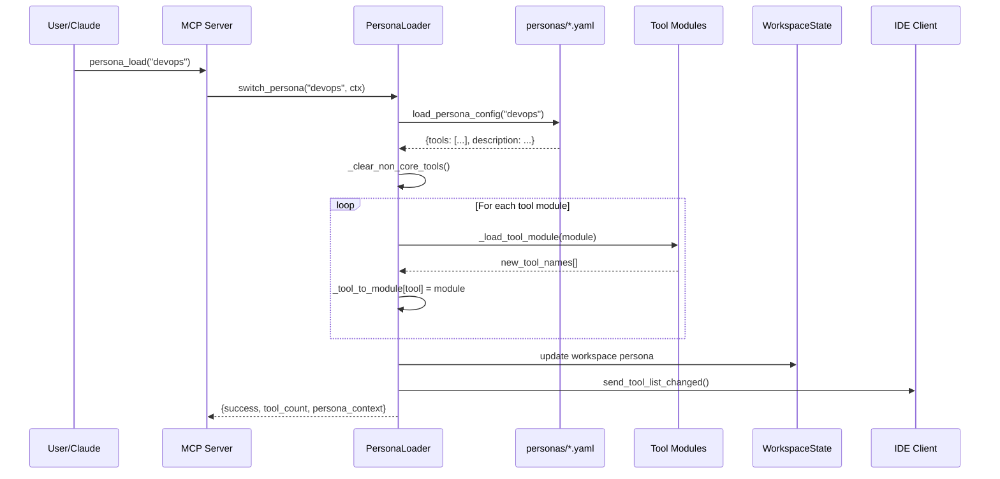
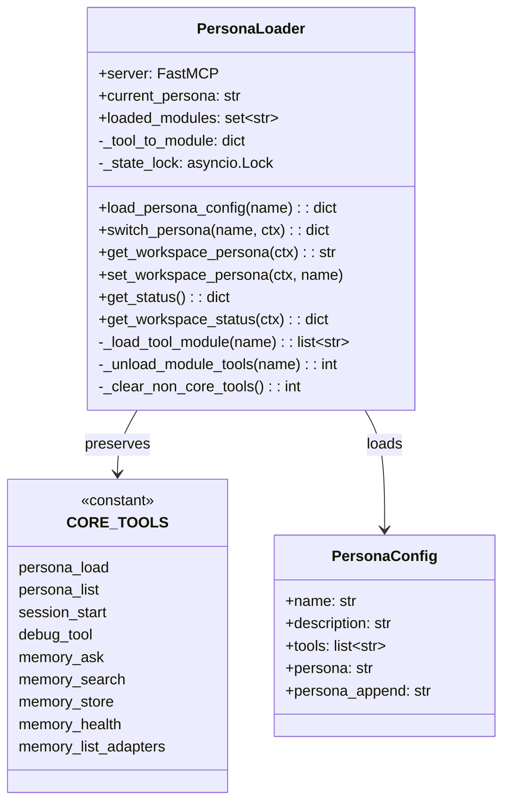
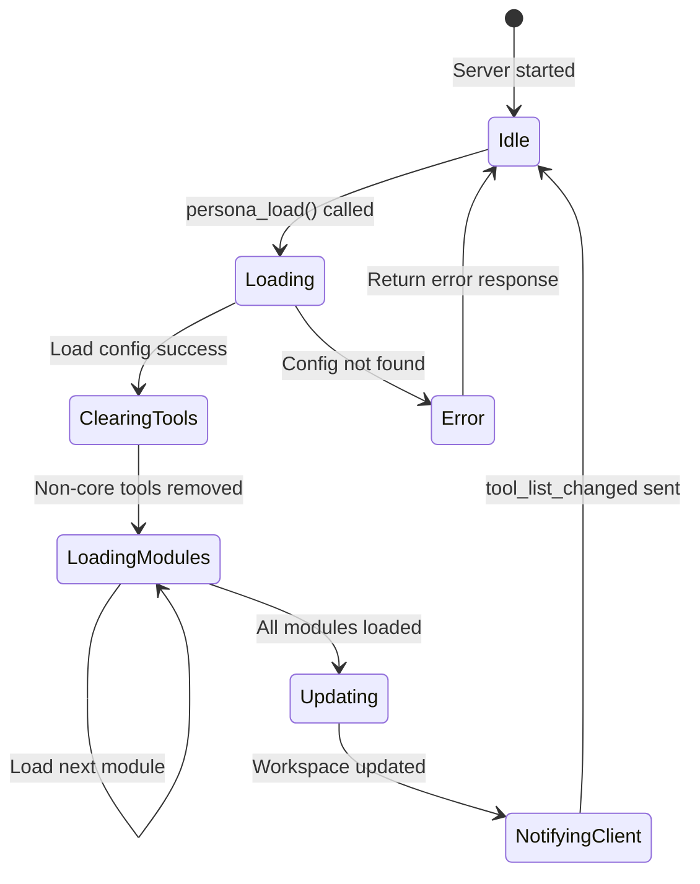

# Persona Loader

> Dynamic tool loading and persona switching at runtime

## Diagram



## Class Structure



## Persona Switching State



## Components

| Component | File | Description |
|-----------|------|-------------|
| PersonaLoader | `server/persona_loader.py` | Main loader class |
| CORE_TOOLS | `server/persona_loader.py` | Protected tool names |
| discover_tool_modules | `server/persona_loader.py` | Module discovery |
| get_available_modules | `server/persona_loader.py` | Available modules cache |
| init_loader | `server/persona_loader.py` | Global instance init |
| get_loader | `server/persona_loader.py` | Get global instance |

## Persona Config Structure

```yaml
# personas/devops.yaml
name: DevOps
description: Infrastructure and deployment tools
tools:
  - k8s_basic
  - bonfire_basic
  - jira_basic
  - quay_basic
  - konflux_basic
persona: personas/devops.md
```

## Related Diagrams

- [MCP Server Core](./mcp-server-core.md)
- [Tool Registry](./tool-registry.md)
- [Persona Architecture](../05-personas/persona-architecture.md)
