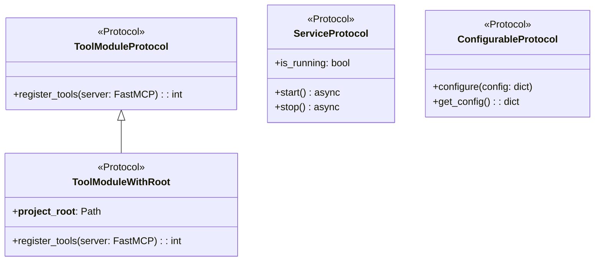
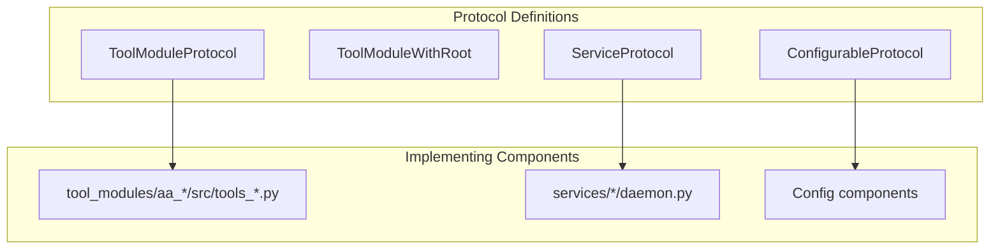

# Protocol Definitions

> Type-safe structural interfaces for MCP server components

## Diagram



## Protocol Hierarchy



## Components

| Component | File | Description |
|-----------|------|-------------|
| `ToolModuleProtocol` | `server/protocols.py` | Interface for tool modules |
| `ToolModuleWithRoot` | `server/protocols.py` | Tool module with project root |
| `ServiceProtocol` | `server/protocols.py` | Interface for background services |
| `ConfigurableProtocol` | `server/protocols.py` | Interface for configurable components |
| `is_tool_module` | `server/protocols.py` | Runtime validation function |
| `validate_tool_module` | `server/protocols.py` | Full validation with error list |

## ToolModuleProtocol

The primary interface for tool modules that can be loaded by `PersonaLoader`.

### Required Methods

| Method | Signature | Description |
|--------|-----------|-------------|
| `register_tools` | `(server: FastMCP) -> int` | Register tools with server, return count |

### Example Implementation

```python
# tool_modules/aa_example/src/tools_basic.py

from pathlib import Path
from fastmcp import FastMCP
from tool_modules.common import PROJECT_ROOT

__project_root__ = PROJECT_ROOT

def register_tools(server: FastMCP) -> int:
    '''Register tools with the MCP server.'''
    from server.tool_registry import ToolRegistry
    registry = ToolRegistry(server)

    @registry.tool()
    async def example_tool(arg: str) -> str:
        '''Example tool.'''
        return f"Result: {arg}"

    return registry.count
```

## ServiceProtocol

Interface for background services and daemons.

### Required Members

| Member | Type | Description |
|--------|------|-------------|
| `is_running` | `property -> bool` | Whether service is running |
| `start` | `async method` | Start the service |
| `stop` | `async method` | Stop the service gracefully |

## Validation Functions

### is_tool_module(obj)

Runtime check if an object implements `ToolModuleProtocol`.

```python
from server.protocols import is_tool_module

if is_tool_module(module):
    module.register_tools(server)
```

### validate_tool_module(module, name)

Full validation with detailed error messages.

```python
from server.protocols import validate_tool_module

errors = validate_tool_module(module, "example")
if errors:
    for error in errors:
        logger.warning(f"Validation: {error}")
```

## Related Diagrams

- [MCP Server Core](./mcp-server-core.md)
- [Persona Loader](./persona-loader.md)
- [Tool Registry](./tool-registry.md)
