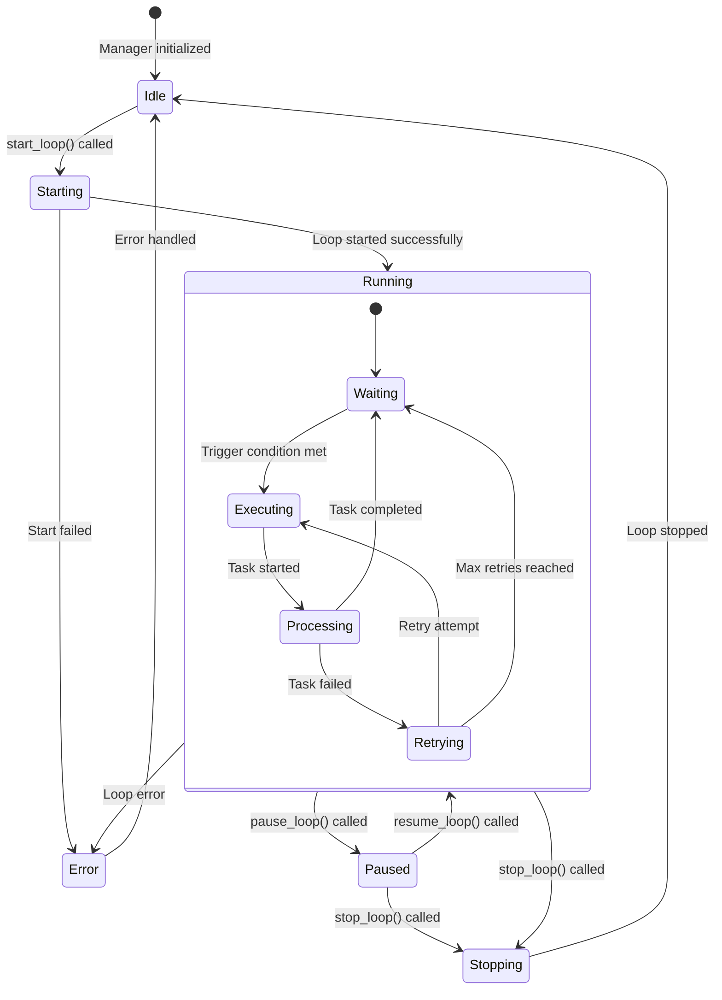
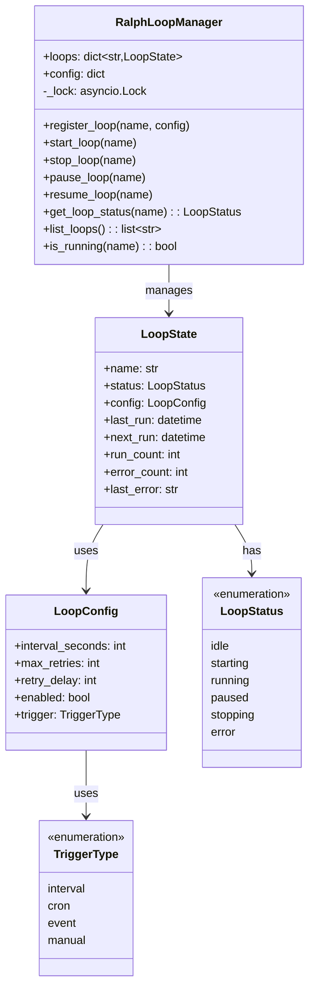

# Ralph Loop Manager

> Background loop state management for autonomous operations

## Diagram



## Class Structure



## Loop Execution Flow

```mermaid
sequenceDiagram
    participant Manager as RalphLoopManager
    participant Loop as LoopState
    participant Task as Task Handler
    participant Memory as Memory System

    Manager->>Loop: start_loop()
    Loop->>Loop: Set status = running

    loop While running
        Loop->>Loop: Wait for trigger
        
        alt Trigger condition met
            Loop->>Task: Execute task
            
            alt Task succeeds
                Task-->>Loop: Success result
                Loop->>Memory: Log success
                Loop->>Loop: Update last_run
            else Task fails
                Task-->>Loop: Error
                Loop->>Loop: Increment error_count
                
                alt Retries remaining
                    Loop->>Loop: Wait retry_delay
                    Loop->>Task: Retry task
                else Max retries reached
                    Loop->>Memory: Log failure
                    Loop->>Loop: Continue to next cycle
                end
            end
        end
    end

    Manager->>Loop: stop_loop()
    Loop->>Loop: Set status = idle
```

## Components

| Component | File | Description |
|-----------|------|-------------|
| RalphLoopManager | `server/ralph_loop_manager.py` | Main loop manager |
| LoopState | `server/ralph_loop_manager.py` | Individual loop state |
| LoopConfig | `server/ralph_loop_manager.py` | Loop configuration |

## Loop Types

| Type | Trigger | Use Case |
|------|---------|----------|
| interval | Fixed time interval | Periodic checks |
| cron | Cron expression | Scheduled tasks |
| event | External event | Reactive processing |
| manual | User triggered | On-demand execution |

## Configuration Example

```yaml
loops:
  jira_sync:
    interval_seconds: 300
    max_retries: 3
    retry_delay: 30
    enabled: true
    trigger: interval

  slack_monitor:
    interval_seconds: 60
    max_retries: 2
    retry_delay: 10
    enabled: true
    trigger: interval
```

## Related Diagrams

- [Cron Daemon](../02-services/cron-daemon.md)
- [SLOP Daemon](../02-services/slop-daemon.md)
- [State Manager](./state-manager.md)
