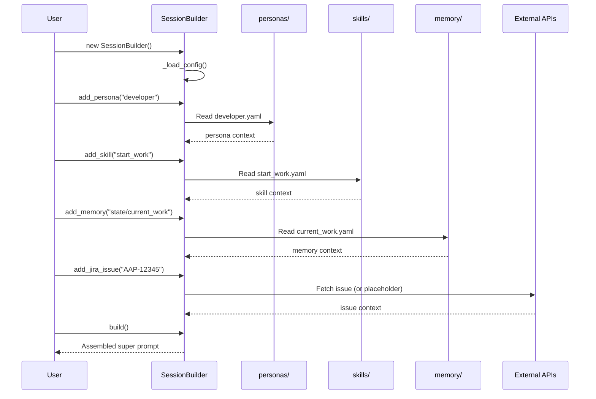
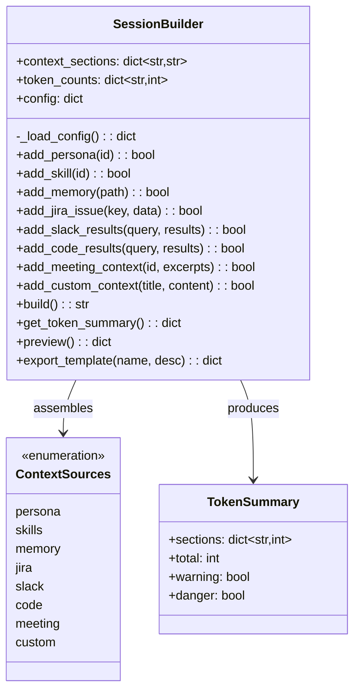
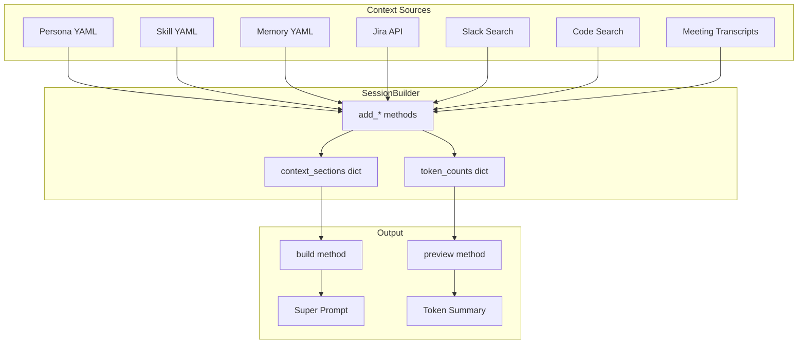

# Session Builder

> Super prompt context assembly from multiple sources

## Diagram

## Class Structure

## Context Assembly Flow

## Components

| Component | File | Description |
|-----------|------|-------------|
| SessionBuilder | `server/session_builder.py` | Main builder class |
| estimate_tokens | `server/session_builder.py` | Token estimation (4 chars/token) |
| build_auto_context | `server/session_builder.py` | Auto-build from issue key |
| WORKSPACE_ROOT | `server/session_builder.py` | Project root path |

## Section Order

The `build()` method assembles sections in this order:

1. persona - System prompt and tool context
2. jira - Issue details
3. memory - Current work, patterns
4. skills - Workflow definitions
5. slack - Related messages
6. code - Related code snippets
7. meeting - Transcript excerpts
8. (custom sections)

## Related Diagrams

- [MCP Server Core](./mcp-server-core.md)
- [Memory Architecture](../06-memory/memory-architecture.md)
- [Context Gathering Flow](../08-data-flows/context-gathering.md)
