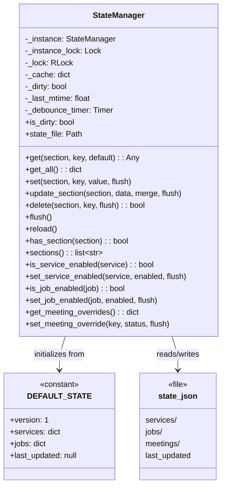
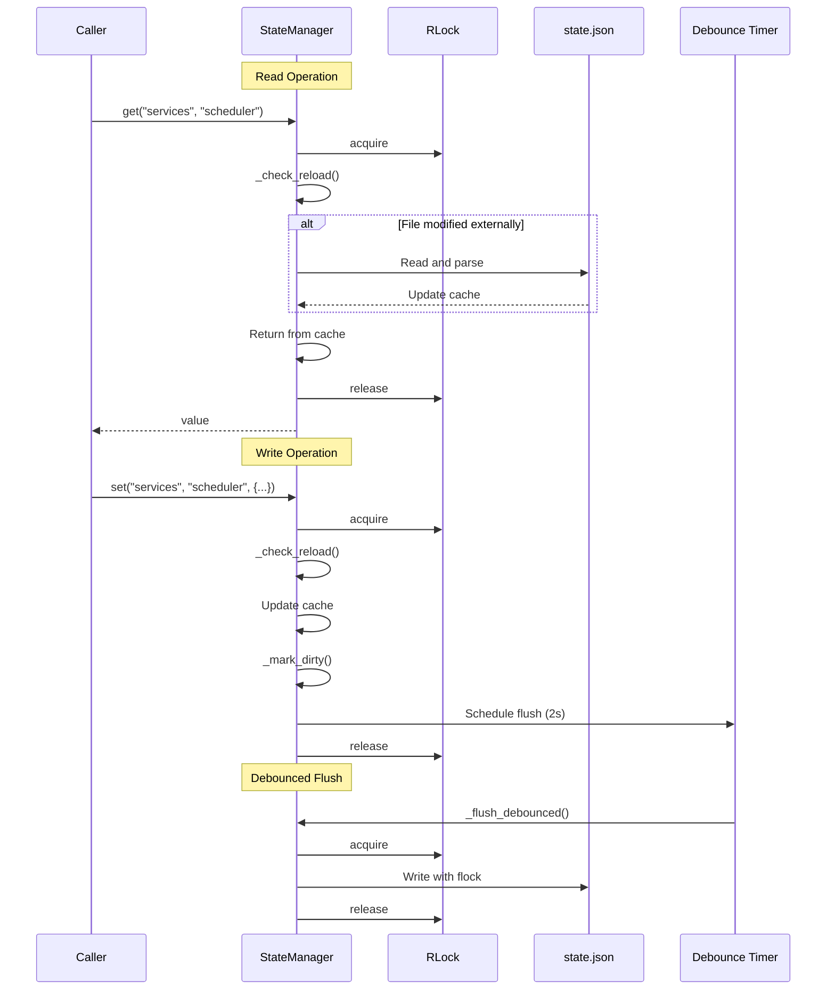

# State Manager

> Thread-safe, debounced state persistence

## Diagram



## Read/Write Flow



## State Structure

```mermaid
graph TB
    subgraph StateJSON[state.json]
        VERSION[version: 1]
        subgraph Services[services]
            SCHEDULER[scheduler: enabled]
            SPRINT[sprint_bot: enabled]
            GCAL[google_calendar: enabled]
            GMAIL[gmail: enabled]
        end
        subgraph Jobs[jobs]
            JOB1[morning_coffee: enabled]
            JOB2[jira_hygiene: enabled]
        end
        subgraph Meetings[meetings]
            OVERRIDES[overrides: {...}]
        end
        UPDATED[last_updated: timestamp]
    end
```

## Components

| Component | File | Description |
|-----------|------|-------------|
| StateManager | `server/state_manager.py` | Singleton state manager |
| state | `server/state_manager.py` | Global instance |
| DEFAULT_STATE | `server/state_manager.py` | Default structure |
| DEBOUNCE_DELAY | `server/state_manager.py` | 2.0 seconds |
| STATE_FILE | `server/paths.py` | File path |

## Thread Safety Features

| Feature | Implementation |
|---------|----------------|
| Singleton | `__new__` with class lock |
| Thread-safe ops | RLock for all operations |
| Cross-process | fcntl.flock on writes |
| External changes | mtime checking on reads |
| Debounced writes | Timer-based batching |

## Related Diagrams

- [Config System](./config-system.md)
- [MCP Server Core](./mcp-server-core.md)
