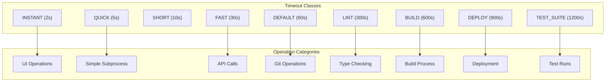

# Timeout Configuration

> Centralized timeout values and output limits for consistent operation

## Diagram



## Components

| Component | File | Description |
|-----------|------|-------------|
| `Timeouts` | `server/timeouts.py` | Timeout constants class |
| `OutputLimits` | `server/timeouts.py` | Output truncation limits |
| `Environment` | `server/timeouts.py` | Type alias for environment names |
| `parse_duration_to_minutes` | `server/timeouts.py` | Parse duration strings |

## Timeout Classes

### Timeouts

Standard timeout values in seconds for different operation types.

| Constant | Value | Use Case |
|----------|-------|----------|
| `INSTANT` | 2s | UI operations (wmctrl, paplay) |
| `QUICK` | 5s | Quick subprocess calls |
| `SHORT` | 10s | Short DB queries, config reads |
| `FAST` | 30s | Simple commands, API calls |
| `DEFAULT` | 60s | Standard git/CLI operations |
| `LINT` | 300s | Linting, type checking |
| `BUILD` | 600s | Building, bundling |
| `DEPLOY` | 900s | Deployments, namespace reservation |
| `TEST_SUITE` | 1200s | Full test runs |

### Network-Specific Timeouts

| Constant | Value | Use Case |
|----------|-------|----------|
| `HTTP_REQUEST` | 30s | HTTP API calls |
| `CLUSTER_LOGIN` | 120s | Kubernetes login with MFA |

### Bonfire-Specific Timeouts

| Constant | Value | Use Case |
|----------|-------|----------|
| `BONFIRE_RESERVE` | 660s | Namespace reservation |
| `BONFIRE_DEPLOY` | 960s | Full deploy |
| `BONFIRE_IQE` | 900s | IQE test run |

### Database Timeouts

| Constant | Value | Use Case |
|----------|-------|----------|
| `DB_CONNECT` | 10s | SQLite connection |
| `DB_QUERY` | 30s | Standard query |

## OutputLimits

Standard output truncation limits in characters.

| Constant | Value | Use Case |
|----------|-------|----------|
| `SHORT` | 1000 | Error messages, short snippets |
| `MEDIUM` | 2000 | Command output, formatted results |
| `STANDARD` | 5000 | Default for most tools |
| `LONG` | 10000 | Pipeline logs, kubectl describe |
| `FULL` | 15000 | Complete output when needed |
| `EXTENDED` | 20000 | Very long logs (konflux builds) |

## Environment Type

Type alias for valid environment names:

```python
Environment = Literal["stage", "prod", "ephemeral", "konflux"]
DEFAULT_ENVIRONMENT: Environment = "stage"
VALID_ENVIRONMENTS = {"stage", "prod", "ephemeral", "konflux"}
```

## Duration Parsing

Parse duration strings like "30m", "2h", "1d" to minutes:

```python
from server.timeouts import parse_duration_to_minutes

parse_duration_to_minutes("30m")  # -> 30
parse_duration_to_minutes("2h")   # -> 120
parse_duration_to_minutes("1d")   # -> 1440
parse_duration_to_minutes("1w")   # -> 10080
```

## Usage

```python
from server.timeouts import Timeouts, OutputLimits

# Use in subprocess calls
success, output = await run_cmd(cmd, timeout=Timeouts.DEFAULT)

# Use for output truncation
from server.utils import truncate_output
truncated = truncate_output(output, max_length=OutputLimits.STANDARD)
```

## Related Diagrams

- [MCP Server Core](./mcp-server-core.md)
- [HTTP Client](./http-client.md)
