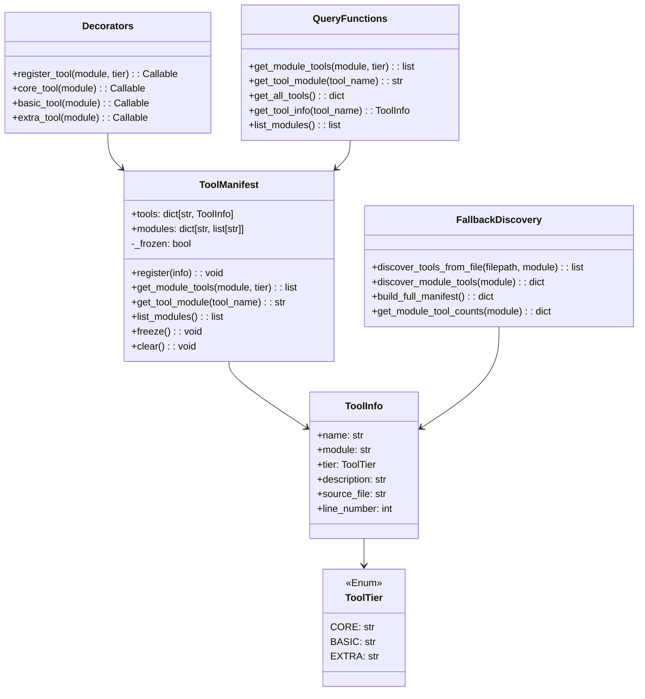
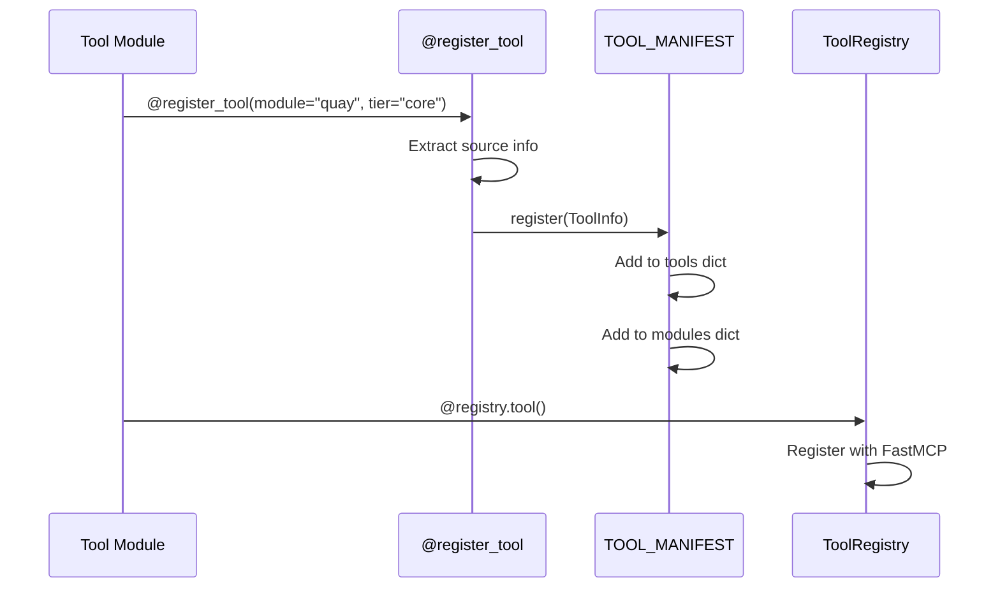

# Tool Discovery System

> Decorator-based tool registration with automatic discovery

## Diagram



## Registration Flow



## Components

| Component | File | Description |
|-----------|------|-------------|
| ToolTier | `server/tool_discovery.py` | Enum for CORE/BASIC/EXTRA tiers |
| ToolInfo | `server/tool_discovery.py` | Metadata about a registered tool |
| ToolManifest | `server/tool_discovery.py` | Global registry of all tools |
| TOOL_MANIFEST | `server/tool_discovery.py` | Singleton manifest instance |

## Tool Tiers

Three-tier system for managing tool context limits (~80 tools max):

| Tier | Description | Loading |
|------|-------------|---------|
| **CORE** | Essential tools (5-10 per module) | Loaded by default with persona |
| **BASIC** | Common tools | Loaded with `_basic` suffix |
| **EXTRA** | Advanced tools | Available via `tool_exec()` only |

## Decorator Usage

```python
from server.tool_discovery import register_tool, core_tool, basic_tool
from server.tool_registry import ToolRegistry

def register_tools(server: FastMCP) -> int:
    registry = ToolRegistry(server)

    # Full decorator
    @register_tool(module="quay", tier="core")
    @registry.tool()
    async def quay_get_tag(...):
        """Get tag details."""
        ...

    # Shorthand decorators
    @core_tool(module="quay")
    @registry.tool()
    async def quay_check_image_exists(...):
        ...

    @basic_tool(module="quay")
    @registry.tool()
    async def quay_list_tags(...):
        ...

    return registry.count
```

## Query Functions

```python
from server.tool_discovery import (
    get_module_tools,
    get_tool_module,
    get_all_tools,
    get_tool_info,
    list_modules,
)

# Get all tools for a module
tools = get_module_tools("quay")  # ["quay_get_tag", "quay_list_tags", ...]

# Get only core tools
core_tools = get_module_tools("quay", tier="core")

# Find which module a tool belongs to
module = get_tool_module("quay_get_tag")  # "quay"

# Get full tool info
info = get_tool_info("quay_get_tag")
# ToolInfo(name="quay_get_tag", module="quay", tier=CORE, ...)

# List all modules
modules = list_modules()  # ["quay", "gitlab", "jira", ...]

# Get all tools grouped by module
all_tools = get_all_tools()  # {"quay": [...], "gitlab": [...]}
```

## Fallback Discovery

When tools haven't been loaded yet, the system can scan files:

```python
from server.tool_discovery import (
    discover_module_tools,
    build_full_manifest,
    get_module_tool_counts,
)

# Discover tools by scanning files (no import)
discovered = discover_module_tools("quay")
# {"core": ["quay_get_tag"], "basic": ["quay_list_tags"], "extra": []}

# Build complete manifest from all modules
manifest = build_full_manifest()
# {"quay": [...], "gitlab": [...], "jira": [...]}

# Get tool counts per tier
counts = get_module_tool_counts("quay")
# {"core": 2, "basic": 5, "extra": 3, "total": 10}
```

## File Structure Detection

The discovery system scans these files:

| File | Tier | Priority |
|------|------|----------|
| `tools_core.py` | CORE | Highest |
| `tools_basic.py` | BASIC | Medium |
| `tools_extra.py` | EXTRA | Lower |
| `tools.py` | BASIC | Legacy fallback |

## Related Diagrams

- [Tool Registry](./tool-registry.md)
- [Tool Tiers](../03-tools/tool-tiers.md)
- [Tool Module Structure](../03-tools/tool-module-structure.md)
- [Persona Loader](./persona-loader.md)
