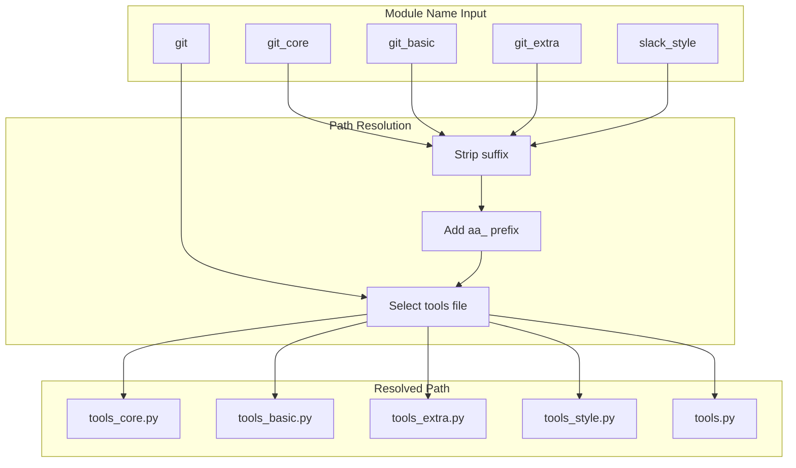

# Tool Path Resolution

> Shared utilities for resolving tool module file paths

## Diagram



## Components

| Component | File | Description |
|-----------|------|-------------|
| `PROJECT_DIR` | `server/tool_paths.py` | Project root path |
| `TOOL_MODULES_DIR` | `server/tool_paths.py` | tool_modules/ directory path |
| `get_tools_file_path` | `server/tool_paths.py` | Resolve module name to file path |
| `get_module_dir` | `server/tool_paths.py` | Get directory for a module |

## Directory Structure

```
ai-workflow/
├── server/
│   └── tool_paths.py      <- This module
└── tool_modules/
    ├── aa_git/
    │   └── src/
    │       ├── tools_core.py
    │       ├── tools_basic.py
    │       └── tools_extra.py
    ├── aa_jira/
    │   └── src/
    │       ├── tools_basic.py
    │       └── tools_extra.py
    └── ...
```

## File Naming Conventions

| Constant | Filename | Purpose |
|----------|----------|---------|
| `TOOLS_FILE` | `tools.py` | Legacy single-file tools |
| `TOOLS_CORE_FILE` | `tools_core.py` | Core/essential tools |
| `TOOLS_BASIC_FILE` | `tools_basic.py` | Basic tier tools |
| `TOOLS_EXTRA_FILE` | `tools_extra.py` | Extended tier tools |
| `TOOLS_STYLE_FILE` | `tools_style.py` | Style/formatting tools |

## get_tools_file_path(module_name)

Determine the correct tools file path for a module name.

**Suffix Handling:**

| Input | Output |
|-------|--------|
| `k8s_core` | `aa_k8s/src/tools_core.py` |
| `k8s_basic` | `aa_k8s/src/tools_basic.py` |
| `k8s_extra` | `aa_k8s/src/tools_extra.py` |
| `slack_style` | `aa_slack/src/tools_style.py` |
| `workflow` | `aa_workflow/src/tools_core.py` (or fallback) |

**Fallback Logic for non-suffixed names:**
1. Try `tools_core.py` first (new default)
2. Then `tools_basic.py`
3. Finally `tools.py` (legacy)

```python
from server.tool_paths import get_tools_file_path

path = get_tools_file_path("git")        # aa_git/src/tools_core.py
path = get_tools_file_path("git_basic")  # aa_git/src/tools_basic.py
path = get_tools_file_path("git_extra")  # aa_git/src/tools_extra.py
```

## get_module_dir(module_name)

Get the directory for a tool module, stripping any suffix.

```python
from server.tool_paths import get_module_dir

dir = get_module_dir("git")        # tool_modules/aa_git
dir = get_module_dir("git_basic")  # tool_modules/aa_git
dir = get_module_dir("git_extra")  # tool_modules/aa_git
```

## Usage

This module is used by:
- `server/main.py` - Loading tool modules at startup
- `server/persona_loader.py` - Dynamic persona tool loading

```python
from server.tool_paths import get_tools_file_path, TOOL_MODULES_DIR

# Load a specific tool module
tools_path = get_tools_file_path("git_basic")
if tools_path.exists():
    spec = importlib.util.spec_from_file_location("tools", tools_path)
    module = importlib.util.module_from_spec(spec)
    spec.loader.exec_module(module)
    module.register_tools(server)
```

## Related Diagrams

- [MCP Server Core](./mcp-server-core.md)
- [Persona Loader](./persona-loader.md)
- [Tool Registry](./tool-registry.md)
