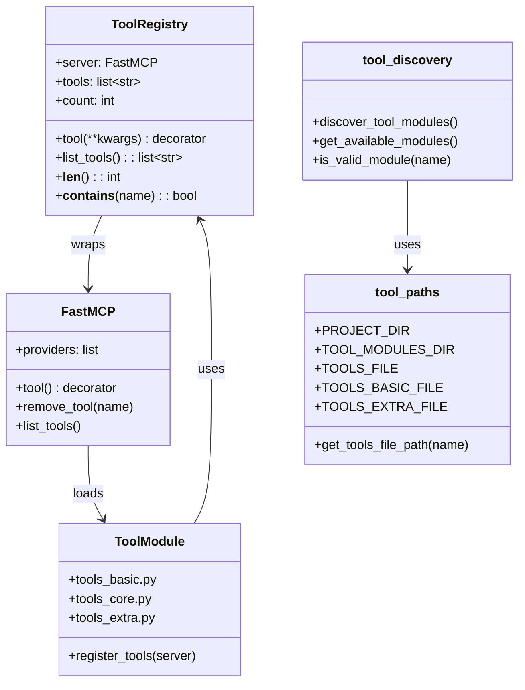
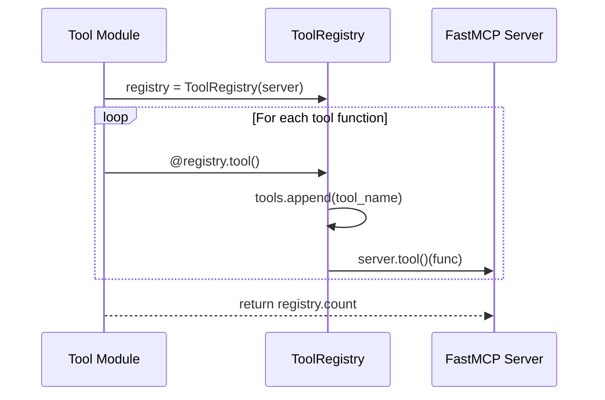
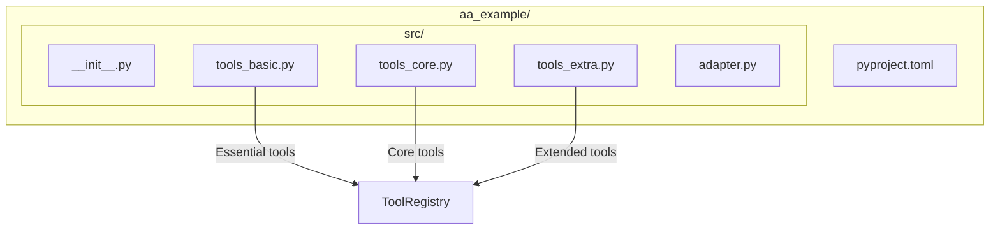

# Tool Registry

> Tool registration and discovery system

## Diagram

## Registration Flow

## Tool Module Structure

## Components

| Component | File | Description |
|-----------|------|-------------|
| ToolRegistry | `server/tool_registry.py` | Decorator-based tool tracking |
| tool_discovery | `server/tool_discovery.py` | Module discovery |
| tool_paths | `server/tool_paths.py` | Path resolution utilities |
| tools_basic.py | `tool_modules/aa_*/src/` | Essential tools |
| tools_core.py | `tool_modules/aa_*/src/` | Core tools |
| tools_extra.py | `tool_modules/aa_*/src/` | Extended tools |

## Tool Tiers

| Tier | File | Purpose |
|------|------|---------|
| basic | `tools_basic.py` | Essential, always-needed tools |
| core | `tools_core.py` | Core functionality |
| extra | `tools_extra.py` | Extended/advanced tools |
| style | `tools_style.py` | Style-related tools |

## Related Diagrams

- [MCP Server Core](./mcp-server-core.md)
- [Persona Loader](./persona-loader.md)
- [Tool Module Structure](../03-tools/tool-module-structure.md)
