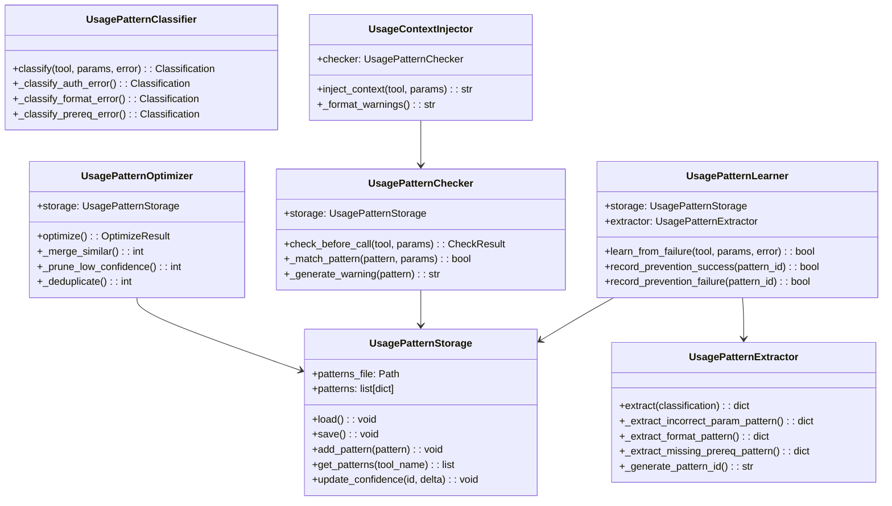
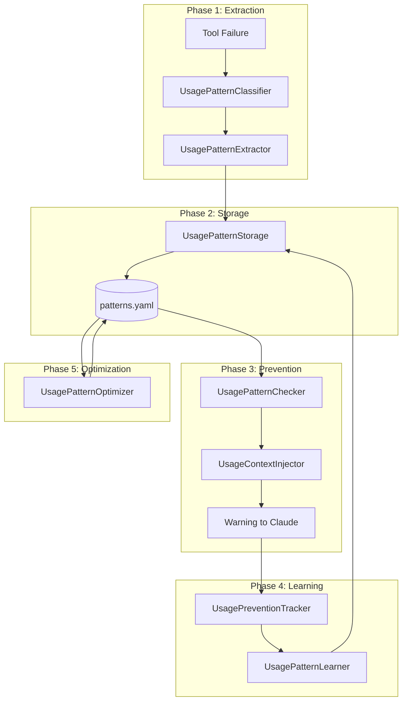
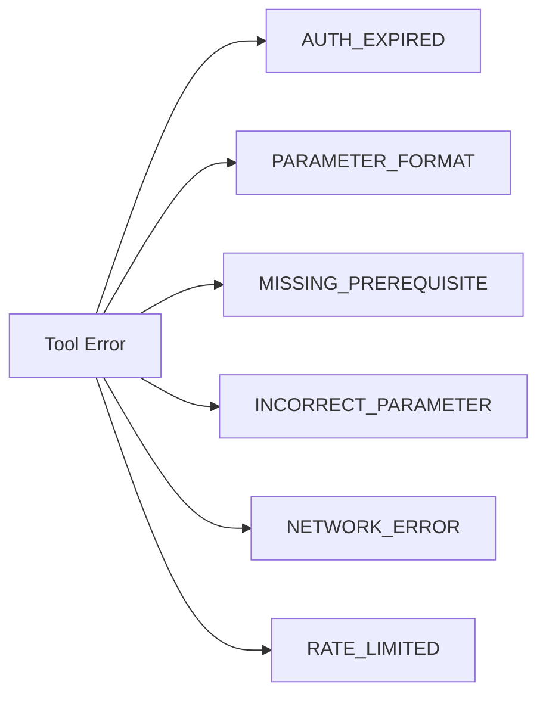

# Usage Pattern Sub-Modules

> Detailed documentation for Layer 5 usage pattern components

## Diagram



## Layer 5 Pipeline



## Components

| Component | File | Phase | Description |
|-----------|------|-------|-------------|
| UsagePatternStorage | `usage_pattern_storage.py` | 2 | YAML-based pattern persistence |
| UsagePatternExtractor | `usage_pattern_extractor.py` | 1 | Extract patterns from errors |
| UsagePatternClassifier | `usage_pattern_classifier.py` | 1 | Classify error types |
| UsagePatternChecker | `usage_pattern_checker.py` | 3 | Pre-call pattern matching |
| UsagePatternLearner | `usage_pattern_learner.py` | 4 | Learn from failures/successes |
| UsagePatternOptimizer | `usage_pattern_optimizer.py` | 5 | Optimize pattern database |
| UsageContextInjector | `usage_context_injector.py` | 3 | Inject warnings into prompts |

## Error Classifications



| Category | Description | Auto-Fix |
|----------|-------------|----------|
| `AUTH_EXPIRED` | Token/session expired | `kube_login`, `vpn_connect` |
| `PARAMETER_FORMAT` | Wrong format (e.g., short SHA) | Suggest correct format |
| `MISSING_PREREQUISITE` | Missing setup step | Suggest prereq tool |
| `INCORRECT_PARAMETER` | Wrong value | Show common mistakes |
| `NETWORK_ERROR` | Connectivity issue | VPN check |
| `RATE_LIMITED` | Too many requests | Wait suggestion |

## Pattern Structure

```yaml
# memory/learned/patterns.yaml
patterns:
  - id: "bonfire_deploy_short_sha_abc123"
    tool: "bonfire_deploy"
    category: "PARAMETER_FORMAT"
    error_regex: "manifest unknown"
    parameter: "image_tag"
    validation:
      min_length: 40
      pattern: "^[a-f0-9]{40,64}$"
    common_mistakes:
      - "Using 7-char short SHA instead of 40-char full SHA"
    prevention_message: "Use full 40-char git SHA for image_tag"
    confidence: 0.92
    observations: 15
    last_seen: "2026-02-05T10:30:00Z"
```

## Checker Flow

```python
# Pre-call check
result = checker.check_before_call(
    tool_name="bonfire_deploy",
    params={"image_tag": "abc123"},  # Short SHA
    min_confidence=0.75
)

# Result:
# {
#     "warnings": ["image_tag may be too short (7 chars). Use full 40-char SHA."],
#     "preventions": [{...}],
#     "should_block": False,
#     "patterns_matched": ["bonfire_deploy_short_sha_abc123"],
#     "suggestions": [{"use": "Full 40-char git SHA"}]
# }
```

## Optimizer Operations

```python
from server.usage_pattern_optimizer import UsagePatternOptimizer

optimizer = UsagePatternOptimizer()
result = optimizer.optimize()

# Result:
# {
#     "merged": 3,      # Similar patterns merged
#     "pruned": 2,      # Low-confidence removed
#     "deduplicated": 1 # Exact duplicates removed
# }
```

## Confidence Updates

| Event | Confidence Change |
|-------|------------------|
| Prevention success | +0.05 |
| Prevention failure (false positive) | -0.10 |
| New observation | +0.02 |
| No match in 30 days | -0.01/day |

## Related Diagrams

- [Usage Pattern System](./usage-pattern-system.md)
- [Usage Prevention Tracker](./usage-prevention-tracker.md)
- [Auto-Heal Decorator](./auto-heal-decorator.md)
- [Pattern Miner](../11-scripts/pattern-miner.md)
