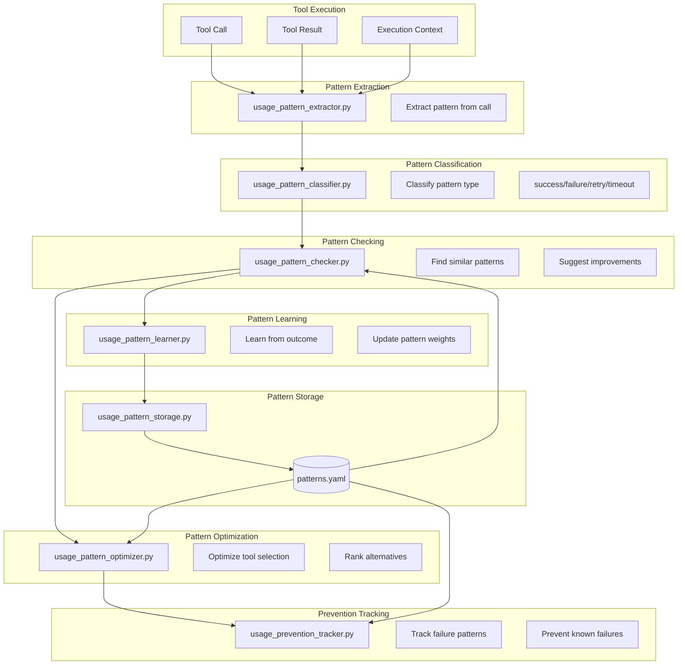
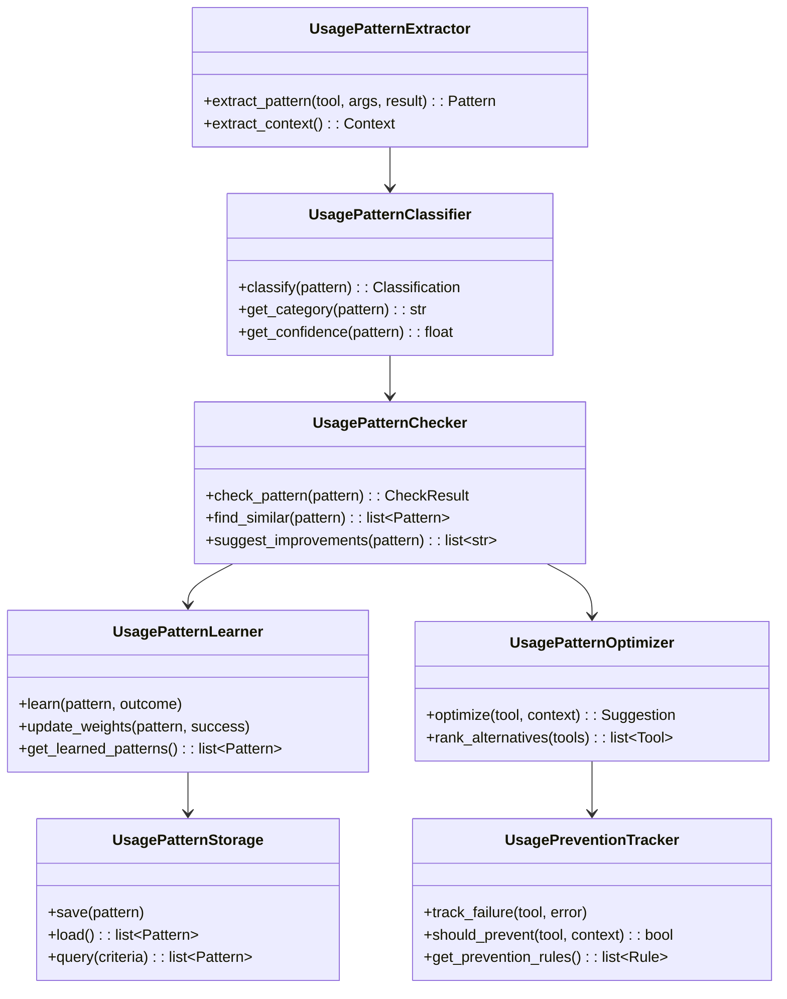
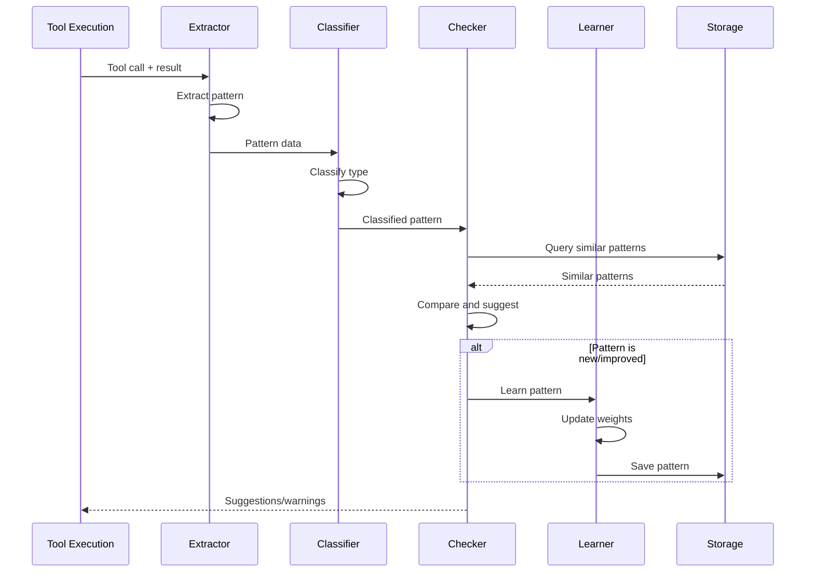

# Usage Pattern System

> Learning and optimization from tool usage patterns

## Diagram

## Module Relationships

## Pattern Flow

## Components

| Component | File | Description |
|-----------|------|-------------|
| UsagePatternExtractor | `server/usage_pattern_extractor.py` | Extract patterns from calls |
| UsagePatternClassifier | `server/usage_pattern_classifier.py` | Classify pattern types |
| UsagePatternChecker | `server/usage_pattern_checker.py` | Check against known patterns |
| UsagePatternLearner | `server/usage_pattern_learner.py` | Learn from outcomes |
| UsagePatternStorage | `server/usage_pattern_storage.py` | Persist patterns to YAML |
| UsagePatternOptimizer | `server/usage_pattern_optimizer.py` | Optimize tool selection |
| UsagePreventionTracker | `server/usage_prevention_tracker.py` | Track and prevent failures |
| UsageContextInjector | `server/usage_context_injector.py` | Inject context into calls |

## Pattern Categories

| Category | Description | Example |
|----------|-------------|---------|
| success | Tool completed successfully | `jira_view_issue` returned issue |
| failure | Tool failed with error | Auth error, timeout |
| retry | Tool succeeded after retry | Auto-heal fixed auth |
| timeout | Tool timed out | Network unreachable |
| prevented | Call prevented due to pattern | Known bad input |

## Related Diagrams

- [Auto-Heal Decorator](./auto-heal-decorator.md)
- [Memory Architecture](../06-memory/memory-architecture.md)
- [Tool Registry](./tool-registry.md)
