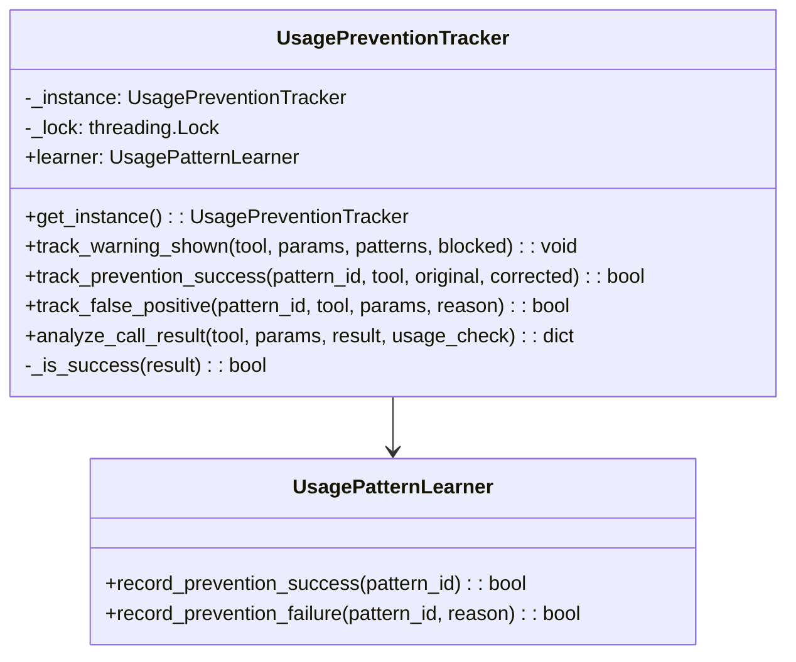
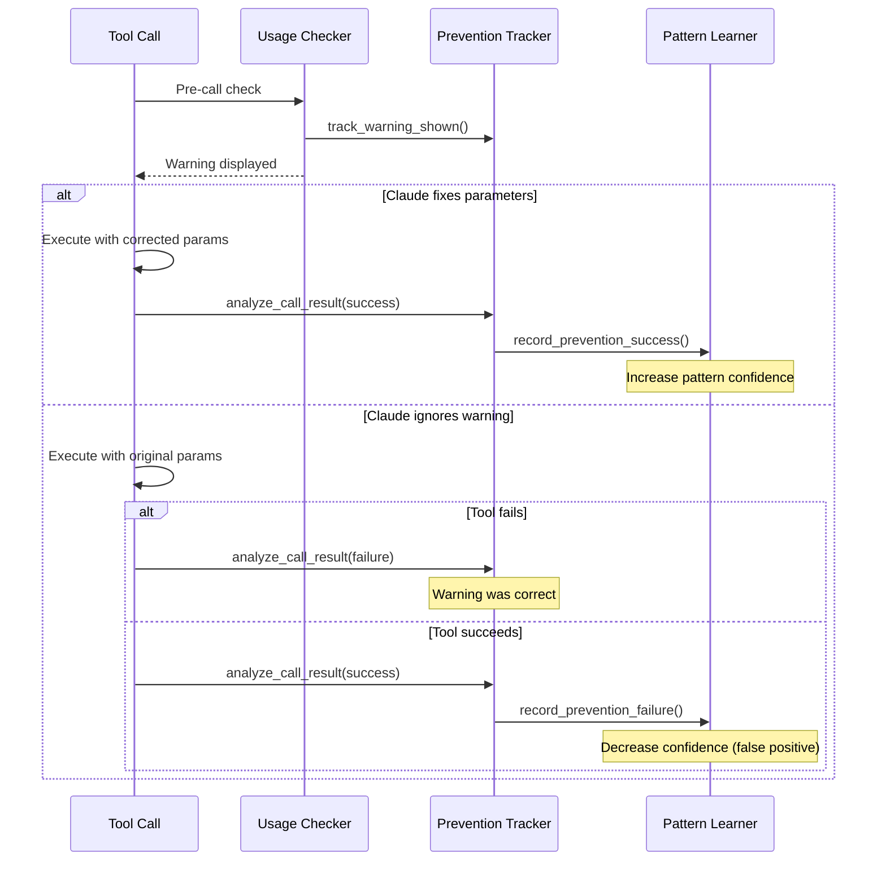

# Usage Prevention Tracker

> Layer 5 Phase 4 - Tracks prevention effectiveness and false positives

## Diagram



## Tracking Flow



## Components

| Component | File | Description |
|-----------|------|-------------|
| UsagePreventionTracker | `server/usage_prevention_tracker.py` | Main tracking class |
| UsagePatternLearner | `server/usage_pattern_learner.py` | Updates pattern confidence |

## Tracking Methods

### track_warning_shown()

Records when a warning is displayed to Claude:

```python
await tracker.track_warning_shown(
    tool_name="bonfire_deploy",
    params={"image_tag": "abc123"},  # Short SHA
    patterns_matched=["short_sha_deploy"],
    was_blocked=False
)
```

### track_prevention_success()

Records when Claude follows the warning and succeeds:

```python
await tracker.track_prevention_success(
    pattern_id="short_sha_deploy",
    tool_name="bonfire_deploy",
    original_params={"image_tag": "abc123"},  # Short SHA
    corrected_params={"image_tag": "abc123def456..."}  # Full SHA
)
# → Pattern confidence increases
```

### track_false_positive()

Records when a warning was incorrect:

```python
await tracker.track_false_positive(
    pattern_id="short_sha_deploy",
    tool_name="bonfire_deploy",
    params={"image_tag": "abc123"},
    reason="tool_succeeded_despite_warning"
)
# → Pattern confidence decreases
```

### analyze_call_result()

Analyzes tool result to detect prevention success or false positive:

```python
analysis = await tracker.analyze_call_result(
    tool_name="bonfire_deploy",
    params={"image_tag": "abc123"},
    result="✅ Deployed successfully",
    usage_check={
        "warnings": ["Short SHA may not exist..."],
        "patterns_matched": ["short_sha_deploy"]
    }
)
# Returns:
# {
#     "prevention_success": False,
#     "false_positive": True,
#     "patterns_affected": ["short_sha_deploy"],
#     "reason": "tool_succeeded_despite_warning"
# }
```

## Success Detection

The tracker determines if a tool call succeeded:

```python
def _is_success(self, result: str) -> bool:
    """Check for error indicators."""
    is_error = (
        "❌" in result
        or result.lower().startswith("error")
        or "failed" in result.lower()[:200]
        or "exception" in result.lower()[:200]
        or "unauthorized" in result.lower()
        or "forbidden" in result.lower()
    )
    return not is_error
```

## Singleton Pattern

The tracker uses thread-safe singleton:

```python
from server.usage_prevention_tracker import get_prevention_tracker

tracker = get_prevention_tracker()
await tracker.track_warning_shown(...)
```

## Integration with Layer 5

The tracker is part of the Usage Pattern System (Layer 5):

| Phase | Component | Role |
|-------|-----------|------|
| Phase 1 | UsagePatternExtractor | Extract patterns from failures |
| Phase 2 | UsagePatternClassifier | Classify pattern types |
| Phase 3 | UsagePatternChecker | Check calls against patterns |
| **Phase 4** | **UsagePreventionTracker** | **Track prevention effectiveness** |
| Phase 5 | UsagePatternOptimizer | Optimize pattern database |

## Related Diagrams

- [Usage Pattern System](./usage-pattern-system.md)
- [Auto-Heal Decorator](./auto-heal-decorator.md)
- [Auto-Heal Flow](../08-data-flows/auto-heal-flow.md)
