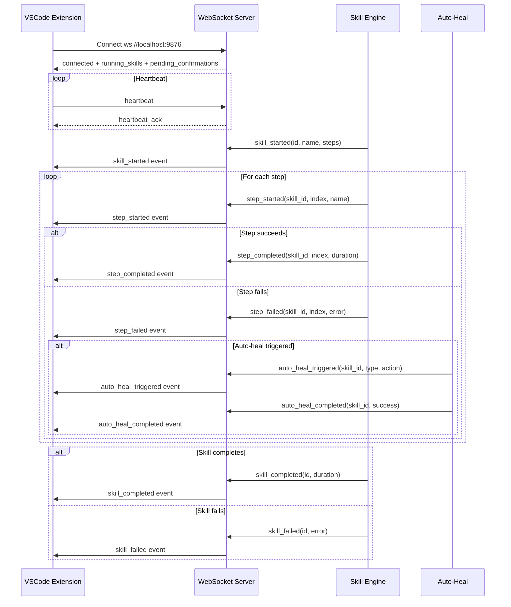
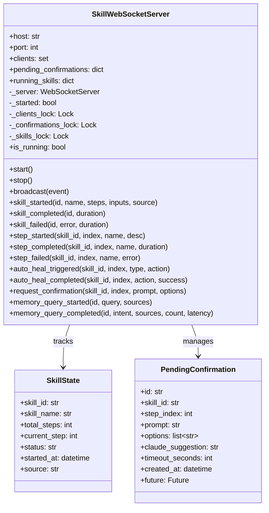
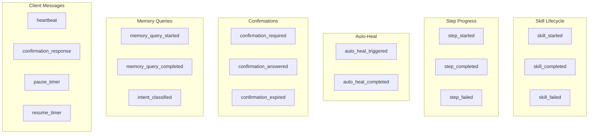
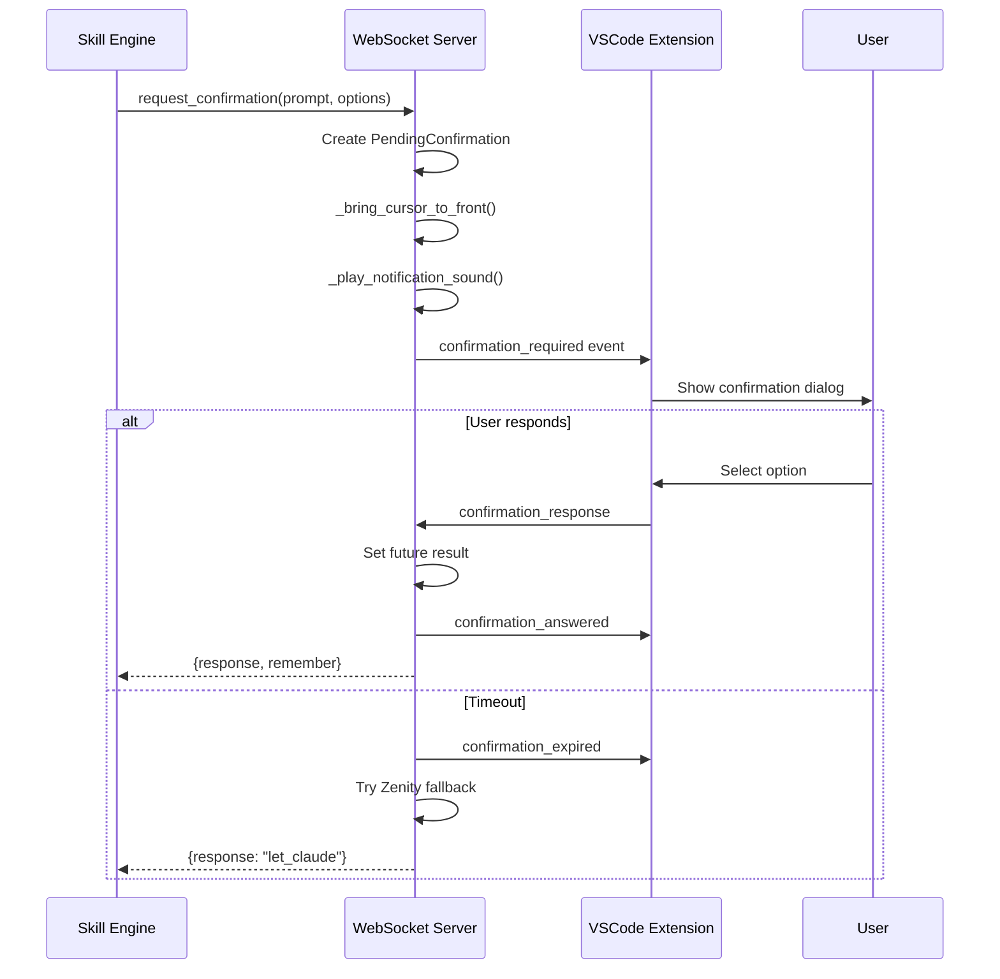

# WebSocket Server

> Real-time skill execution updates and confirmations

## Diagram

## Class Structure

## Event Types

## Components

| Component | File | Description |
|-----------|------|-------------|
| SkillWebSocketServer | `server/websocket_server.py` | Main server class |
| SkillState | `server/websocket_server.py` | Running skill state |
| PendingConfirmation | `server/websocket_server.py` | Confirmation request |
| get_websocket_server | `server/websocket_server.py` | Get global instance |
| start_websocket_server | `server/websocket_server.py` | Start server |
| stop_websocket_server | `server/websocket_server.py` | Stop server |

## Confirmation Flow

## Related Diagrams

- [MCP Server Core](./mcp-server-core.md)
- [Skill Execution Flow](../04-skills/skill-execution-flow.md)
- [VSCode Extension](../10-vscode-extension/README.md)
