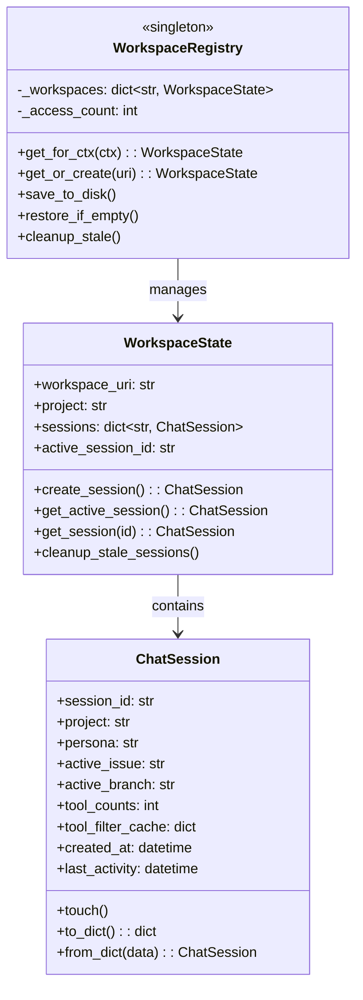
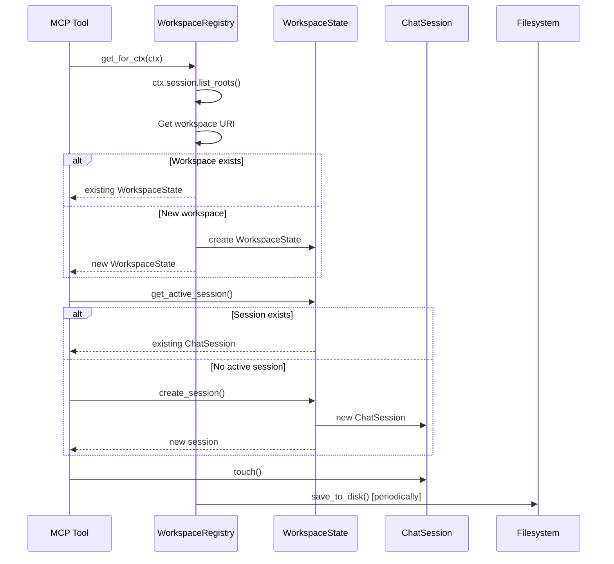
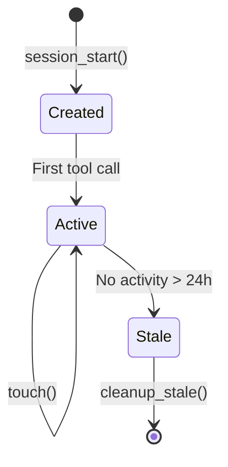

# Workspace State Management

> Per-workspace and per-session context management for MCP server

## Diagram



## Architecture Flow



## Components

| Component | File | Description |
|-----------|------|-------------|
| `ChatSession` | `server/workspace_state.py` | Per-chat session state |
| `WorkspaceState` | `server/workspace_state.py` | Per-workspace state container |
| `WorkspaceRegistry` | `server/workspace_state.py` | Global registry singleton |
| `get_default_persona` | `server/workspace_state.py` | Read default persona from config |
| `get_cursor_chat_info_from_db` | `server/workspace_state.py` | Read chat info from Cursor's DB |

## ChatSession

Each chat session maintains its own:
- **session_id**: Unique identifier (from Cursor DB or generated)
- **project**: Which project is being worked on
- **persona**: Current persona (developer, devops, etc.)
- **active_issue**: Current Jira issue key
- **active_branch**: Current git branch
- **tool_counts**: Number of tools available
- **tool_filter_cache**: NPU filter cache
- **timestamps**: created_at, last_activity

## WorkspaceState

A workspace (Cursor folder) can have multiple chat sessions:
- **workspace_uri**: Cursor workspace identifier
- **project**: Shared project context
- **sessions**: Map of session_id to ChatSession
- **active_session_id**: Currently active session

## WorkspaceRegistry

Singleton registry that manages all workspaces:
- **get_for_ctx(ctx)**: Get workspace for MCP context
- **save_to_disk()**: Persist to ~/.config/aa-workflow/workspace_states.json
- **restore_if_empty()**: Load from disk on startup
- **cleanup_stale()**: Remove sessions older than 24 hours

## Persistence

Sessions persist across server restarts:

```
~/.config/aa-workflow/workspace_states.json
```

```json
{
  "file:///home/user/project": {
    "workspace_uri": "file:///home/user/project",
    "project": "automation-analytics-backend",
    "active_session_id": "abc123",
    "sessions": {
      "abc123": {
        "session_id": "abc123",
        "project": "automation-analytics-backend",
        "persona": "developer",
        "created_at": "2026-02-04T09:00:00Z"
      }
    }
  }
}
```

## Usage

```python
from server.workspace_state import WorkspaceRegistry

# In a tool function with MCP context
workspace = await WorkspaceRegistry.get_for_ctx(ctx)

# Get active session
session = workspace.get_active_session()
if session:
    print(f"Persona: {session.persona}")
    print(f"Project: {session.project}")

# Create new session
session = workspace.create_session()
session.persona = "developer"
session.project = "my-project"

# Save periodically
WorkspaceRegistry.save_to_disk()
```

## Session Lifecycle



## Configuration

- **SESSION_STALE_HOURS**: 24 hours (sessions older are cleaned up)
- **MAX_FILTER_CACHE_SIZE**: 50 entries (per-session NPU cache limit)
- **DEFAULT_PROJECT**: "redhat-ai-workflow" (fallback)
- **DEFAULT_WORKSPACE**: "default" (when list_roots unavailable)

## Related Diagrams

- [MCP Server Core](./mcp-server-core.md)
- [Session Builder](./session-builder.md)
- [State Manager](./state-manager.md)
