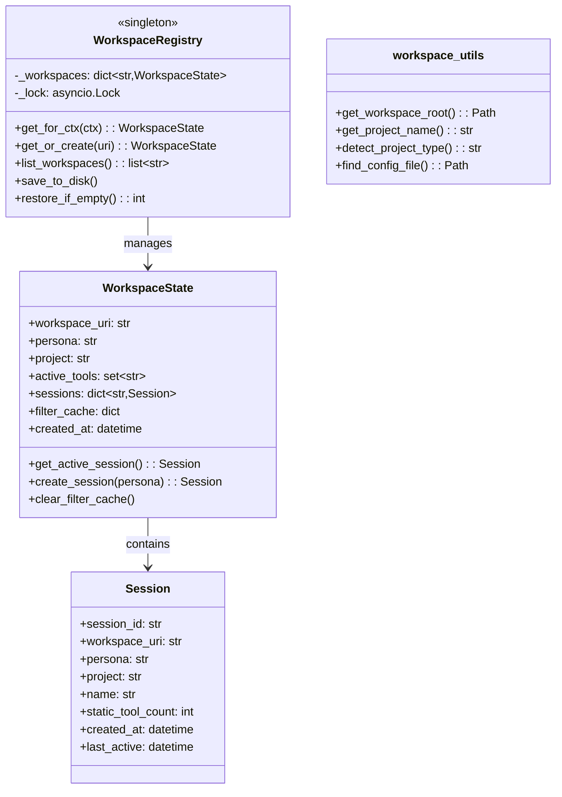
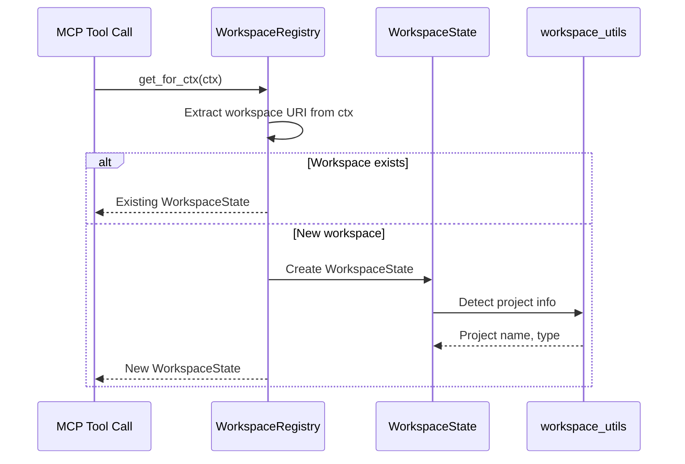
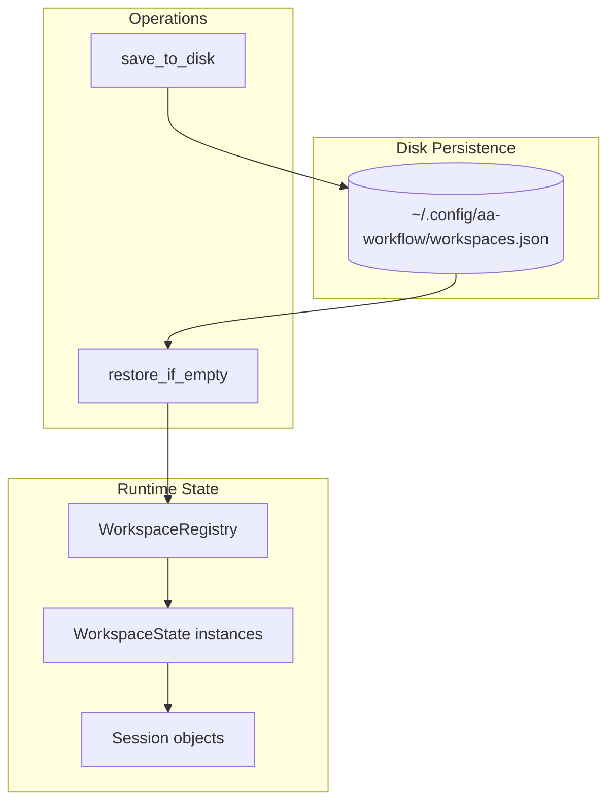

# Workspace Tools

> Workspace state management and utilities

## Diagram

## Workspace Detection Flow

## State Persistence

## Components

| Component | File | Description |
|-----------|------|-------------|
| WorkspaceRegistry | `server/workspace_state.py` | Singleton registry |
| WorkspaceState | `server/workspace_state.py` | Per-workspace state |
| Session | `server/workspace_state.py` | Session within workspace |
| workspace_utils | `server/workspace_utils.py` | Utility functions |
| workspace_tools | `server/workspace_tools.py` | MCP tools for workspace |

## Workspace State Fields

| Field | Type | Description |
|-------|------|-------------|
| workspace_uri | str | Unique workspace identifier |
| persona | str | Current active persona |
| project | str | Detected project name |
| active_tools | set | Currently loaded tools |
| sessions | dict | Sessions in this workspace |
| filter_cache | dict | NPU filter cache |
| created_at | datetime | When workspace was created |

## Session Fields

| Field | Type | Description |
|-------|------|-------------|
| session_id | str | Unique session ID |
| workspace_uri | str | Parent workspace |
| persona | str | Session's persona |
| project | str | Session's project |
| name | str | User-friendly name |
| static_tool_count | int | Tools loaded |
| created_at | datetime | Session creation time |
| last_active | datetime | Last activity time |

## Related Diagrams

- [Session Builder](./session-builder.md)
- [Persona Loader](./persona-loader.md)
- [State Manager](./state-manager.md)
