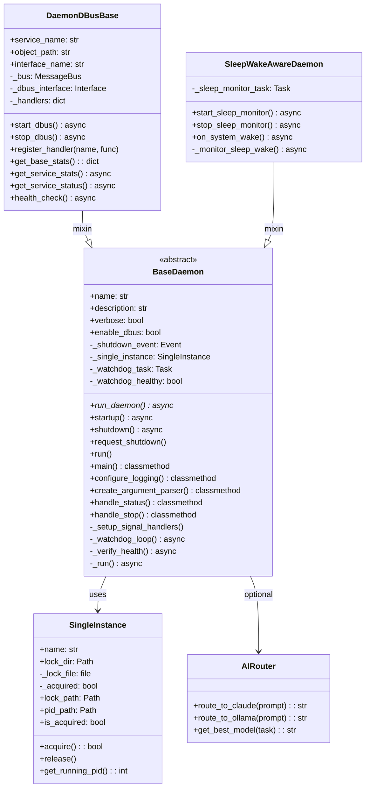
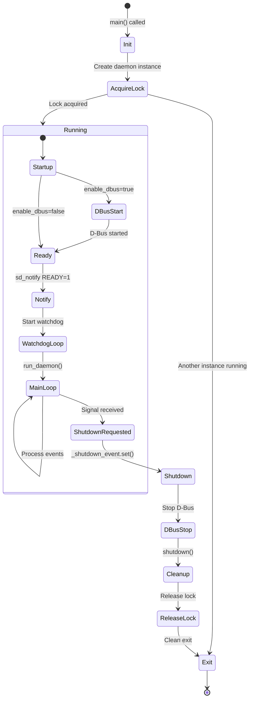

# Base Daemon

> Foundation classes for all AI Workflow daemons

## Diagram



## Daemon Lifecycle



## Signal Handling

```mermaid
sequenceDiagram
    participant OS as Operating System
    participant Daemon as BaseDaemon
    participant Event as _shutdown_event
    participant Loop as run_daemon()

    OS->>Daemon: SIGTERM/SIGINT
    Daemon->>Daemon: signal_handler()
    Daemon->>Event: set()
    Event-->>Loop: Wake up
    Loop->>Daemon: Exit run_daemon()
    Daemon->>Daemon: shutdown()
```

## Components

| Component | File | Description |
|-----------|------|-------------|
| BaseDaemon | `services/base/daemon.py` | Abstract base class |
| SingleInstance | `services/base/daemon.py` | Lock file management |
| DaemonDBusBase | `services/base/dbus.py` | D-Bus IPC mixin |
| SleepWakeAwareDaemon | `services/base/sleep_wake.py` | Sleep/wake handling |
| AIRouter | `services/base/ai_router.py` | AI model routing |
| sd_notify | `services/base/daemon.py` | Systemd notification |
| get_watchdog_interval | `services/base/daemon.py` | Watchdog timing |

## CLI Arguments

| Argument | Description |
|----------|-------------|
| `--status` | Check if daemon is running |
| `--stop` | Stop running daemon |
| `-v, --verbose` | Enable verbose logging |
| `--dbus` | Enable D-Bus IPC (default) |
| `--no-dbus` | Disable D-Bus IPC |

## Inheritance Order (MRO)

```python
# CORRECT order - mixins before BaseDaemon
class MyDaemon(SleepWakeAwareDaemon, DaemonDBusBase, BaseDaemon):
    pass

# INCORRECT - will break method resolution
class MyDaemon(BaseDaemon, DaemonDBusBase, SleepWakeAwareDaemon):
    pass
```

## Related Diagrams

- [Daemon Overview](./daemon-overview.md)
- [D-Bus Architecture](../09-deployment/dbus-architecture.md)
- [Systemd Services](../09-deployment/systemd-services.md)
