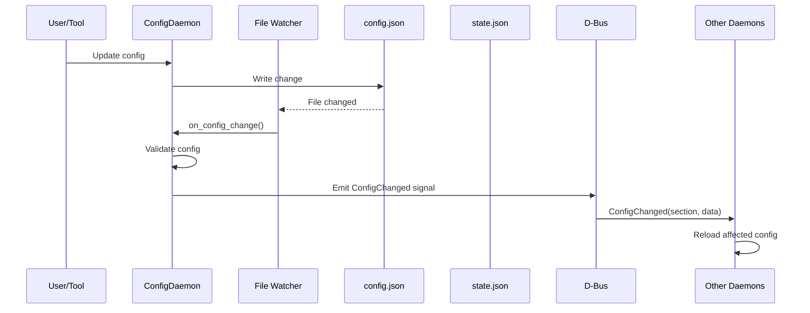
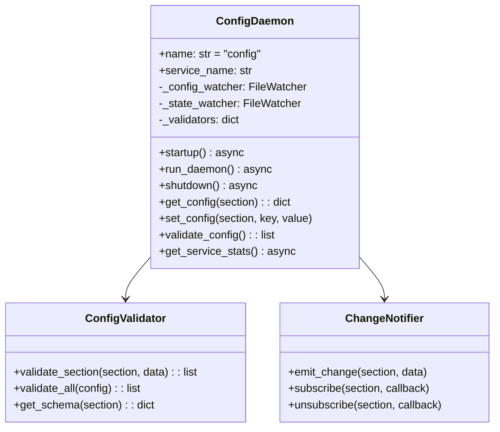
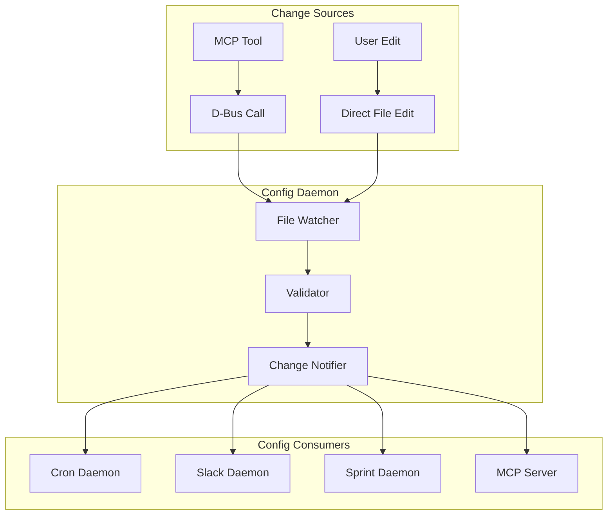

# Config Daemon

> Configuration synchronization and change propagation

## Diagram



## Class Structure



## Change Propagation



## Components

| Component | File | Description |
|-----------|------|-------------|
| ConfigDaemon | `services/config/daemon.py` | Main daemon class |
| ConfigValidator | Internal | Schema validation |
| ChangeNotifier | Internal | D-Bus signal emitter |

## D-Bus Methods

| Method | Description |
|--------|-------------|
| `get_config(section)` | Get config section |
| `set_config(section, key, value)` | Update config |
| `validate_config()` | Validate all config |
| `reload_config()` | Force reload |
| `get_schema(section)` | Get section schema |

## D-Bus Signals

| Signal | Parameters | Description |
|--------|------------|-------------|
| ConfigChanged | section, data | Config section changed |
| StateChanged | section, data | State section changed |
| ValidationError | section, errors | Validation failed |

## Config Sections

| Section | Watched By | Description |
|---------|------------|-------------|
| schedules | Cron Daemon | Job schedules |
| slack | Slack Daemon | Slack settings |
| sprint | Sprint Daemon | Sprint settings |
| agent | MCP Server | Agent settings |
| paths | All | Path configuration |

## Validation Schema

```json
{
  "schedules": {
    "type": "object",
    "properties": {
      "enabled": {"type": "boolean"},
      "timezone": {"type": "string"},
      "jobs": {"type": "array"}
    }
  }
}
```

## Related Diagrams

- [Daemon Overview](./daemon-overview.md)
- [Config System](../01-server/config-system.md)
- [State Manager](../01-server/state-manager.md)
