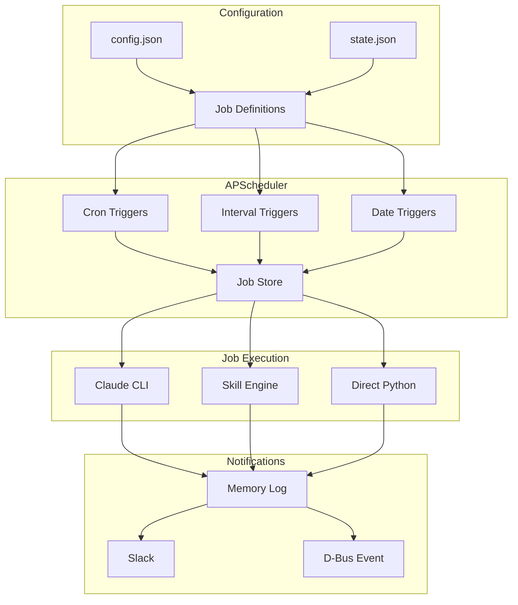
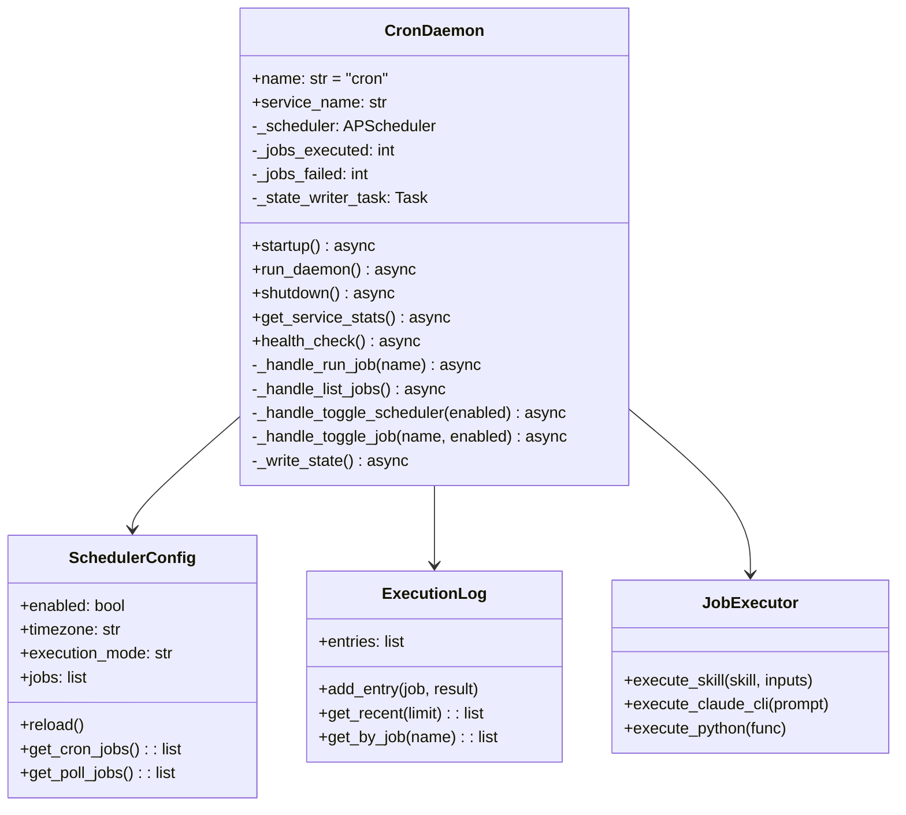
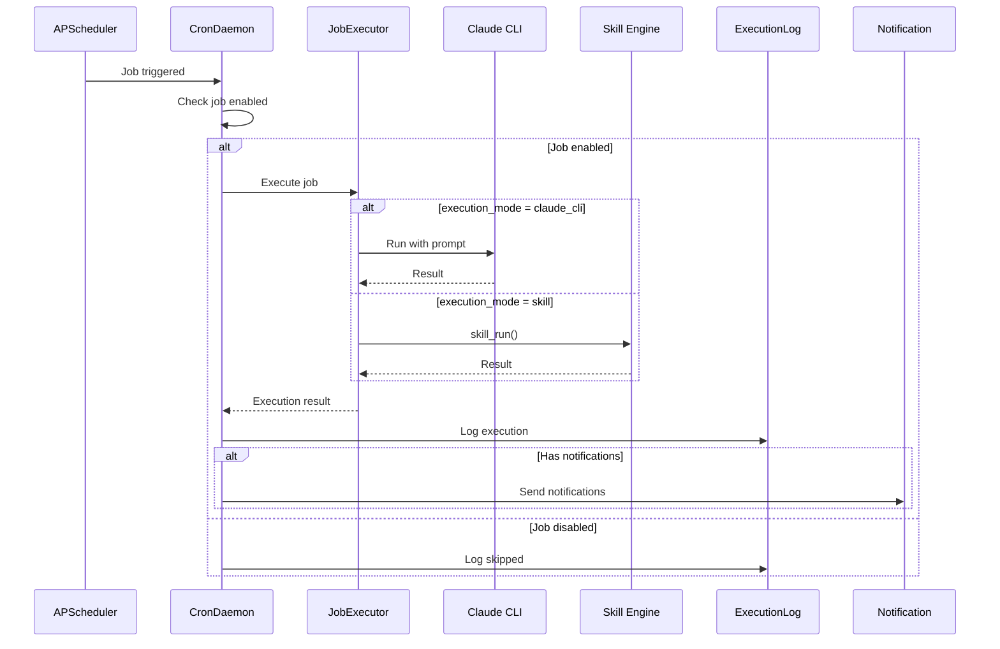

# Cron Daemon

> Scheduled job execution using APScheduler

## Diagram



## Class Structure



## Job Execution Flow



## Components

| Component | File | Description |
|-----------|------|-------------|
| CronDaemon | `services/cron/daemon.py` | Main daemon class |
| SchedulerConfig | `tool_modules/aa_workflow/src/scheduler.py` | Configuration |
| ExecutionLog | `tool_modules/aa_workflow/src/scheduler.py` | Execution history |
| init_scheduler | `tool_modules/aa_workflow/src/scheduler.py` | Scheduler init |

## Job Configuration

```json
{
  "schedules": {
    "enabled": true,
    "timezone": "America/New_York",
    "execution_mode": "claude_cli",
    "jobs": [
      {
        "name": "morning_coffee",
        "description": "Morning briefing",
        "cron": "0 9 * * 1-5",
        "skill": "coffee",
        "persona": "developer",
        "enabled": true,
        "notify": ["slack", "memory"]
      }
    ]
  }
}
```

## D-Bus Methods

| Method | Description |
|--------|-------------|
| `run_job(name)` | Run job immediately |
| `list_jobs()` | List all jobs |
| `get_history(limit)` | Get execution history |
| `toggle_scheduler(enabled)` | Enable/disable scheduler |
| `toggle_job(name, enabled)` | Enable/disable job |
| `get_state()` | Get full cron state |

## Related Diagrams

- [Daemon Overview](./daemon-overview.md)
- [Skill Engine](../04-skills/skill-engine-architecture.md)
- [Automation Skills](../04-skills/automation-skills.md)
