# Daemon Overview

> All background daemons and their relationships

## Diagram

```mermaid
graph TB
    subgraph Control[Control Layer]
        SYSTEMD[systemd user services]
        DBUS[D-Bus Session Bus]
    end

    subgraph Daemons[Daemon Processes]
        SLACK[Slack Daemon<br/>Real-time messages]
        SPRINT[Sprint Daemon<br/>Jira automation]
        MEET[Meet Daemon<br/>Meeting bot]
        VIDEO[Video Daemon<br/>Virtual camera]
        SESSION[Session Daemon<br/>IDE sync]
        CRON[Cron Daemon<br/>Scheduled jobs]
        MEMORY[Memory Daemon<br/>Memory service]
        CONFIG[Config Daemon<br/>Config sync]
        SLOP[SLOP Daemon<br/>Orchestrator]
        STATS[Stats Daemon<br/>Statistics]
        EXT_WATCH[Extension Watcher<br/>VSCode sync]
    end

    subgraph External[External Connections]
        SLACK_API[Slack WebSocket]
        JIRA_API[Jira API]
        MEET_WS[Google Meet WebRTC]
        V4L2[V4L2 Loopback]
        CURSOR_DB[Cursor SQLite]
        SKILLS[Skill Engine]
        YAML_MEM[YAML Memory]
    end

    SYSTEMD --> SLACK
    SYSTEMD --> SPRINT
    SYSTEMD --> MEET
    SYSTEMD --> VIDEO
    SYSTEMD --> SESSION
    SYSTEMD --> CRON
    SYSTEMD --> MEMORY
    SYSTEMD --> CONFIG
    SYSTEMD --> SLOP
    SYSTEMD --> STATS
    SYSTEMD --> EXT_WATCH

    SLACK --> DBUS
    SPRINT --> DBUS
    MEET --> DBUS
    VIDEO --> DBUS
    SESSION --> DBUS
    CRON --> DBUS
    MEMORY --> DBUS
    CONFIG --> DBUS
    SLOP --> DBUS
    STATS --> DBUS
    EXT_WATCH --> DBUS

    SLACK --> SLACK_API
    SPRINT --> JIRA_API
    MEET --> MEET_WS
    VIDEO --> V4L2
    SESSION --> CURSOR_DB
    CRON --> SKILLS
    MEMORY --> YAML_MEM
```

## Daemon Summary

| Daemon | Service Name | Purpose | External Connection |
|--------|--------------|---------|---------------------|
| Slack | bot-slack | Real-time Slack messages | Slack WebSocket |
| Sprint | bot-sprint | Jira workflow automation | Jira API |
| Meet | bot-meet | Meeting transcription | Google Meet |
| Video | bot-video | Virtual camera avatar | V4L2 Loopback |
| Session | bot-session | IDE session sync | Cursor SQLite |
| Cron | bot-cron | Scheduled job execution | Skill Engine |
| Memory | bot-memory | Memory service | YAML files |
| Config | bot-config | Config synchronization | config.json |
| SLOP | bot-slop | Loop orchestration | Multiple |
| Stats | bot-stats | Statistics collection | Various |
| Extension Watcher | - | VSCode extension sync | VSCode |

## D-Bus Service Names

| Daemon | D-Bus Service |
|--------|---------------|
| Slack | com.aiworkflow.BotSlack |
| Sprint | com.aiworkflow.BotSprint |
| Meet | com.aiworkflow.BotMeet |
| Video | com.aiworkflow.BotVideo |
| Session | com.aiworkflow.BotSession |
| Cron | com.aiworkflow.BotCron |
| Memory | com.aiworkflow.BotMemory |
| Config | com.aiworkflow.BotConfig |
| SLOP | com.aiworkflow.BotSlop |
| Stats | com.aiworkflow.BotStats |

## Components

| Component | File | Description |
|-----------|------|-------------|
| BaseDaemon | `services/base/daemon.py` | Base daemon class |
| DaemonDBusBase | `services/base/dbus.py` | D-Bus mixin |
| SleepWakeAwareDaemon | `services/base/sleep_wake.py` | Sleep/wake handling |

## Related Diagrams

- [Base Daemon](./base-daemon.md)
- [D-Bus Architecture](../09-deployment/dbus-architecture.md)
- [Systemd Services](../09-deployment/systemd-services.md)
