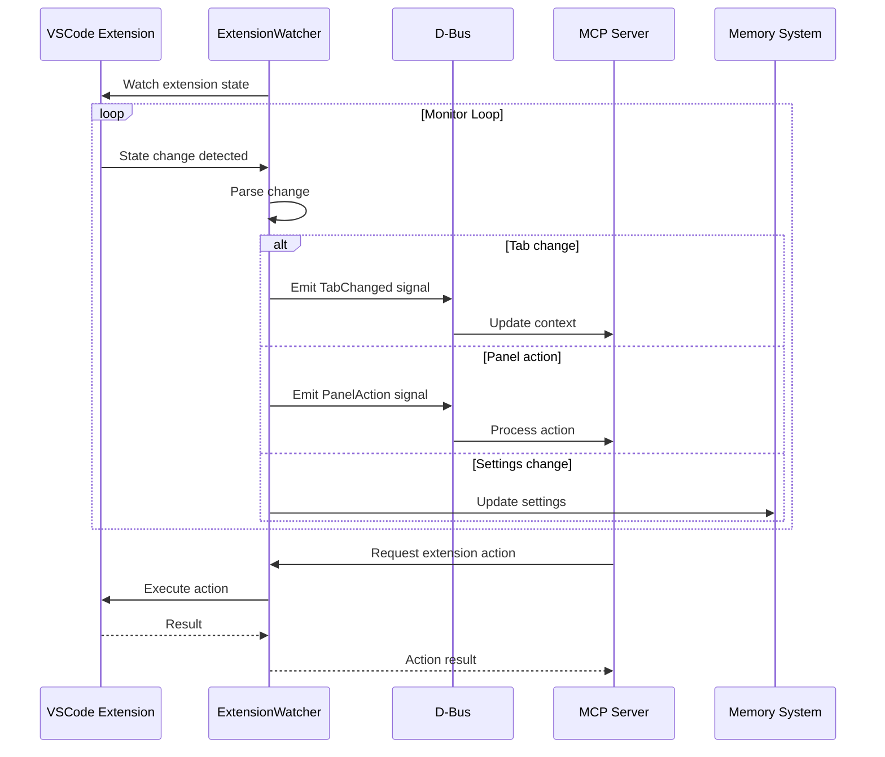
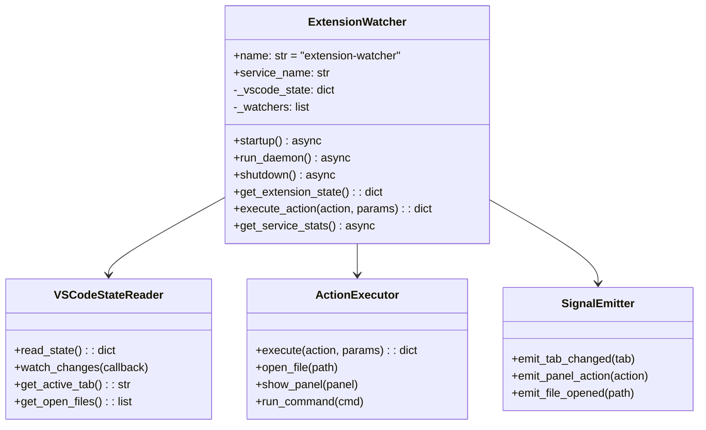
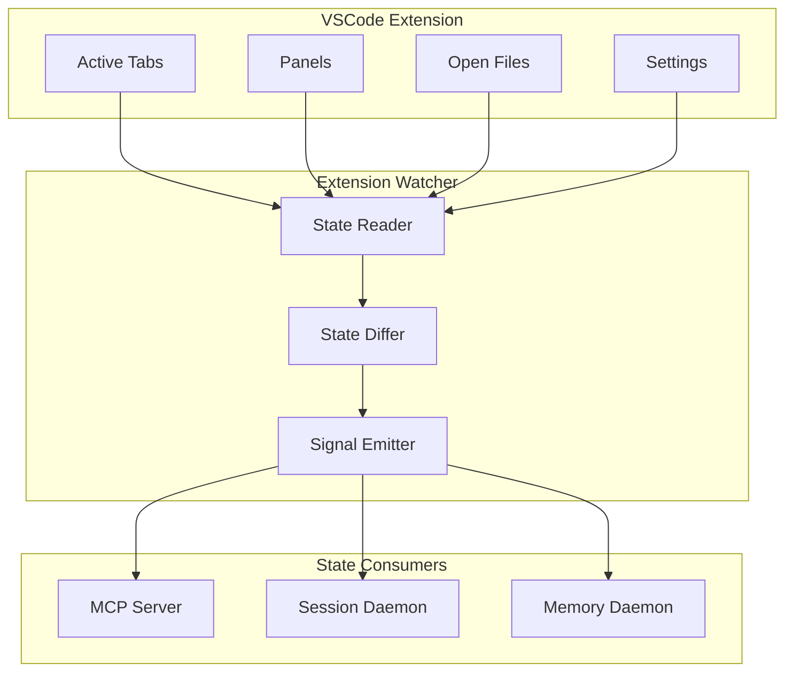

# Extension Watcher

> VSCode extension synchronization daemon

## Diagram

## Class Structure

## State Synchronization

## Components

| Component | File | Description |
|-----------|------|-------------|
| ExtensionWatcher | `services/extension_watcher/daemon.py` | Main daemon class |
| VSCodeStateReader | Internal | State reading |
| ActionExecutor | Internal | Action execution |

## D-Bus Methods

| Method | Description |
|--------|-------------|
| `get_extension_state()` | Get current state |
| `execute_action(action, params)` | Execute action |
| `get_active_tab()` | Get active tab |
| `get_open_files()` | List open files |
| `show_panel(panel)` | Show panel |
| `run_command(cmd)` | Run VSCode command |

## D-Bus Signals

| Signal | Parameters | Description |
|--------|------------|-------------|
| TabChanged | tab_id, tab_name | Active tab changed |
| PanelAction | action, params | Panel action triggered |
| FileOpened | path | File opened |
| FileClosed | path | File closed |
| SettingsChanged | key, value | Settings changed |

## Watched State

| State | Description | Signal |
|-------|-------------|--------|
| Active tab | Currently selected tab | TabChanged |
| Open files | List of open files | FileOpened/Closed |
| Panel state | Panel visibility | PanelAction |
| Settings | Extension settings | SettingsChanged |

## Actions

| Action | Parameters | Description |
|--------|------------|-------------|
| `open_file` | path | Open file in editor |
| `show_panel` | panel_id | Show specific panel |
| `run_command` | command | Run VSCode command |
| `refresh_tab` | tab_id | Refresh tab content |
| `update_setting` | key, value | Update setting |

## Related Diagrams

- [Daemon Overview](./daemon-overview.md)
- [VSCode Extension](../09-deployment/vscode-extension.md)
- [Session Daemon](./session-daemon.md)
