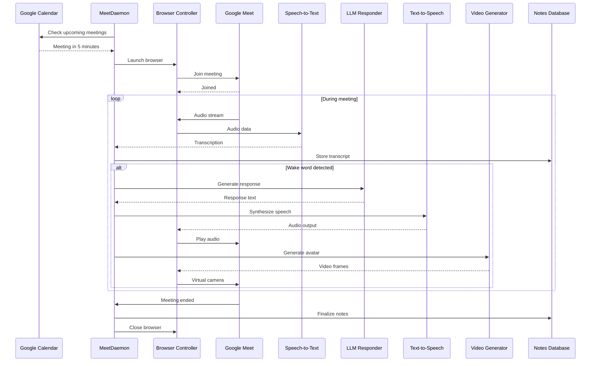
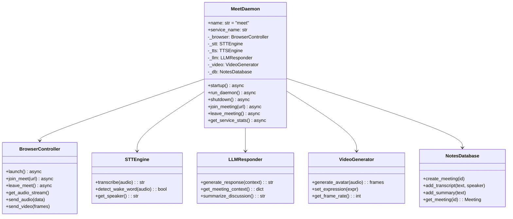
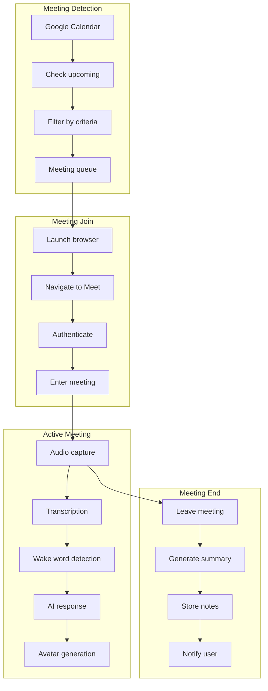

# Meet Daemon

> Google Meet bot for meeting transcription and AI participation

## Diagram

## Class Structure

## Meeting Flow

## Components

| Component | File | Description |
|-----------|------|-------------|
| MeetDaemon | `services/meet/daemon.py` | Main daemon class |
| BrowserController | `tool_modules/aa_meet_bot/src/browser_controller.py` | Browser automation |
| STTEngine | `tool_modules/aa_meet_bot/src/stt_engine.py` | Speech recognition |
| TTSEngine | `tool_modules/aa_meet_bot/src/tts_engine.py` | Speech synthesis |
| LLMResponder | `tool_modules/aa_meet_bot/src/llm_responder.py` | AI responses |
| VideoGenerator | `tool_modules/aa_meet_bot/src/video_generator.py` | Avatar generation |
| NotesDatabase | `tool_modules/aa_meet_bot/src/notes_database.py` | SQLite storage |

## D-Bus Methods

| Method | Description |
|--------|-------------|
| `join_meeting(url)` | Join a meeting |
| `leave_meeting()` | Leave current meeting |
| `get_transcript()` | Get current transcript |
| `toggle_responses(enabled)` | Enable/disable AI responses |
| `set_wake_word(word)` | Change wake word |

## Related Diagrams

- [Daemon Overview](./daemon-overview.md)
- [Meet Bot Pipeline](../03-tools/meet-bot-pipeline.md)
- [Meeting Flow](../08-data-flows/meeting-flow.md)
