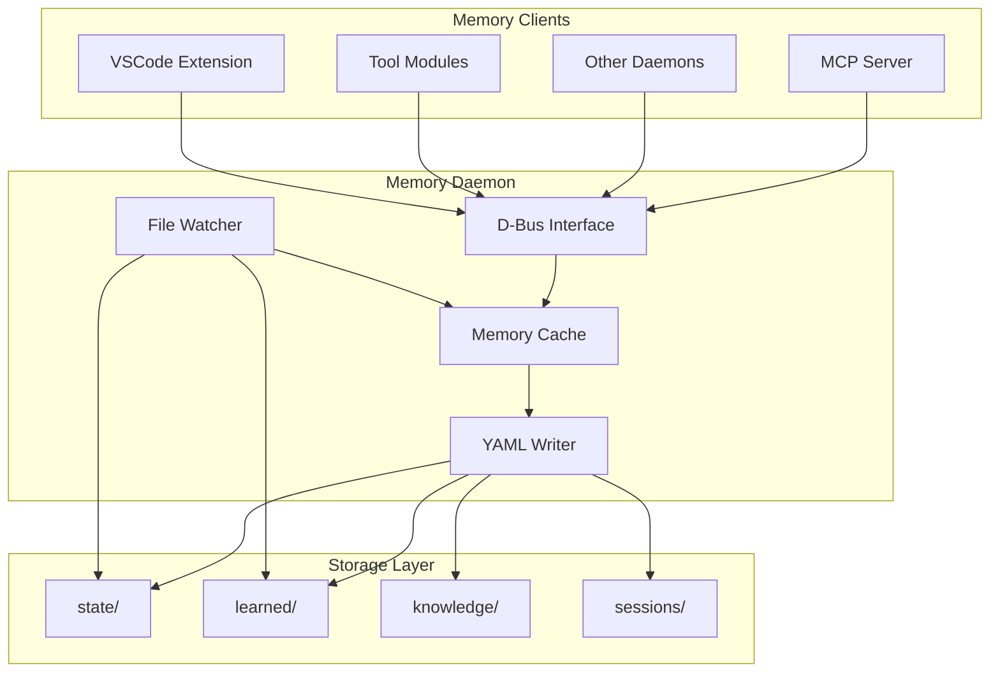
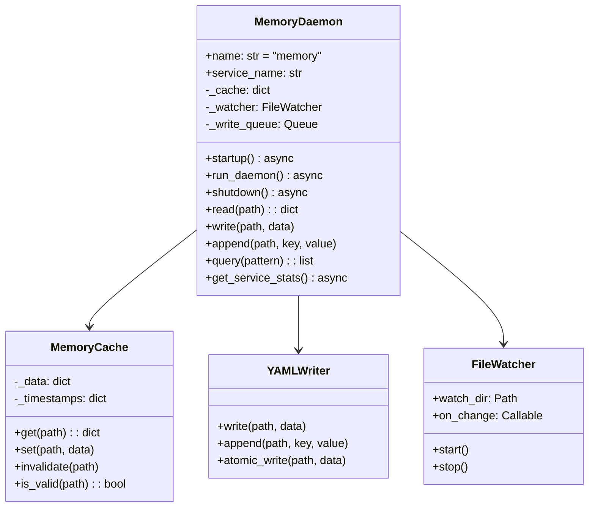
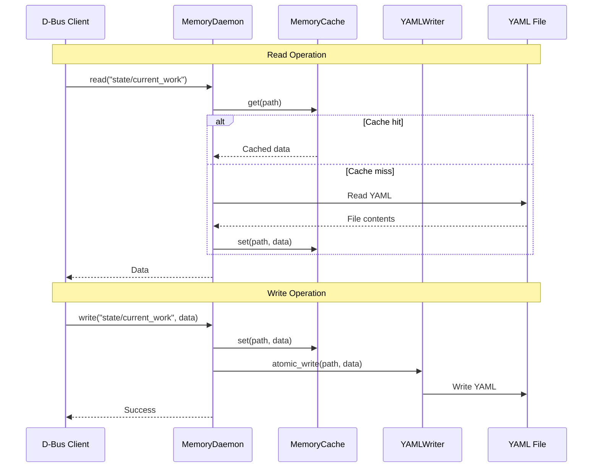

# Memory Daemon

> Memory service for YAML-based persistence

## Diagram



## Class Structure



## Read/Write Flow



## Components

| Component | File | Description |
|-----------|------|-------------|
| MemoryDaemon | `services/memory/daemon.py` | Main daemon class |
| MemoryCache | Internal | In-memory cache |
| YAMLWriter | Internal | Atomic YAML writes |

## D-Bus Methods

| Method | Description |
|--------|-------------|
| `read(path)` | Read memory path |
| `write(path, data)` | Write to memory path |
| `append(path, key, value)` | Append to list/dict |
| `delete(path, key)` | Delete key |
| `query(pattern)` | Query with pattern |
| `list_paths()` | List all paths |
| `invalidate_cache()` | Clear cache |

## Memory Paths

| Path | Description |
|------|-------------|
| `state/current_work` | Active work items |
| `state/environments` | Environment status |
| `learned/patterns` | Learned patterns |
| `learned/tool_fixes` | Tool fix history |
| `knowledge/personas/*` | Persona knowledge |
| `sessions/YYYY-MM-DD` | Daily session logs |

## Configuration

```json
{
  "memory": {
    "cache_ttl": 60,
    "write_debounce": 2,
    "watch_enabled": true,
    "backup_enabled": true
  }
}
```

## Related Diagrams

- [Daemon Overview](./daemon-overview.md)
- [Memory Architecture](../06-memory/memory-architecture.md)
- [Memory Layers](../06-memory/memory-layers.md)
