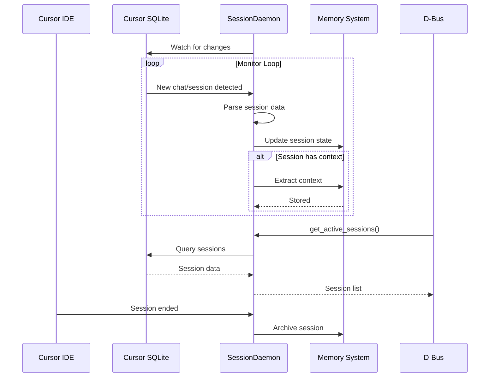
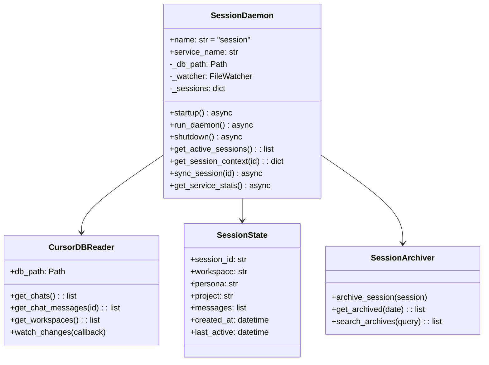
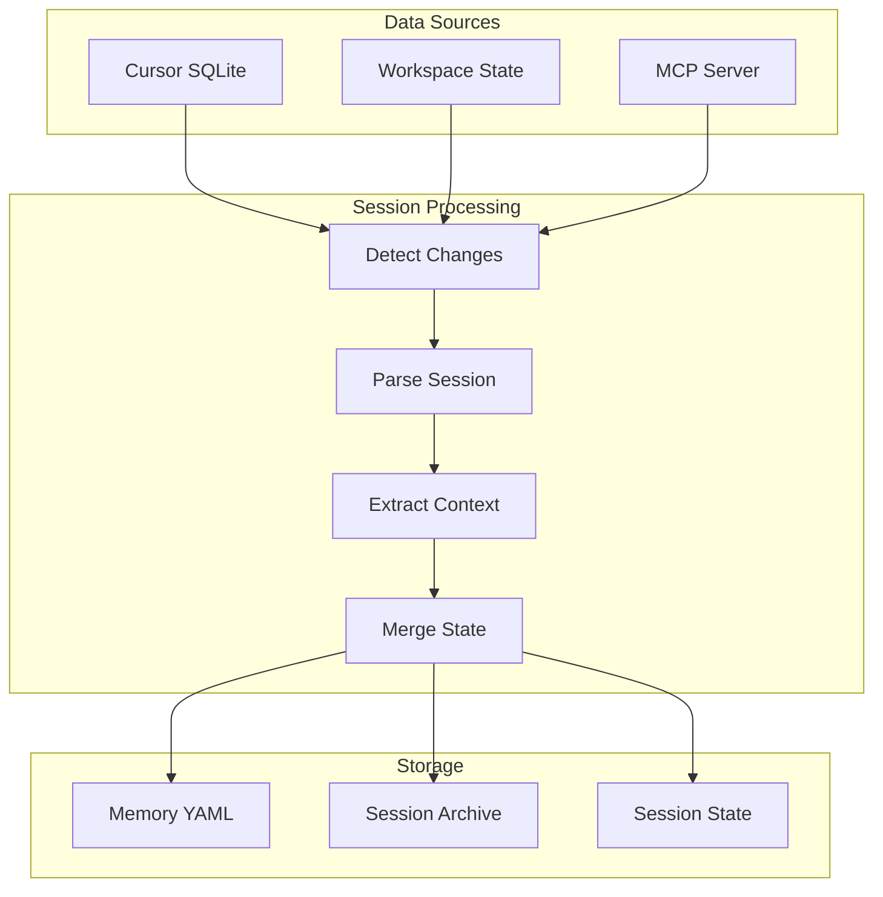

# Session Daemon

> IDE session synchronization and state management

## Diagram



## Class Structure



## Session Sync Flow



## Components

| Component | File | Description |
|-----------|------|-------------|
| SessionDaemon | `services/session/daemon.py` | Main daemon class |
| CursorDBReader | Internal | SQLite reader |
| SessionState | Internal | Session model |

## Cursor SQLite Schema

| Table | Description |
|-------|-------------|
| chats | Chat sessions |
| messages | Chat messages |
| workspaces | Workspace info |
| settings | IDE settings |

## D-Bus Methods

| Method | Description |
|--------|-------------|
| `get_active_sessions()` | List active sessions |
| `get_session_context(id)` | Get session context |
| `sync_session(id)` | Force sync session |
| `archive_session(id)` | Archive session |
| `search_sessions(query)` | Search sessions |

## Session State Structure

```yaml
sessions:
  abc123:
    session_id: "abc123"
    workspace: "/home/user/project"
    persona: "developer"
    project: "automation-analytics-backend"
    created_at: "2024-01-15T10:00:00"
    last_active: "2024-01-15T12:30:00"
    context:
      active_issue: "AAP-12345"
      active_branch: "aap-12345-fix-bug"
      recent_files:
        - "src/app.py"
        - "tests/test_app.py"
```

## Related Diagrams

- [Daemon Overview](./daemon-overview.md)
- [Workspace Tools](../01-server/workspace-tools.md)
- [Session Builder](../01-server/session-builder.md)
