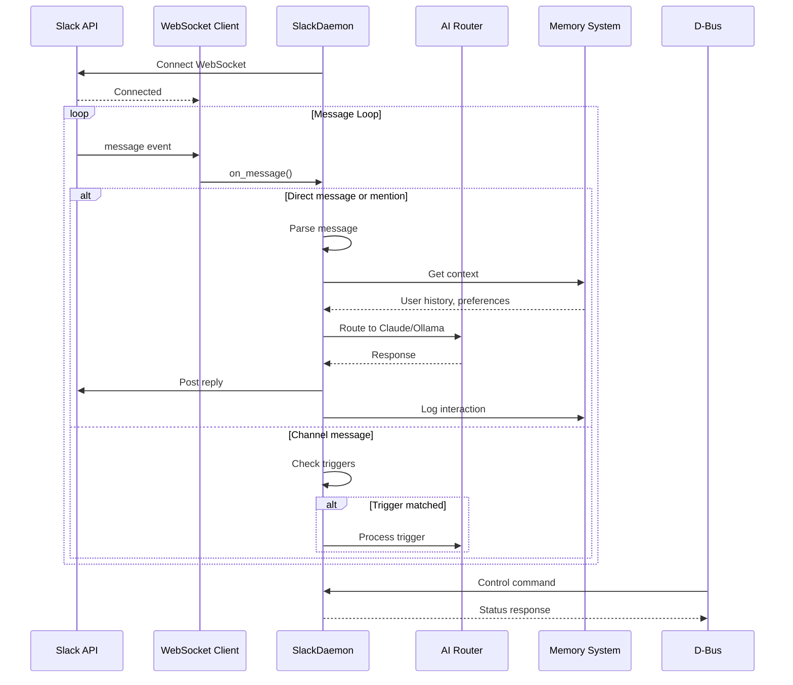
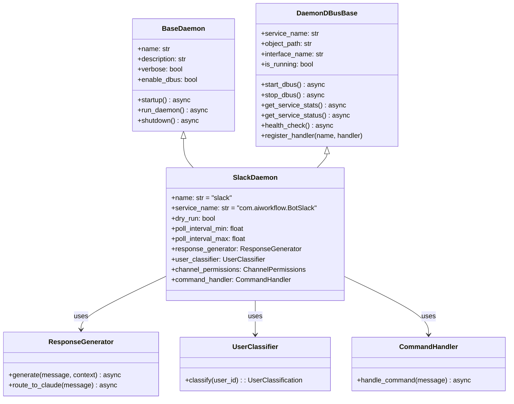
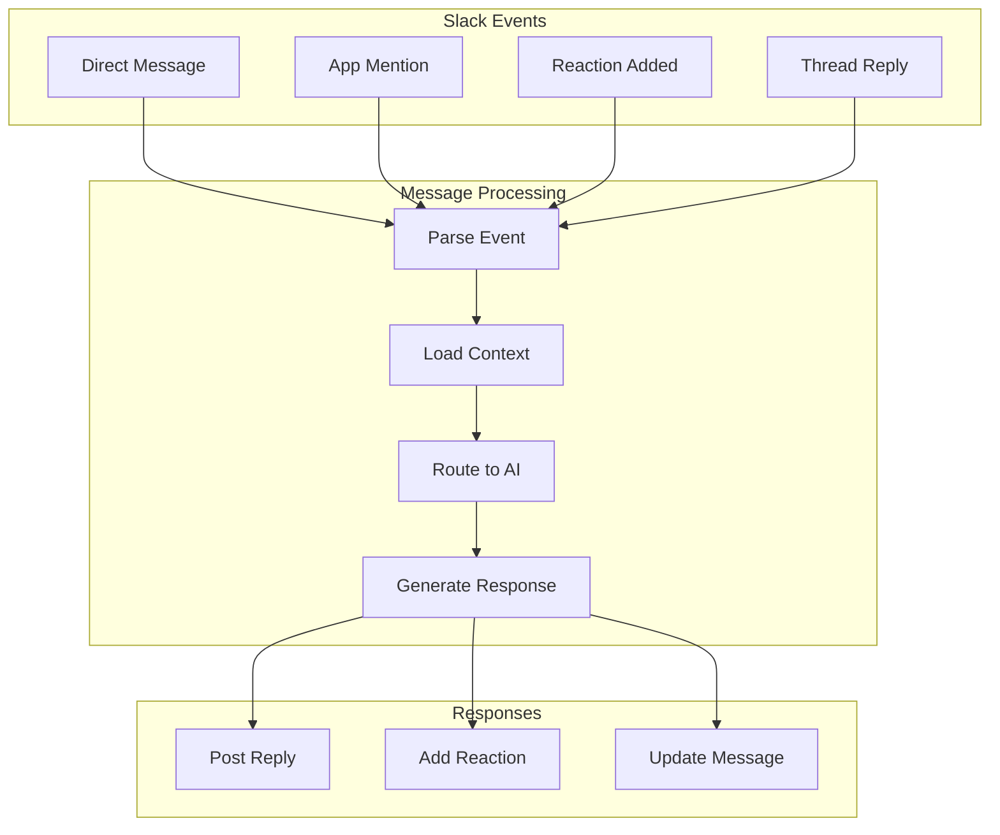

# Slack Daemon

> Real-time Slack message handling and AI responses

## Diagram



## Class Structure



## Message Flow



## Components

| Component | File | Description |
|-----------|------|-------------|
| SlackDaemon | `services/slack/daemon.py` | Main daemon class |
| SlackDBusInterface | `services/slack/dbus.py` | D-Bus interface |
| control | `services/slack/control.py` | Control functions |
| path_setup | `services/slack/path_setup.py` | Path configuration |

## D-Bus Interface

**Service:** `com.aiworkflow.BotSlack`
**Path:** `/com/aiworkflow/BotSlack`

### Standard Methods (from BaseDaemon)

| Method | Description |
|--------|-------------|
| `Ping()` | Simple ping, returns "pong" |
| `GetStatus()` | Get daemon status as JSON |
| `GetStats()` | Get daemon statistics as JSON |
| `Shutdown()` | Request graceful shutdown |
| `HealthCheck()` | Perform health check |
| `CallMethod(name, args)` | Call custom handler |

### Custom Handlers (via CallMethod)

Service-specific handlers are registered and called via `CallMethod("handler_name", args_json)`.
Check daemon source for available handlers.

## Configuration

```json
{
  "slack": {
    "workspace": "redhat",
    "bot_user_id": "U...",
    "channels": ["#ai-workflow"],
    "response_enabled": true,
    "persona": "slack"
  }
}
```

## Related Diagrams

- [Daemon Overview](./daemon-overview.md)
- [Slack Integration](../07-integrations/slack-integration.md)
- [Slack Tools](../03-tools/slack-tools.md)
