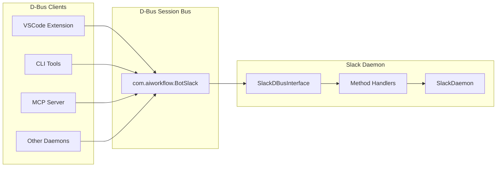
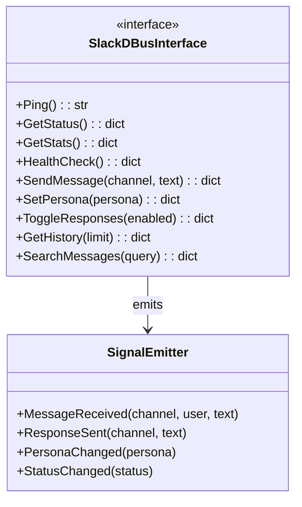
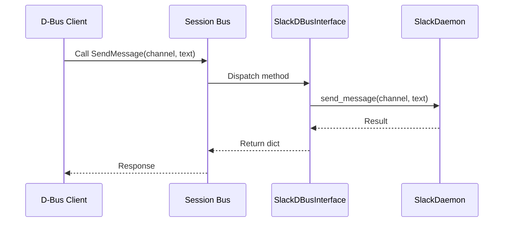

# Slack D-Bus Interface

> D-Bus IPC interface for Slack daemon control

## Diagram



## Interface Definition



## Method Calls



## Components

| Component | File | Description |
|-----------|------|-------------|
| SlackDBusInterface | `services/slack/dbus.py` | D-Bus interface class |
| get_client | `services/base/dbus.py` | Get D-Bus client |
| DaemonDBusBase | `services/base/dbus.py` | Base D-Bus mixin |

## D-Bus Methods

| Method | Parameters | Returns | Description |
|--------|------------|---------|-------------|
| Ping | - | str | Health check |
| GetStatus | - | dict | Full status |
| GetStats | - | dict | Statistics |
| HealthCheck | - | dict | Health info |
| SendMessage | channel, text | dict | Send message |
| SetPersona | persona | dict | Change persona |
| ToggleResponses | enabled | dict | Toggle AI responses |
| GetHistory | limit | dict | Recent messages |
| SearchMessages | query | dict | Search messages |

## D-Bus Signals

| Signal | Parameters | Description |
|--------|------------|-------------|
| MessageReceived | channel, user, text | New message received |
| ResponseSent | channel, text | AI response sent |
| PersonaChanged | persona | Persona changed |
| StatusChanged | status | Daemon status changed |

## Client Usage

```python
from services.base.dbus import get_client

# Get Slack daemon client
client = get_client("com.aiworkflow.BotSlack")

# Send message
result = await client.call("SendMessage", "#general", "Hello!")

# Get status
status = await client.call("GetStatus")

# Toggle responses
await client.call("ToggleResponses", False)
```

## Related Diagrams

- [Slack Daemon](./slack-daemon.md)
- [D-Bus Architecture](../09-deployment/dbus-architecture.md)
- [Base Daemon](./base-daemon.md)
