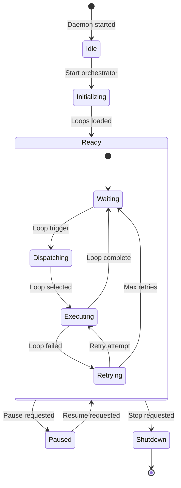
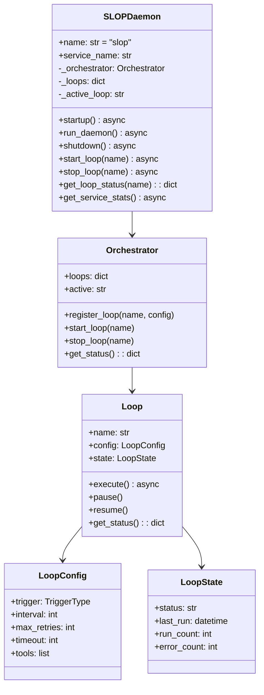
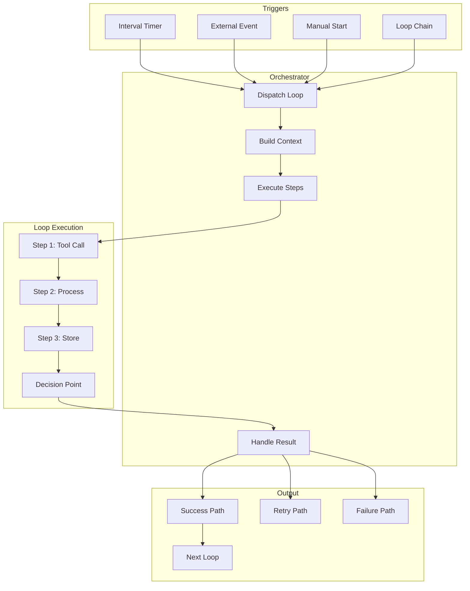

# SLOP Daemon

> Stateful Loop Orchestration Protocol daemon

## Diagram



## Class Structure



## Loop Execution



## Components

| Component | File | Description |
|-----------|------|-------------|
| SLOPDaemon | `services/slop/daemon.py` | Main daemon class |
| Orchestrator | `services/slop/orchestrator.py` | Loop orchestration |
| loops | `services/slop/loops.py` | Loop definitions |
| external_tools | `services/slop/external_tools.py` | External tool calls |
| database | `services/slop/database.py` | State persistence |

## D-Bus Methods

| Method | Description |
|--------|-------------|
| `start_loop(name)` | Start a loop |
| `stop_loop(name)` | Stop a loop |
| `pause_loop(name)` | Pause a loop |
| `resume_loop(name)` | Resume a loop |
| `get_loop_status(name)` | Get loop status |
| `list_loops()` | List all loops |
| `trigger_loop(name)` | Trigger immediate run |

## Loop Types

| Type | Trigger | Use Case |
|------|---------|----------|
| polling | Interval | Check for updates |
| reactive | Event | Respond to changes |
| scheduled | Cron | Timed execution |
| chained | Previous loop | Sequential processing |

## Configuration

```yaml
loops:
  jira_sync:
    trigger: interval
    interval: 300
    max_retries: 3
    tools:
      - jira_search
      - memory_write
    on_success: slack_notify
    on_failure: log_error
```

## Related Diagrams

- [Daemon Overview](./daemon-overview.md)
- [SLOP Loops](./slop-loops.md)
- [Ralph Loop Manager](../01-server/ralph-loop-manager.md)
