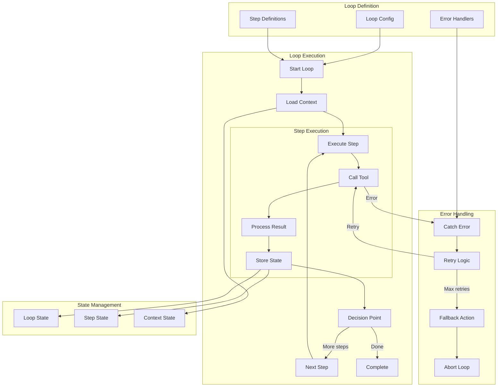
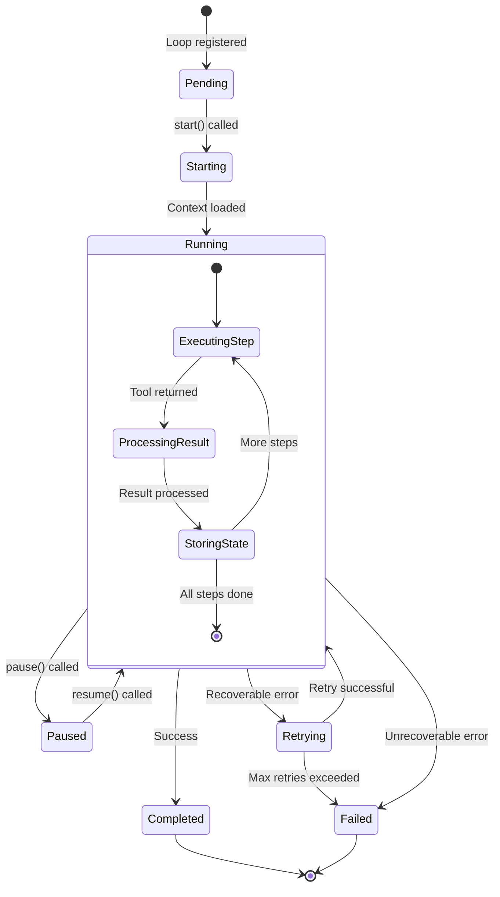
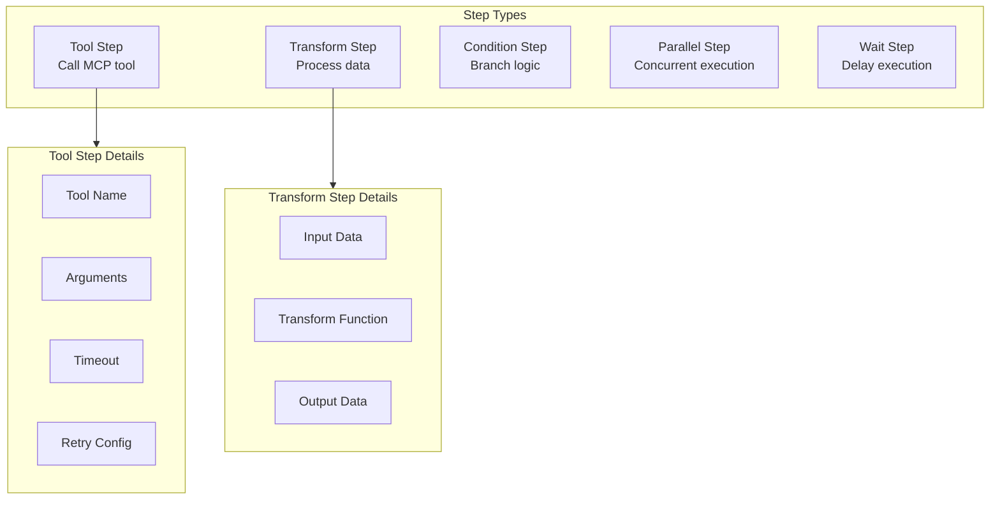

# SLOP Loops

> Loop execution flow and state management

## Diagram



## Loop State Machine



## Step Types



## Components

| Component | File | Description |
|-----------|------|-------------|
| loops | `services/slop/loops.py` | Loop definitions |
| Orchestrator | `services/slop/orchestrator.py` | Execution engine |
| database | `services/slop/database.py` | State storage |
| external_tools | `services/slop/external_tools.py` | Tool integration |

## Loop Configuration Schema

```yaml
loop:
  name: string
  description: string
  enabled: boolean
  
  trigger:
    type: interval | cron | event | manual
    interval: integer  # seconds
    cron: string       # cron expression
    event: string      # event name
  
  context:
    - source: memory
      path: state/current_work
    - source: jira
      query: "project = AAP"
  
  steps:
    - name: fetch_issues
      type: tool
      tool: jira_search
      args:
        jql: "{{ context.jql }}"
      on_error: retry
      
    - name: process_issues
      type: transform
      input: "{{ steps.fetch_issues.result }}"
      transform: filter_stale
      
    - name: notify
      type: tool
      tool: slack_send
      condition: "{{ steps.process_issues.count > 0 }}"
  
  on_success:
    - log_to_memory
    - emit_event: loop_completed
    
  on_failure:
    - log_error
    - notify_slack
```

## Built-in Loops

| Loop | Trigger | Purpose |
|------|---------|---------|
| jira_sync | 5 min interval | Sync Jira issues |
| slack_monitor | 1 min interval | Monitor Slack |
| health_check | 1 min interval | System health |
| cleanup | Daily cron | Clean old data |

## Related Diagrams

- [SLOP Daemon](./slop-daemon.md)
- [Ralph Loop Manager](../01-server/ralph-loop-manager.md)
- [Skill Execution Flow](../04-skills/skill-execution-flow.md)
