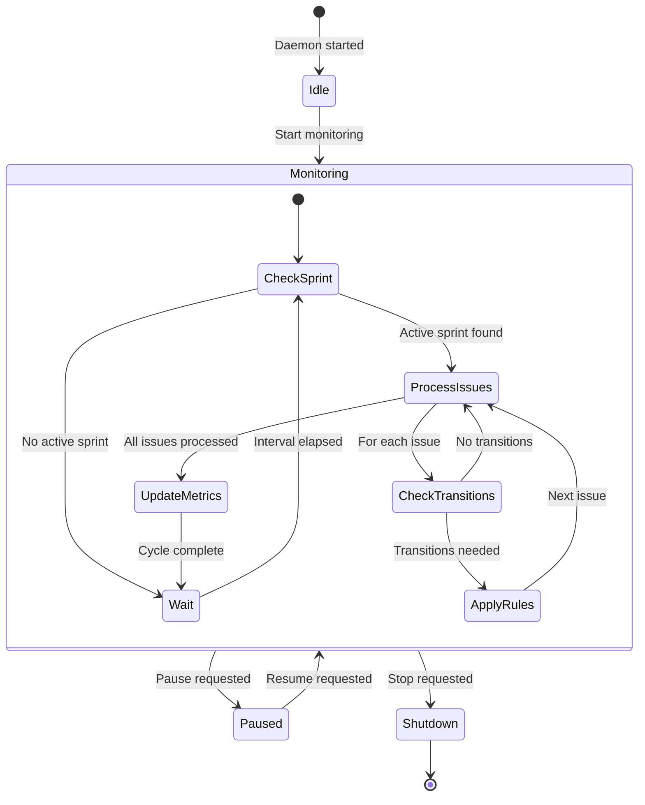
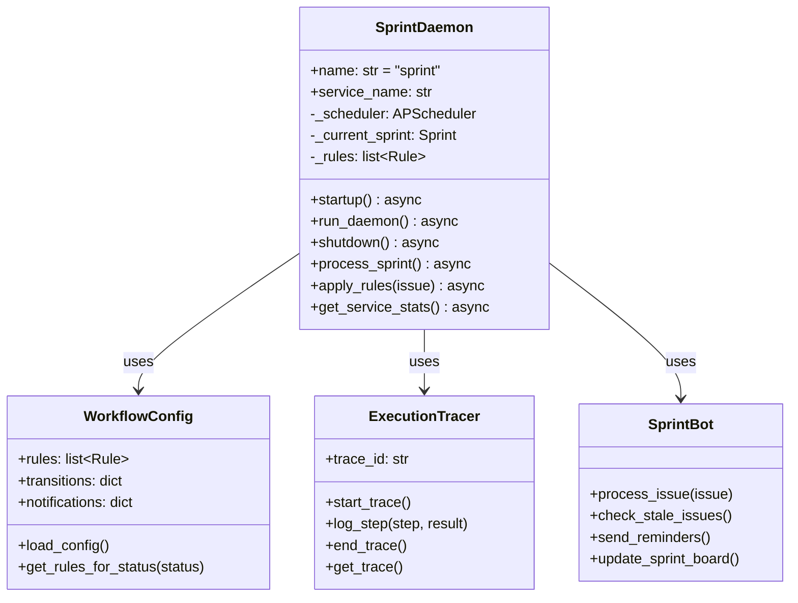
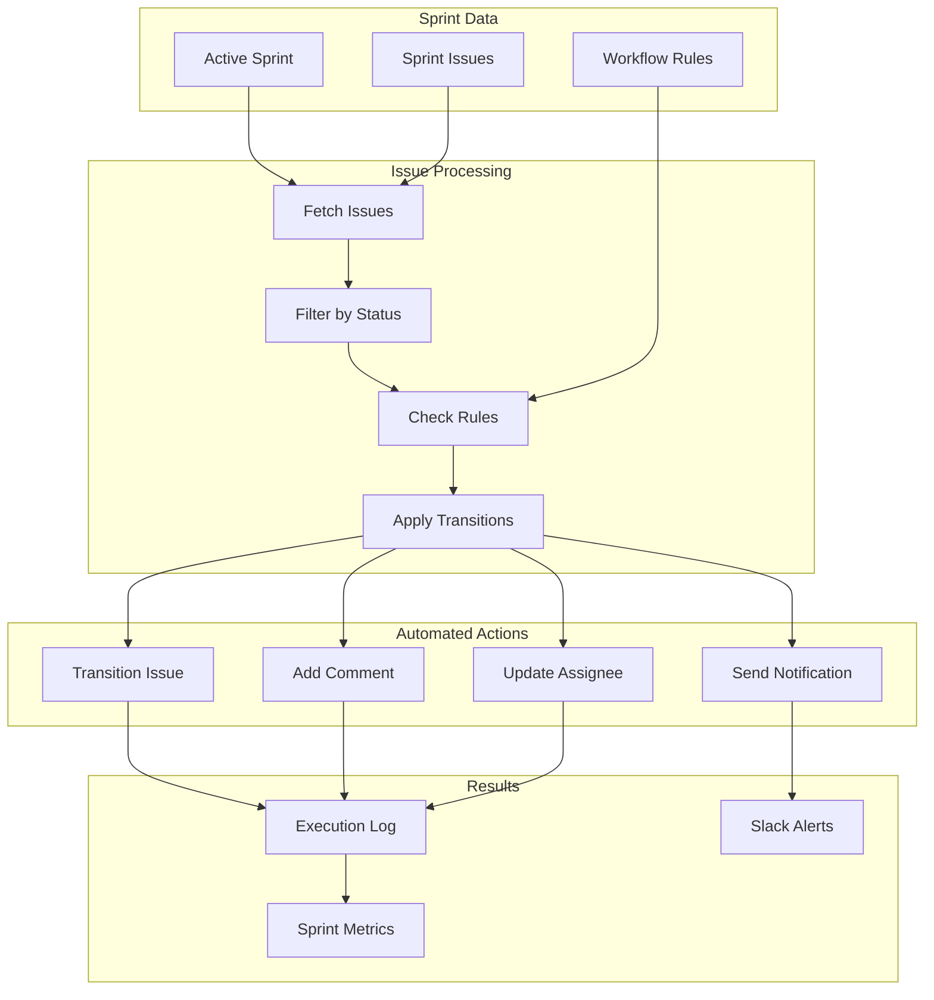

# Sprint Daemon

> Jira sprint automation and workflow management

## Diagram



## Class Structure



## Workflow Processing



## Components

| Component | File | Description |
|-----------|------|-------------|
| SprintDaemon | `services/sprint/daemon.py` | Main daemon class |
| WorkflowConfig | `services/sprint/bot/workflow_config.py` | Rule configuration |
| ExecutionTracer | `services/sprint/bot/execution_tracer.py` | Execution tracing |

## Workflow Rules Example

```yaml
rules:
  - name: stale_in_progress
    condition:
      status: "In Progress"
      days_unchanged: 3
    action:
      comment: "Issue has been in progress for 3 days"
      notify: ["assignee", "#sprint-alerts"]

  - name: auto_close_merged
    condition:
      status: "In Review"
      mr_merged: true
    action:
      transition: "Done"
      comment: "Auto-closed: MR merged"
```

## D-Bus Methods

| Method | Description |
|--------|-------------|
| `process_now()` | Trigger immediate processing |
| `get_sprint_status()` | Get current sprint info |
| `toggle_rule(name, enabled)` | Enable/disable rule |
| `get_execution_history()` | Get recent executions |

## Related Diagrams

- [Daemon Overview](./daemon-overview.md)
- [Jira Integration](../07-integrations/jira-integration.md)
- [Sprint Automation Flow](../08-data-flows/sprint-automation.md)
