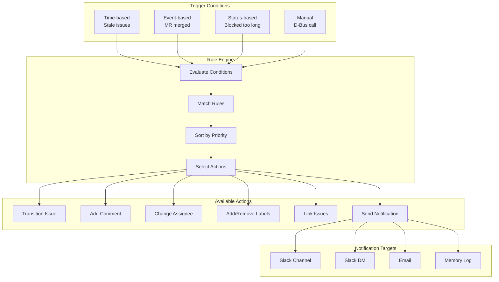
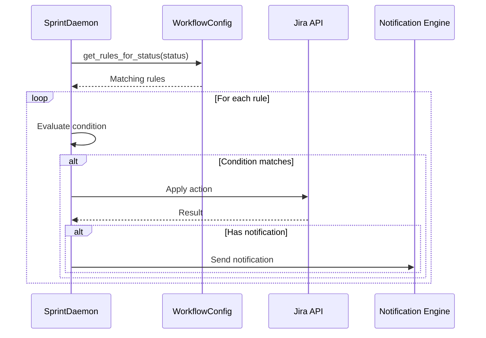
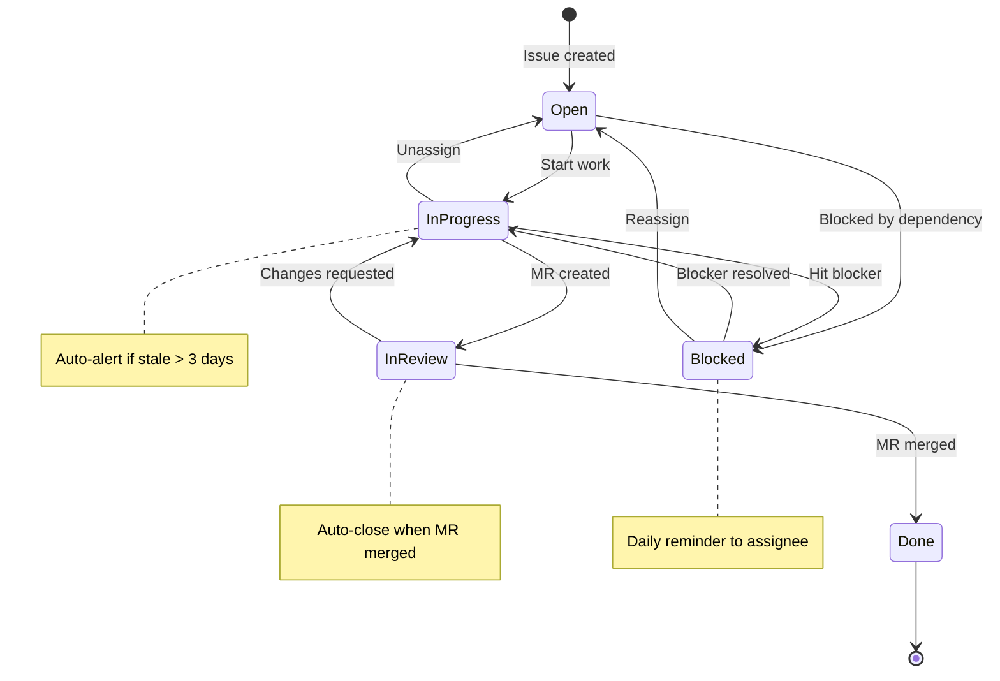

# Sprint Workflow

> Jira workflow automation rules and transitions

## Diagram



## Rule Evaluation



## Workflow States



## Components

| Component | File | Description |
|-----------|------|-------------|
| WorkflowConfig | `services/sprint/bot/workflow_config.py` | Rule definitions |
| ExecutionTracer | `services/sprint/bot/execution_tracer.py` | Action logging |
| SprintDaemon | `services/sprint/daemon.py` | Rule executor |

## Rule Schema

```yaml
rule:
  name: string           # Unique rule name
  description: string    # Human-readable description
  enabled: boolean       # Enable/disable rule
  priority: integer      # Execution order (lower = first)

  condition:
    status: string       # Issue status
    days_unchanged: int  # Days since last update
    days_in_status: int  # Days in current status
    assignee: string     # Assignee filter
    labels: list         # Required labels
    mr_merged: boolean   # MR merge status
    custom_field: any    # Custom field check

  action:
    transition: string   # Target status
    comment: string      # Comment to add
    assignee: string     # New assignee
    labels_add: list     # Labels to add
    labels_remove: list  # Labels to remove
    notify: list         # Notification targets
```

## Built-in Rules

| Rule | Trigger | Action |
|------|---------|--------|
| stale_in_progress | In Progress > 3 days | Comment + notify |
| auto_close_merged | In Review + MR merged | Transition to Done |
| blocked_reminder | Blocked > 1 day | Daily DM to assignee |
| unassigned_alert | Open + no assignee | Notify channel |
| sprint_end_warning | 2 days before end | Notify incomplete |

## Related Diagrams

- [Sprint Daemon](./sprint-daemon.md)
- [Jira Integration](../07-integrations/jira-integration.md)
- [Sprint Automation Flow](../08-data-flows/sprint-automation.md)
