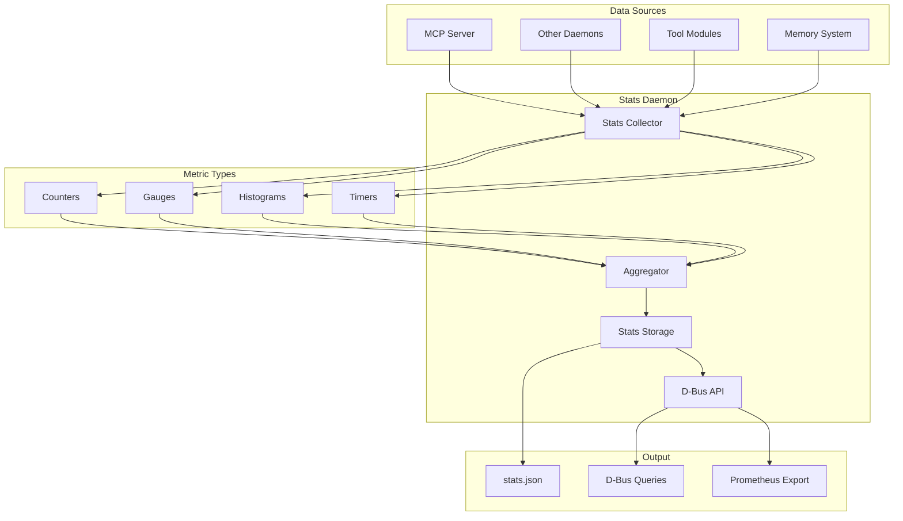
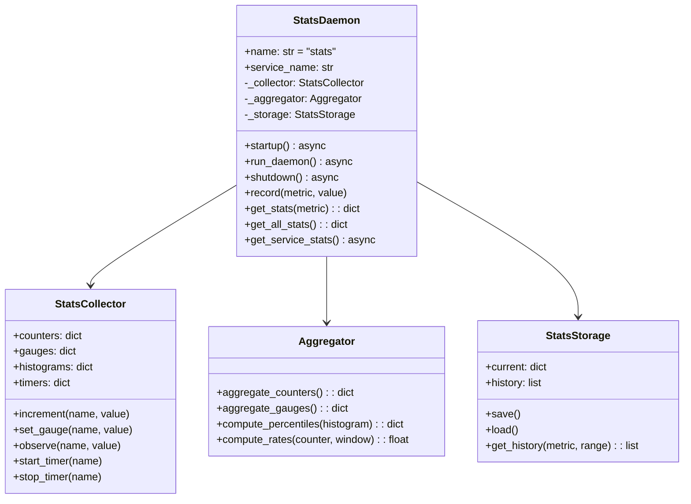
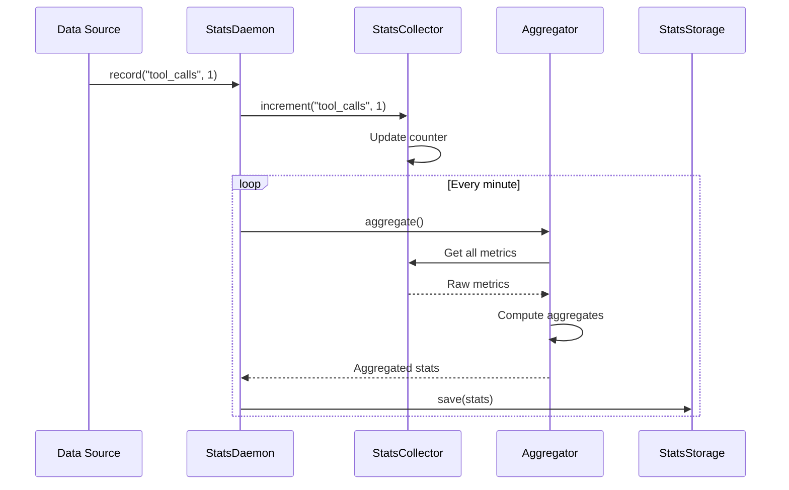

# Stats Daemon

> Statistics collection and aggregation service

## Diagram



## Class Structure



## Metric Collection Flow



## Components

| Component | File | Description |
|-----------|------|-------------|
| StatsDaemon | `services/stats/daemon.py` | Main daemon class |
| StatsCollector | Internal | Metric collection |
| Aggregator | Internal | Metric aggregation |
| StatsStorage | Internal | Persistence |

## Metric Types

| Type | Description | Example |
|------|-------------|---------|
| Counter | Monotonic count | `tool_calls_total` |
| Gauge | Current value | `active_sessions` |
| Histogram | Distribution | `response_time_ms` |
| Timer | Duration tracking | `skill_execution_time` |

## D-Bus Methods

| Method | Description |
|--------|-------------|
| `record(metric, value)` | Record metric value |
| `get_stats(metric)` | Get specific metric |
| `get_all_stats()` | Get all metrics |
| `get_history(metric, range)` | Get historical data |
| `reset_stats()` | Reset all counters |

## Collected Metrics

| Metric | Type | Description |
|--------|------|-------------|
| `tool_calls_total` | Counter | Total tool invocations |
| `skill_executions_total` | Counter | Total skill runs |
| `skill_failures_total` | Counter | Failed skill runs |
| `active_sessions` | Gauge | Current sessions |
| `memory_usage_bytes` | Gauge | Memory consumption |
| `response_time_ms` | Histogram | Tool response times |
| `skill_duration_ms` | Histogram | Skill execution times |

## Output Format

```json
{
  "timestamp": "2024-01-15T12:00:00",
  "counters": {
    "tool_calls_total": 1234,
    "skill_executions_total": 56
  },
  "gauges": {
    "active_sessions": 3,
    "memory_usage_bytes": 104857600
  },
  "histograms": {
    "response_time_ms": {
      "p50": 45,
      "p90": 120,
      "p99": 350
    }
  }
}
```

## Related Diagrams

- [Daemon Overview](./daemon-overview.md)
- [Memory Architecture](../06-memory/memory-architecture.md)
