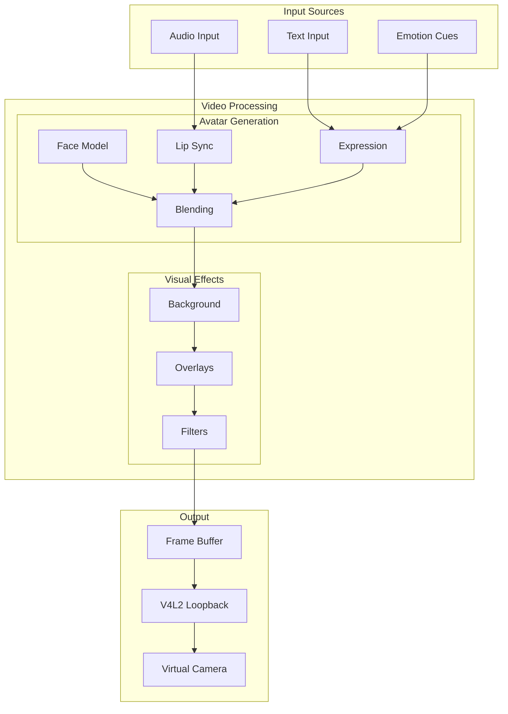
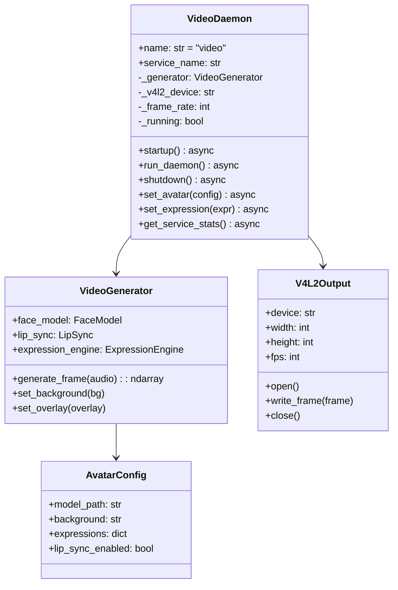
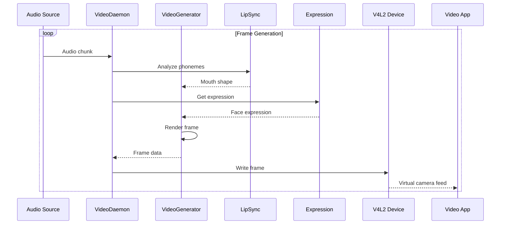

# Video Daemon

> Virtual camera and avatar generation pipeline

## Diagram



## Class Structure



## Pipeline Flow



## Components

| Component | File | Description |
|-----------|------|-------------|
| VideoDaemon | `services/video/daemon.py` | Main daemon class |
| VideoGenerator | `tool_modules/aa_meet_bot/src/video_generator.py` | Frame generation |
| AvatarGenerator | `tool_modules/aa_meet_bot/src/avatar_generator.py` | Avatar rendering |
| IntelStreaming | `tool_modules/aa_meet_bot/src/intel_streaming.py` | Intel NPU acceleration |

## V4L2 Setup

```bash
# Load v4l2loopback module
sudo modprobe v4l2loopback devices=1 video_nr=10 \
    card_label="AI Avatar" exclusive_caps=1

# Check device
v4l2-ctl --list-devices
```

## D-Bus Methods

| Method | Description |
|--------|-------------|
| `start_video()` | Start video output |
| `stop_video()` | Stop video output |
| `set_avatar(config)` | Change avatar config |
| `set_expression(expr)` | Set expression |
| `set_background(bg)` | Change background |
| `get_frame_rate()` | Get current FPS |

## Configuration

```json
{
  "video": {
    "device": "/dev/video10",
    "width": 1280,
    "height": 720,
    "fps": 30,
    "avatar": {
      "model": "default",
      "background": "blur",
      "lip_sync": true
    }
  }
}
```

## Related Diagrams

- [Daemon Overview](./daemon-overview.md)
- [Meet Daemon](./meet-daemon.md)
- [Meet Bot Pipeline](../03-tools/meet-bot-pipeline.md)
